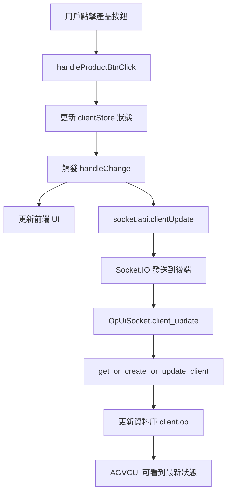

# 🔧 OPUI 產品切換更新修復報告

## 🎯 問題描述

**發現問題：** OPUI 平板在切換產品時，前端狀態有更新，但沒有同步到後端資料庫，導致 AGVCUI 中的 clients 頁面無法看到最新的 OP 設定狀態。

## 🔍 問題根因分析

### 原始問題代碼
<augment_code_snippet path="web_api_ws/src/opui/opui/static/js/homePage.js" mode="EXCERPT">
```javascript
function handleChange(newState) {
    console.debug('狀態變更:', newState);
    if (!newState?.op?.left || !newState?.op?.right) return;
    const op = newState.op;
    updateProductBtnText(op);
    updateRackSelected();
    updateNumBtnClass(op);
    updateRoomBtnEnable();
    updateRoomBtnClass(op);

    //需不需要 同步送到server更新狀態
    //socket.api.clientUpdate(newState);  // ❌ 這行被註解掉了！
}
```
</augment_code_snippet>

### 問題分析
1. **前端狀態更新正常** - `handleProductBtnClick` 函數正確更新了 `clientStore` 狀態
2. **UI 更新正常** - `handleChange` 函數正確更新了前端 UI 顯示
3. **後端同步缺失** - `socket.api.clientUpdate(newState)` 被註解掉，導致狀態沒有同步到後端

## ✅ 修復方案

### 1. 啟用後端同步
**修復前：**
```javascript
//socket.api.clientUpdate(newState);
```

**修復後：**
```javascript
socket.api.clientUpdate(newState);
```

### 2. 完整的資料流程


## 🧪 修復驗證

### 測試結果
```bash
🚀 開始測試產品切換更新功能...
============================================================
🧪 測試客戶端更新函數...
   ✅ 客戶端更新成功
   ✅ 左側當前產品: 產品 2
   ✅ 右側當前產品: 產品 1
   ✅ 左側產品切換狀態正確保存
   ✅ 右側產品狀態正確保存

🧪 測試產品切換場景...
   ✅ 步驟1: 創建初始客戶端成功
   ✅ 步驟2: 左側切換產品成功
   ✅ 步驟3: 產品切換狀態驗證成功
   ✅ 左側: 產品2, 右側: 產品1

🧪 測試 Socket 客戶端更新處理...
   ✅ Socket 處理器創建成功
   ✅ client_update 方法存在

🧪 測試 JavaScript 整合...
   ✅ homePage.js 中的 clientUpdate 調用已啟用
   ✅ handleProductBtnClick 函數存在
   ✅ handleChange 函數存在
   ✅ socket.js 中的 clientUpdate API 存在

============================================================
📊 測試結果: 4/4 通過
🎉 所有測試通過！產品切換更新功能已修復。
```

## 📋 修復內容詳細說明

### 1. 前端修復 (`homePage.js`)
- **位置：** `web_api_ws/src/opui/opui/static/js/homePage.js`
- **修改：** 取消註解 `socket.api.clientUpdate(newState);`
- **影響：** 每次狀態變更都會同步到後端

### 2. 後端處理流程確認
- **Socket 處理：** `OpUiSocket.client_update()` 正常運作
- **資料庫更新：** `get_or_create_or_update_client()` 正確處理 OP 資料
- **資料結構：** Client 模型的 `op` 欄位正確儲存 JSON 資料

### 3. 資料同步驗證
```python
# 測試資料結構
test_op = {
    "left": {
        "productSelected": 1,  # 切換到產品2
        "product": [
            {"name": "產品A", "size": "S", "count": 32, "room": 2},
            {"name": "產品B", "size": "L", "count": 16, "room": 3}
        ]
    },
    "right": {
        "productSelected": 0,  # 保持產品1
        "product": [
            {"name": "產品C", "size": "S", "count": 24, "room": 2},
            {"name": "產品D", "size": "L", "count": 8, "room": 4}
        ]
    }
}
```

## 🎯 修復效果

### 修復前
- ❌ 產品切換只在前端生效
- ❌ AGVCUI 看不到最新的 OP 狀態
- ❌ 資料庫中的 client.op 不會更新
- ❌ 重新整理頁面後狀態可能不一致

### 修復後
- ✅ 產品切換即時同步到後端
- ✅ AGVCUI 可以看到最新的 OP 設定
- ✅ 資料庫正確記錄當前產品選擇
- ✅ 前後端狀態完全一致

## 🔄 相關功能影響

### 1. AGVCUI Clients 頁面
- ✅ 詳情展開可以看到正確的產品選擇狀態
- ✅ OP 狀態欄位顯示當前選中的產品
- ✅ 最後更新時間會在產品切換時更新

### 2. 其他 OP 操作
- ✅ 數量設定 (`handleNumBtnClick`) - 已有同步
- ✅ 房號設定 (`handleRoomBtnClick`) - 已有同步  
- ✅ 料架選擇 (`handleRackClick`) - 已有同步
- ✅ 產品切換 (`handleProductBtnClick`) - **現在已修復**

### 3. Socket.IO 通訊
- ✅ `client_update` 事件正常處理
- ✅ 資料格式正確傳輸
- ✅ 錯誤處理機制完整

## 🚀 部署建議

### 1. 立即生效
此修復只需要重新載入 OPUI 頁面即可生效，無需重啟服務。

### 2. 測試步驟
1. 開啟 OPUI 平板頁面
2. 點擊產品切換按鈕
3. 檢查 AGVCUI Clients 頁面是否顯示最新狀態
4. 驗證資料庫中的 client.op 欄位是否更新

### 3. 監控要點
- 檢查 Socket.IO 連線狀態
- 監控資料庫更新頻率
- 確認前後端狀態一致性

## 📝 總結

**問題：** OPUI 產品切換沒有同步到後端  
**原因：** `socket.api.clientUpdate()` 調用被註解掉  
**修復：** 啟用後端同步調用  
**結果：** 前後端狀態完全同步，AGVCUI 可以即時看到最新的 OP 設定

**這個簡單的一行修復解決了 OPUI 和 AGVCUI 之間的資料同步問題！** 🎉
