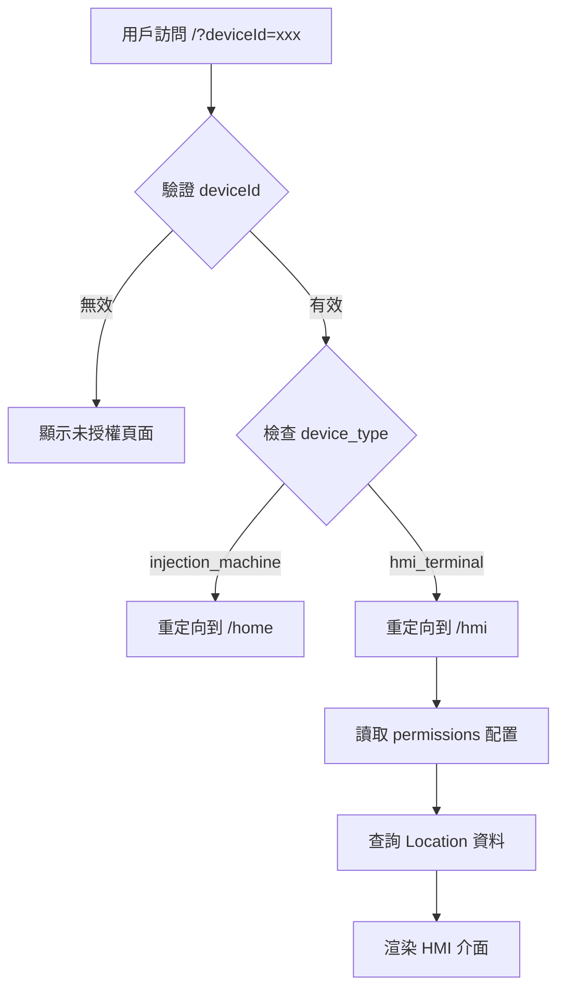
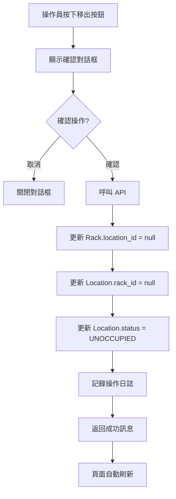

# HMI 系統設計文檔

## 🎯 適用場景
- HMI（Human-Machine Interface）終端介面系統的架構說明
- 雙層路由機制的實作細節
- 擴充和維護 HMI 系統的指導

## 📋 系統概述

HMI 系統是 RosAGV OPUI 模組的擴展功能，提供彈性化的人機介面，讓操作人員可以透過簡單的大按鈕介面進行 Rack 移出操作。系統採用雙層路由架構，根據設備類型和 deviceId 提供不同的介面。

## 🏗️ 系統架構

### 雙層路由機制

#### 第一層：Device Type 路由
根據 License 表中的 `device_type` 欄位決定設備類型：

| device_type | 說明 | 路由目標 |
|------------|------|---------|
| injection_machine | 射出機操作面板 | /home (原 OPUI 介面) |
| hmi_terminal | HMI 終端設備 | /hmi (HMI 介面) |

#### 第二層：DeviceId 配置
HMI 終端根據 `permissions` JSON 欄位中的配置顯示不同內容：

```json
{
  "locations": ["LOC001", "LOC002"],  // 監控的 Location 列表
  "layout": "1x2",                    // 按鈕排版方式
  "can_remove_rack": true             // 是否可執行移出操作
}
```

### 資料庫結構

#### License 表結構 (實際 SQLModel 定義)
```python
class License(SQLModel, table=True):
    __tablename__ = "license"
    id: Optional[int] = Field(default=None, primary_key=True)
    device_id: str = Field(index=True, unique=True)
    active: int = Field(default=1)
    device_type: str = Field(default="injection_machine")  # 設備類型
    description: Optional[str] = None  # 描述
    permissions: Optional[dict] = Field(default=None, sa_column=Column(JSON))  # 權限設定
```

#### 相關資料表結構 (實際 SQLModel 定義)

**Location 表**:
```python
class Location(SQLModel, table=True):
    __tablename__ = "location"
    id: Optional[int] = Field(default=None, primary_key=True)
    name: str
    rack_id: Optional[int] = Field(default=None, foreign_key="rack.id")
    location_status_id: Optional[int] = Field(
        default=LocationStatus.UNOCCUPIED,
        foreign_key="location_status.id")
```

**Rack 表**:
```python
class Rack(SQLModel, table=True):
    __tablename__ = "rack"
    id: Optional[int] = Field(default=None, primary_key=True)
    name: str
    location_id: Optional[int] = Field(default=None, foreign_key="location.id")
    product_id: Optional[int] = Field(default=None, foreign_key="product.id")
```

**Product 表**:
```python
class Product(SQLModel, table=True):
    __tablename__ = "product"
    id: Optional[int] = Field(default=None, primary_key=True)
    name: str
    size: str
    process_settings_id: int = Field(foreign_key="process_settings.id")
```

**Carrier 表**:
```python
class Carrier(SQLModel, table=True):
    __tablename__ = "carrier"
    id: Optional[int] = Field(default=None, primary_key=True)
    rack_id: Optional[int] = None  # FK rack.id 不強綁定
```

#### 預設資料範例
```sql
-- 射出機操作員
INSERT INTO license (device_id, active, device_type, description, permissions) VALUES
('ca08777c72096c51', 1, 'injection_machine', '射出機 #1 操作面板', 
 '{"can_call_agv": true, "can_view_tasks": true}'::jsonb);

-- HMI 終端 1 (2個 Location)
INSERT INTO license (device_id, active, device_type, description, permissions) VALUES
('hmi0000000000001', 1, 'hmi_terminal', '射出機區 HMI 終端',
 '{"locations": ["LOC001", "LOC002"], "layout": "1x2", "can_remove_rack": true}'::jsonb);

-- HMI 終端 2 (4個 Location)
INSERT INTO license (device_id, active, device_type, description, permissions) VALUES
('hmi0000000000002', 1, 'hmi_terminal', '倉儲區 HMI 終端',
 '{"locations": ["LOC101", "LOC102", "LOC103", "LOC104"], "layout": "2x2", "can_remove_rack": true}'::jsonb);
```

## 🔧 實作細節

### CSS 框架整合
HMI 介面採用 **Bulma CSS Framework v1.0.4** 作為基礎樣式框架，並透過自訂 CSS 進行深度客製化：

- **Bulma 元件使用**:
  - Navbar: 使用 `navbar is-black has-shadow` 創建深色導覽列
  - Box: 使用 `box` 類別作為卡片容器基礎
  - Modal: 使用 `modal` 元件實作確認對話框
  - Button: 基於 `button is-success` 擴展大按鈕樣式
  
- **自訂樣式覆寫**:
  - 將 Bulma 預設的淺色主題轉換為深色主題
  - 新增漸層邊框和動畫效果
  - 調整字體大小以適應平板觸控操作

### 後端實作

#### 主路由分發器 (`op_ui_server.py`)
```python
@self.app.get("/", response_class=HTMLResponse)
async def root_dispatcher(request: Request):
    """主路由分發器 - 根據 device_type 導向不同介面"""
    # 1. 取得並驗證 deviceId
    # 2. 查詢 License 資料
    # 3. 根據 device_type 重定向到對應介面
```

#### HMI 路由處理器
```python
@self.app.get("/hmi", response_class=HTMLResponse)
async def hmi(request: Request):
    """HMI 介面 - 根據 permissions 配置顯示不同 Location"""
    # 1. 驗證設備授權
    # 2. 從 permissions 讀取 Location 配置
    # 3. 查詢每個 Location 的 Rack、Carrier 和 Product 資料
    #    - 支援 Product 資訊顯示 (產品名稱和尺寸)
    #    - 統計 Carrier 數量而非列出每個 Carrier
    # 4. 渲染 HMI 模板
```

#### HMI API 端點 (`api/hmi.py`)
```python
@router.post("/api/hmi/remove_rack")
async def remove_rack(request: RemoveRackRequest):
    """從指定 Location 移出 Rack"""
    # 1. 查詢 Location 和關聯的 Rack
    # 2. 設定 Rack.location_id = None
    # 3. 設定 Location.rack_id = None
    # 4. 更新 Location.location_status_id = UNOCCUPIED
    # 5. 記錄操作日誌
```

### 前端實作

#### HMI 介面特色
- **大按鈕設計**: 按鈕佔畫面 40-50% 高度，易於操作
- **動態排版**: 支援 1x2、2x2、2x3 等多種排版方式
- **即時資訊**: 顯示 Location、Rack、Carrier 詳細資訊
- **確認機制**: 操作前顯示確認對話框，避免誤操作
- **自動刷新**: 每 30 秒自動刷新頁面狀態
- **現代化深色主題**: 採用深色背景配合漸層邊框設計
- **呼吸動畫效果**: 按鈕具有呼吸燈效果，提升視覺吸引力
- **點擊動畫**: 完整的點擊動畫效果，即使快速放開也會播放完成

#### 視覺設計 (2025-08-28 更新)
- **深色主題配色**:
  - 背景色: `linear-gradient(135deg, #1a1a1a 0%, #0f0f0f 100%)` (漸層深灰黑)
  - 按鈕背景: `linear-gradient(135deg, #00d68f 0%, #00b074 100%)` (綠色漸層)
  - 文字顏色: `#ffffff` (純白)
  - 強調色: `#00d68f` (亮綠)
- **漸層邊框效果**:
  - 使用 CSS linear-gradient 創建四色漸層邊框
  - 邊框顏色: `#ff4757 → #5f27cd → #00d2d3 → #48dbfb` (紅紫青藍)
  - 使用 CSS mask 技術實現純邊框效果
- **動畫效果**:
  - 呼吸動畫: 3秒循環，陰影脈動效果
  - 點擊動畫: 600毫秒觸控發光效果 (touchGlow)
  - 內部光暈: radialGradient 創建的內部發光效果
- **資訊排版**:
  - 左右對齊設計: 標籤靠左，數值靠右
  - 統一字體大小: 所有數值使用 1.5rem
  - 英文標籤: Product、Size、Carrier (簡潔明瞭)

#### 響應式設計
- 桌面版: 完整網格排版
- 平板版: 自動調整按鈕大小，針對 11 吋平板優化
- 手機版: 單列顯示，適合小螢幕

## 📊 系統流程

### 設備訪問流程


### Rack 移出流程


## 🎨 CSS 實作技術細節 (2025-08-28)

### 漸層邊框實作
```css
/* 實際使用偽元素創建漸層邊框 */
.location-box::before {
    content: '';
    position: absolute;
    inset: 0;
    padding: 3px;
    border-radius: 16px;
    background: linear-gradient(135deg, #ff4757, #5f27cd, #00d2d3, #48dbfb);
    -webkit-mask: linear-gradient(#fff 0 0) content-box, 
                  linear-gradient(#fff 0 0);
    -webkit-mask-composite: xor;
    mask-composite: exclude;
}
```

### 呼吸動畫實作
```css
/* 實際的呼吸燈動畫 - 簡化為2個關鍵幀 */
@keyframes breathing {
    0%, 100% {
        box-shadow: 0 2px 15px rgba(0, 214, 143, 0.3),
                    inset 0 0 20px rgba(0, 214, 143, 0.1);
    }
    50% {
        box-shadow: 0 4px 30px rgba(0, 214, 143, 0.5),
                    inset 0 0 30px rgba(0, 214, 143, 0.2);
    }
}

.button-large {
    animation: breathing 3s ease-in-out infinite;
}
```

### JavaScript 點擊動畫控制
```javascript
// 實際的觸控動畫實作
locationBox.addEventListener('touchstart', function() {
    this.classList.add('touched');
});

locationBox.addEventListener('touchend', function() {
    setTimeout(() => {
        this.classList.remove('touched');
    }, 600);
});

// 滑鼠支援
locationBox.addEventListener('mousedown', function(e) {
    if (e.button === 0) {
        this.classList.add('touched');
    }
});

locationBox.addEventListener('mouseup', function() {
    setTimeout(() => {
        this.classList.remove('touched');
    }, 600);
});
```

## 🚀 擴充指南

### 新增 HMI 終端
1. **在資料庫新增記錄**:
```sql
INSERT INTO license (device_id, active, device_type, description, permissions) VALUES
('hmi0000000000003', 1, 'hmi_terminal', '新區域 HMI 終端',
 '{"locations": ["LOC201", "LOC202", "LOC203"], "layout": "1x3", "can_remove_rack": true}'::jsonb);
```

2. **設定完成**: 新設備即可使用，無需修改程式碼

### 支援的排版方式
- `1x2`: 1 列 2 欄
- `2x2`: 2 列 2 欄
- `1x3`: 1 列 3 欄
- `1x4`: 1 列 4 欄
- `2x3`: 2 列 3 欄

### 新增設備類型
如需新增其他類型的設備（如 warehouse_operator），只需：
1. 在主路由分發器加入新的 device_type 判斷
2. 建立對應的路由處理器和模板
3. 在資料庫新增對應的 License 記錄

## 🔍 故障排除

### 常見問題

#### DeviceId 格式錯誤
- **問題**: "deviceId 必須為恰好16個字符的英數字串"
- **解決**: 確保 deviceId 為 16 個字元，只包含英文字母和數字

#### Location 不存在
- **問題**: HMI 顯示 Location 但無資料
- **解決**: 檢查資料庫中是否有對應的 Location 記錄

#### 權限配置錯誤
- **問題**: HMI 介面無法正常顯示
- **解決**: 檢查 License 表的 permissions 欄位是否為有效的 JSON 格式

### 診斷指令
```bash
# 檢查 License 資料
docker compose -f docker-compose.agvc.yml exec postgres bash -c \
  "PGPASSWORD=password psql -U agvc -d agvc -c 'SELECT * FROM license;'"

# 測試路由分發
curl -L "http://localhost:8002/?deviceId=hmi0000000000001"

# 檢查 HMI API
curl -X POST "http://localhost:8002/api/hmi/remove_rack" \
  -H "Content-Type: application/json" \
  -d '{"location_id": 1, "device_id": "hmi0000000000001"}'
```

## 🔗 交叉引用
- OPUI 系統: `/app/web_api_ws/src/opui/CLAUDE.md`
- 資料庫設計: @docs-ai/knowledge/agv-domain/wcs-database-design.md
- Web 開發: @docs-ai/operations/development/web-development.md
- 雙環境架構: @docs-ai/context/system/dual-environment.md