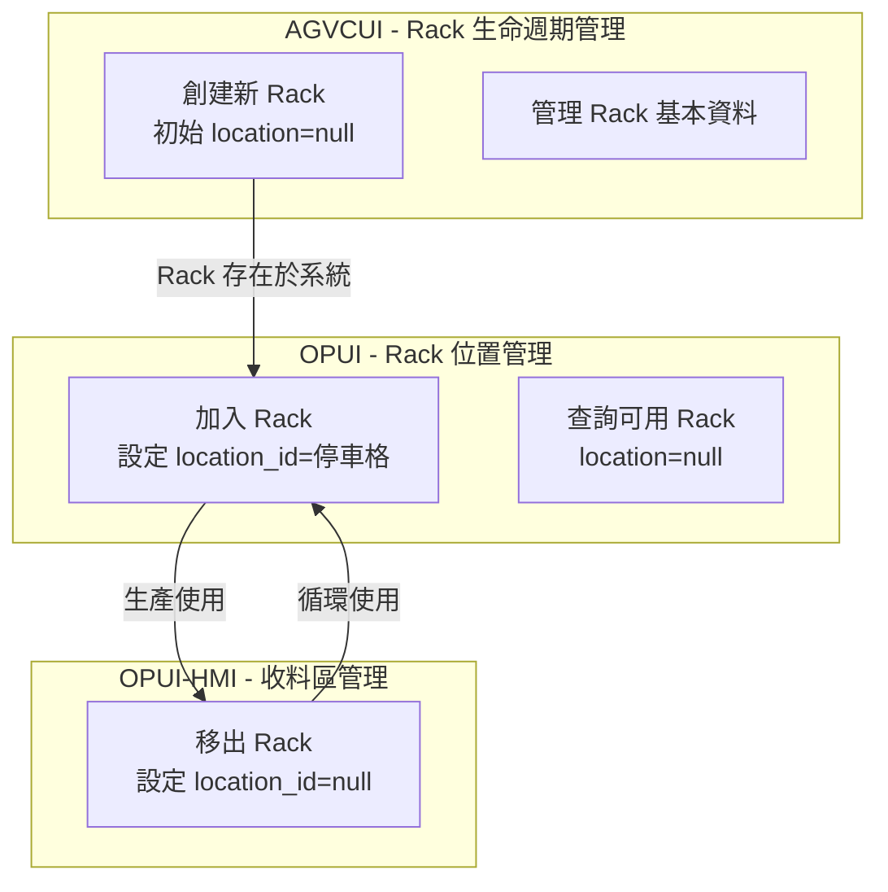
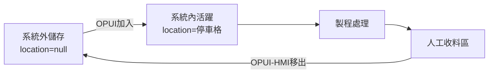

# 手動 Rack 管理系統

## 🎯 適用場景
- 理解新的手動 Rack 管理模式
- 掌握 OPUI 手動加入和移出 Rack 的操作流程
- 了解 location=null 狀態的意義和管理方式

## 📋 概述
新的 Rack 管理模式取消自動叫空車功能，改為人工搬運配合 OPUI 系統管理。這個變更簡化了系統複雜度，同時提供更靈活的 Rack 調度能力。

## 🔄 核心變更

### 1. 取消自動叫空車
**舊流程**：
- 作業員按「叫空車」按鈕
- KUKA AGV 自動配送空 Rack 到停車格
- 系統自動管理空 Rack 庫存

**新流程**：
- 作業員從倉儲區手動搬運 Rack
- 使用 OPUI「加入 Rack」功能納入系統管理
- 人工管理實體 Rack 庫存

### 2. 系統架構分工

**AGVCUI (Port 8001) - Rack 生命週期管理**：
- 創建新 Rack 記錄（首次使用時）
- 管理 Rack 基本資料（名稱、屬性）
- 刪除不再使用的 Rack

**OPUI (Port 8002) - Rack 位置管理**：
- 加入 Rack：設定 `location_id = [停車格ID]`（從倉儲區加入系統）
- 移出 Rack：設定 `location_id = NULL`（暫時不使用）
- 不創建新 Rack，只管理已存在 Rack 的位置

**OPUI-HMI - 人工收料區管理**：
- 移出 Rack：設定 `location_id = NULL`（完成收料後移出系統）

### 3. OPUI 手動加入 Rack
**功能位置**：OPUI 主介面 → Rack 管理 → 加入 Rack

**前提條件**：
- Rack 必須已在 AGVCUI 中創建
- Rack 當前 location_id = NULL（在倉儲區）

**操作步驟**：
1. 手動搬運空 Rack 到射出機旁
2. 開啟 OPUI 平板
3. 點選「Rack 管理」
4. 選擇「加入 Rack」
5. 選擇或輸入 Rack 編號（例：101）
6. 系統分配可用的 location_id
7. 確認 Rack 已加入系統

**系統處理**：
```sql
-- 系統內部處理邏輯
-- 只更新 Rack 表，不修改 Location 表
UPDATE racks 
SET location_id = [assigned_parking_space]
WHERE rack_id = '101' 
  AND location_id IS NULL;
```

### 4. OPUI-HMI Rack 移出
**功能位置**：OPUI-HMI → 人工收料區管理 → 移出系統

**操作步驟**：
1. 完成人工收料（取出所有 carrier）
2. 開啟 OPUI-HMI 介面
3. 選擇人工收料區的 Rack
4. 點選「移出系統」
5. 確認操作
6. 手動將空 Rack 搬到倉儲區

**系統處理**：
```sql
-- 系統內部處理邏輯
-- 1. 清除相關 carrier
DELETE FROM carriers WHERE rack_id = [rack_id];

-- 2. 移出系統
UPDATE racks 
SET location_id = NULL
WHERE id = [rack_id];
```

## 📊 Rack 狀態管理

### location_id 狀態說明
| location_id | 狀態 | 說明 | 實體位置 |
|------------|------|------|---------|
| 1-90 | 系統內活躍 | 正在系統內使用 | 各工作站點 |
| NULL | 系統外儲存 | 脫離系統管理 | 倉儲區 |

### 完整系統架構與分工


### 狀態轉換流程


## 🚦 TAFL 流程影響

### 查詢條件調整
所有 TAFL 流程在查詢 Rack 時需要考慮 location_id：

```yaml
# TAFL 查詢範例
- query:
    target: racks
    where:
      location_id: "!= null"  # 只查詢系統內的 Rack
      status: "available"
    store_as: active_racks
```

### 停用的流程
以下流程類型將被停用或修改：
- 叫空車任務創建
- 空 Rack 自動配送
- 空 Rack 回收搬運

### NG 處理變更
```yaml
# 新的 NG 處理流程
- check:
    condition: "${ocr_result} == 'NG'"
    then:
      - action: pause_agv  # 原地停止
      - action: send_notification  # 發送通知
      - action: wait_for_manual_intervention  # 等待人工處理
```

## 🎯 實施注意事項

### 1. 庫存管理
- 定期盤點倉儲區的 Rack 數量
- 追蹤 location=null 的 Rack 總數
- 建立 Rack 使用率報表

### 2. 人員培訓
- 培訓作業員使用 OPUI 加入 Rack 功能
- 培訓收料人員使用 OPUI-HMI 移出功能
- 制定標準操作程序（SOP）

### 3. 系統監控
- 監控手動加入 Rack 的頻率
- 追蹤 Rack 在系統外的時間
- 設置異常告警（如 location=null 超過閾值）

## 📈 預期效益

### 優點
1. **簡化系統**：減少自動化複雜度
2. **靈活調度**：人工可根據實際需求調配 Rack
3. **降低故障**：減少 AGV 空車搬運的故障點
4. **成本節省**：減少不必要的 AGV 運行

### 挑戰
1. **人力需求**：增加人工搬運工作
2. **追蹤困難**：location=null 的 Rack 需要額外管理
3. **效率影響**：可能影響整體作業效率

## 🔧 技術實作細節

### 資料庫查詢
```python
# 查詢系統外的 Rack
def query_external_racks():
    """查詢 location_id = null 的 Rack"""
    return db.query("""
        SELECT * FROM racks 
        WHERE location_id IS NULL
    """)

# 將 Rack 加入系統
def add_rack_to_system(rack_id: str, location_id: int):
    """將 Rack 重新納入系統管理"""
    return db.execute("""
        UPDATE racks 
        SET location_id = %s
        WHERE rack_id = %s AND location_id IS NULL
    """, (location_id, rack_id))
```

### TAFL 函數擴展
需要在 TAFL WCS 中新增或修改以下函數：
- `check_rack_in_system()`: 檢查 Rack 是否在系統內
- `add_rack_to_system()`: 將 Rack 加入系統
- `remove_rack_from_system()`: 將 Rack 移出系統

## 🔗 相關文檔
- 眼鏡生產業務流程: docs-ai/knowledge/business/eyewear-production-process.md
- WCS 系統設計: docs-ai/knowledge/agv-domain/wcs-system-design.md
- TAFL 語言規格: docs-ai/knowledge/system/tafl/tafl-language-specification.md
- 操作手冊: docs-ai/operations/guides/rack-management-guide.md