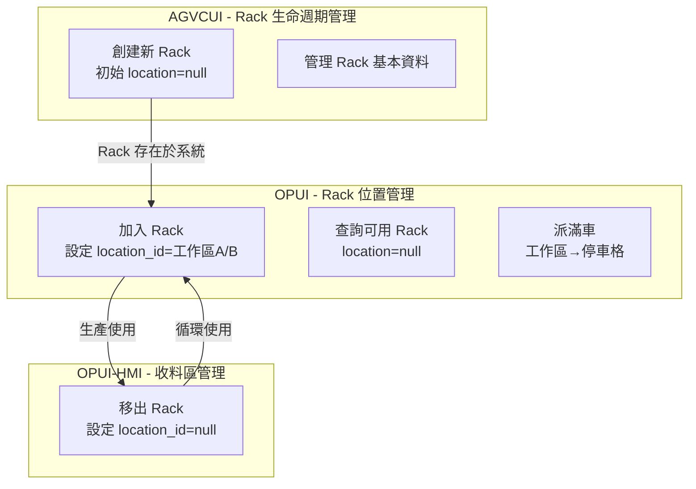
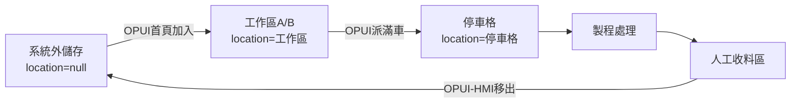

# 手動 Rack 管理系統

## 🎯 適用場景
- 理解新的手動 Rack 管理模式
- 掌握 OPUI 手動加入和移出 Rack 的操作流程
- 了解 location=null 狀態的意義和管理方式

## 📋 概述
新的 Rack 管理模式取消自動叫空車功能，改為人工搬運配合 OPUI 系統管理。這個變更簡化了系統複雜度，同時提供更靈活的 Rack 調度能力。

## 🔄 核心變更

### 1. 取消自動叫空車
**舊流程**：
- 作業員按「叫空車」按鈕
- KUKA AGV 自動配送空 Rack 到停車格
- 系統自動管理空 Rack 庫存

**新流程**：
- 作業員從倉儲區手動搬運空 Rack 到工作區 A 或 B
- 使用 OPUI 首頁「加入料架」按鈕納入系統管理
- 系統自動判斷工作區位置（左側為區域 A，右側為區域 B）
- 人工管理實體 Rack 庫存

### 2. 系統架構分工

**AGVCUI (Port 8001) - Rack 生命週期管理**：
- 創建新 Rack 記錄（首次使用時）
- 管理 Rack 基本資料（名稱、屬性）
- 刪除不再使用的 Rack

**OPUI (Port 8002) - Rack 位置管理**：
- 加入 Rack：設定 `location_id = [工作區A/B]`（從倉儲區加入系統）
- 派滿車：從工作區派送到停車格（停車格專供 KUKA AGV 使用）
- 不創建新 Rack，只管理已存在 Rack 的位置

**OPUI-HMI - 人工收料區管理**：
- 移出 Rack：設定 `location_id = NULL`（完成收料後移出系統）

### 3. OPUI 手動加入 Rack

#### 📌 系統現況（已實作）
**功能位置**：OPUI 首頁 → 平板分左右兩半，每半各有一個「加入料架」按鈕

**前提條件**：
- Rack 必須已在 AGVCUI 中創建
- Rack 當前 location_id = NULL（在倉儲區）

**當前操作步驟**：
1. 手動搬運空 Rack 到停車格
2. 開啟 OPUI 平板首頁（兩個作業員共用一個平板）
3. 點擊對應側的「加入料架」按鈕
   - 左側按鈕：將 Rack 加入到停車格 1
   - 右側按鈕：將 Rack 加入到停車格 2
4. 彈出選擇框，從下拉選單選擇 Rack 編號
5. 系統直接更新 Rack 到對應的停車格 location ID
6. 確認 Rack 已加入系統

**當前系統處理**：
```python
# 實際程式碼邏輯 (op_ui_socket.py)
if side == "left":
    location_id = machine.parking_space_1  # 直接分配到停車格 1
elif side == "right":
    location_id = machine.parking_space_2  # 直接分配到停車格 2
```

#### 🚀 開發藍圖（待實作）
**未來功能**：支援工作區 A/B 的自動偵測和分配

**計劃操作步驟**：
1. 手動搬運空 Rack 到工作區 A 或 B（而非停車格）
2. 開啟 OPUI 平板首頁
3. 點擊「加入料架」按鈕
4. 系統自動偵測空的工作區（A 或 B）
5. 將 Rack 分配到可用的工作區
6. 作業員裝滿後使用「派滿車」將 Rack 從工作區移到停車格

**待開發邏輯**：
```python
# 未來需要的邏輯
def get_available_workspace(machine, side):
    """自動偵測可用的工作區"""
    if side == "left":
        # 檢查工作區 A 是否為空
        if not has_rack_in_workspace_a(machine.workspace_a_1):
            return machine.workspace_a_1
        # 檢查工作區 B 是否為空
        elif not has_rack_in_workspace_b(machine.workspace_b_1):
            return machine.workspace_b_1
    elif side == "right":
        # 類似邏輯for作業員 2
        pass
```

### 4. OPUI-HMI Rack 移出
**功能位置**：OPUI-HMI → 人工收料區管理 → 移出系統

**操作步驟**：
1. 完成人工收料（取出所有 carrier）
2. 開啟 OPUI-HMI 介面
3. 選擇人工收料區的 Rack
4. 點選「移出系統」
5. 確認操作
6. 手動將空 Rack 搬到倉儲區

**系統處理**：
```sql
-- 系統內部處理邏輯
-- 1. 清除相關 carrier
DELETE FROM carriers WHERE rack_id = [rack_id];

-- 2. 移出系統
UPDATE racks 
SET location_id = NULL
WHERE id = [rack_id];
```

## 📊 Rack 狀態管理

### location_id 狀態說明
| location_id | 狀態 | 說明 | 實體位置 |
|------------|------|------|---------|
| 1-90 | 系統內活躍 | 正在系統內使用 | 工作區、停車格、各工作站點 |
| NULL | 系統外儲存 | 脫離系統管理 | 倉儲區 |

### 位置區域劃分

#### 每個射出機的 Location 配置
**重要**：每個射出機配備 6 個獨立的 location ID，分配給 2 個作業員使用

| 作業員 | Location 類型 | 數量 | 用途說明 |
|--------|--------------|------|----------|
| 作業員 1 | 工作區 A | 1 | 手動放置空料架，準備裝載產品 |
| 作業員 1 | 工作區 B | 1 | 第二個空料架準備區 |
| 作業員 1 | 停車格 | 1 | KUKA AGV 取貨專用位置 |
| 作業員 2 | 工作區 A | 1 | 手動放置空料架，準備裝載產品 |
| 作業員 2 | 工作區 B | 1 | 第二個空料架準備區 |
| 作業員 2 | 停車格 | 1 | KUKA AGV 取貨專用位置 |

#### Location ID 範例（以射出機 1 為例）
```
射出機 1 - 作業員 1：
  - Location 91: 工作區 A（左側）
  - Location 92: 工作區 B（右側）
  - Location 95: 停車格 1

射出機 1 - 作業員 2：
  - Location 93: 工作區 A（左側）
  - Location 94: 工作區 B（右側）
  - Location 96: 停車格 2
```

#### 區域功能說明
| 區域類型 | 用途 | 說明 |
|---------|------|------|
| 工作區 A/B | 空料架放置 | 人工搬運空料架至此，準備生產使用（每個作業員各 2 個）|
| 停車格 | KUKA AGV 專用 | 滿料架派送時 KUKA AGV 停放位置（每個作業員 1 個）|
| 倉儲區 | 系統外儲存 | location=null 的料架存放處 |

### 完整系統架構與分工


### 狀態轉換流程


## 🚦 TAFL 流程影響

### 查詢條件調整
所有 TAFL 流程在查詢 Rack 時需要考慮 location_id：

```yaml
# TAFL 查詢範例
- query:
    target: racks
    where:
      location_id: "!= null"  # 只查詢系統內的 Rack
      status: "available"
    as: active_racks
```

### 停用的流程
以下流程類型將被停用或修改：
- 叫空車任務創建
- 空 Rack 自動配送
- 空 Rack 回收搬運

### NG 處理變更
```yaml
# 新的 NG 處理流程
- check:
    condition: "${ocr_result} == 'NG'"
    then:
      - action: pause_agv  # 原地停止
      - action: send_notification  # 發送通知
      - action: wait_for_manual_intervention  # 等待人工處理
```

## 🎯 實施注意事項

### 1. 作業員分工管理
- 每個射出機配置 2 名作業員
- 每個作業員獨立管理 3 個 location（2 個工作區 + 1 個停車格）
- 作業員之間的 location 不可混用
- OPUI 平板需設定作業員身份以確保正確的 location 分配

### 2. 庫存管理
- 定期盤點倉儲區的 Rack 數量
- 追蹤 location=null 的 Rack 總數
- 建立 Rack 使用率報表
- 監控每個作業員的工作效率

### 3. 人員培訓
- 培訓作業員識別自己負責的 location
- 培訓作業員使用 OPUI 加入 Rack 功能
- 培訓收料人員使用 OPUI-HMI 移出功能
- 制定標準操作程序（SOP），明確作業員分工
- 確保每個作業員了解 6 個 location 的配置結構

### 4. 系統監控
- 監控每個作業員的 Rack 處理頻率
- 追蹤每個 location 的使用狀況
- 監控 Rack 在系統外的時間
- 設置異常告警（如 location=null 超過閾值）
- 分析作業員工作負載平衡

## 📈 預期效益

### 優點
1. **簡化系統**：減少自動化複雜度
2. **靈活調度**：人工可根據實際需求調配 Rack
3. **降低故障**：減少 AGV 空車搬運的故障點
4. **成本節省**：減少不必要的 AGV 運行

### 挑戰
1. **人力需求**：增加人工搬運工作
2. **追蹤困難**：location=null 的 Rack 需要額外管理
3. **效率影響**：可能影響整體作業效率

## 🔧 技術實作細節

### 資料庫查詢
```python
# 查詢系統外的 Rack
def query_external_racks():
    """查詢 location_id = null 的 Rack"""
    return db.query("""
        SELECT * FROM racks 
        WHERE location_id IS NULL
    """)

# 將 Rack 加入系統
def add_rack_to_system(rack_id: str, side: str, operator_id: int, machine_id: int):
    """將 Rack 重新納入系統管理

    Args:
        rack_id: Rack 編號
        side: 'left' 為工作區A，'right' 為工作區B
        operator_id: 作業員編號 (1 或 2)
        machine_id: 射出機編號 (1-4)
    """
    # 根據作業員、射出機和側邊計算正確的 location_id
    location_id = get_operator_work_area_location(
        machine_id,
        operator_id,
        side
    )
    return db.execute("""
        UPDATE racks
        SET location_id = %s
        WHERE rack_id = %s AND location_id IS NULL
    """, (location_id, rack_id))

def get_operator_work_area_location(machine_id: int, operator_id: int, side: str) -> int:
    """根據射出機、作業員和側邊獲取對應的 location ID

    每個射出機有 6 個 location：
    - 作業員 1: 工作區A、工作區B、停車格
    - 作業員 2: 工作區A、工作區B、停車格
    """
    # 實際的 location ID 需要從資料庫配置表中查詢
    return query_location_id(machine_id, operator_id, side)
```

### TAFL 函數擴展
需要在 TAFL WCS 中新增或修改以下函數：
- `check_rack_in_system()`: 檢查 Rack 是否在系統內
- `add_rack_to_system()`: 將 Rack 加入系統
- `remove_rack_from_system()`: 將 Rack 移出系統

## 🔗 相關文檔
- 眼鏡生產業務流程: docs-ai/knowledge/business/eyewear-production-process.md
- WCS 系統設計: docs-ai/knowledge/agv-domain/wcs-system-design.md
- TAFL 語言規格: docs-ai/knowledge/system/tafl/tafl-language-specification.md
- 操作手冊: docs-ai/operations/guides/rack-management-guide.md