# Rack 管理系統架構說明

## 📋 架構概述
RosAGV 系統的 Rack 管理採用明確的職責分離設計：
- **AGVCUI**: 負責 Rack 的生命週期管理（創建、刪除）
- **OPUI**: 負責 Rack 的位置管理（location_id 設定）
- **OPUI-HMI**: 負責人工收料區的 Rack 移出

## 🏗️ 系統分工

### AGVCUI (Port 8001) - Rack 生命週期管理
**職責**：
- ✅ 創建新 Rack 記錄（INSERT INTO racks）
- ✅ 編輯 Rack 基本資料（名稱、屬性）
- ✅ 刪除不再使用的 Rack（DELETE FROM racks）
- ✅ 管理 Rack 主資料

**初始狀態**：
- 新創建的 Rack：`location_id = NULL`（表示在倉儲區）

### OPUI (Port 8002) - Rack 位置管理
**職責**：
- ✅ 加入 Rack：設定 `location_id = [停車格ID]`
- ✅ 移出 Rack：設定 `location_id = NULL`
- ❌ **不創建新 Rack**（只操作已存在的 Rack）

**操作邏輯**：
```python
# add_rack - 加入系統
UPDATE racks SET location_id = [parking_space_id] WHERE id = [rack_id]

# del_rack - 移出系統
UPDATE racks SET location_id = NULL WHERE id = [rack_id]
```

### OPUI-HMI - 人工收料區管理
**職責**：
- ✅ 移出 Rack：設定 `location_id = NULL`（完成收料後）
- ✅ 更新 Location 狀態為 UNOCCUPIED

**操作邏輯**：
```python
# remove_rack - 從收料區移出
UPDATE racks SET location_id = NULL WHERE id = [rack_id]
UPDATE locations SET location_status_id = UNOCCUPIED WHERE id = [location_id]
```

## 📊 資料模型關係

### Rack 表
```sql
CREATE TABLE rack (
    id INTEGER PRIMARY KEY,
    name VARCHAR,
    location_id INTEGER REFERENCES location(id),  -- 關鍵欄位
    -- 其他欄位...
);
```

### Location 表
```sql
CREATE TABLE location (
    id INTEGER PRIMARY KEY,
    name VARCHAR,
    location_status_id INTEGER,  -- OCCUPIED/UNOCCUPIED
    -- Location 是靜態的，代表固定的停車格位置
);
```

### 關係說明
- **Rack.location_id** → **Location.id**：外鍵關係
- **location_id = NULL**：Rack 在系統外（倉儲區）
- **location_id = 1-90**：Rack 在系統內特定位置
- **Location 表不會被修改**：只是靜態的位置參考

## 🔄 完整工作流程

```mermaid
graph LR
    subgraph "1. 初次使用"
        A[倉儲區實體 Rack] -->|AGVCUI| B[創建 Rack 記錄<br/>location_id=NULL]
    end
    
    subgraph "2. 加入系統"
        B -->|OPUI| C[設定 location_id<br/>分配停車格]
    end
    
    subgraph "3. 生產使用"
        C --> D[AGV 搬運]
        D --> E[製程處理]
        E --> F[人工收料]
    end
    
    subgraph "4. 移出系統"
        F -->|OPUI-HMI| G[設定 location_id=NULL<br/>回到倉儲區]
    end
    
    G -->|循環| C
```



## 💡 關鍵設計理念

### 1. 職責分離
- **AGVCUI**: CRUD 操作（Create, Read, Update, Delete）
- **OPUI**: 位置管理（Location Management）
- **OPUI-HMI**: 收料操作（Manual Collection）

### 2. 狀態管理
- **系統內**：`location_id = 1-90`
- **系統外**：`location_id = NULL`
- **狀態轉換**：透過更新 `location_id` 實現

### 3. 資料一致性
- Rack 表是主要操作對象
- Location 表保持靜態不變
- 透過外鍵關係維護資料完整性

## 🚀 實施要點

### OPUI 修改需求
1. **保持現有邏輯**：add_rack/del_rack 繼續操作 `Rack.location_id`
2. **移除叫空車功能**：不再自動創建 Rack
3. **改善錯誤提示**：當 Rack 不存在時，提示到 AGVCUI 創建

### AGVCUI 確認事項
1. **Rack 管理介面**：確保能創建新 Rack
2. **初始狀態**：新 Rack 的 `location_id = NULL`
3. **Rack 列表**：顯示所有 Rack（包括 location_id = NULL）

### TAFL 查詢調整
```yaml
# 查詢系統內的 Rack
- query:
    target: racks
    where:
      location_id: "!= null"  # 只查詢系統內的 Rack
    store_as: active_racks

# 查詢倉儲區的 Rack
- query:
    target: racks
    where:
      location_id: "is null"  # 查詢系統外的 Rack
    store_as: stored_racks
```

## 📅 更新記錄
- **2025-09-01**: 確認架構設計，明確 AGVCUI/OPUI/OPUI-HMI 的職責分工
- **核心確認**: OPUI 不創建新 Rack，只管理 location_id

## 🔗 相關文檔
- 手動 Rack 管理詳細說明：@docs-ai/knowledge/system/manual-rack-management.md
- 眼鏡生產業務流程：@docs-ai/knowledge/business/eyewear-production-process.md
- WCS 系統設計：@docs-ai/knowledge/agv-domain/wcs-system-design.md