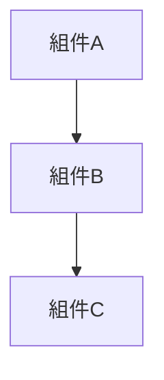
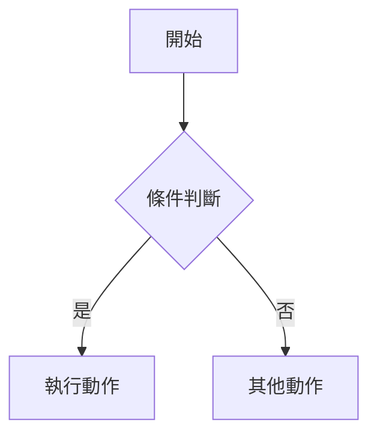
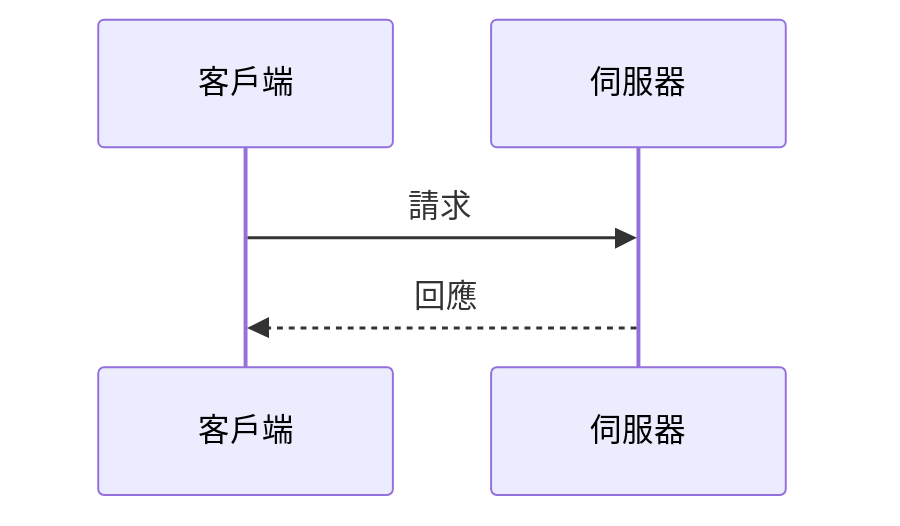
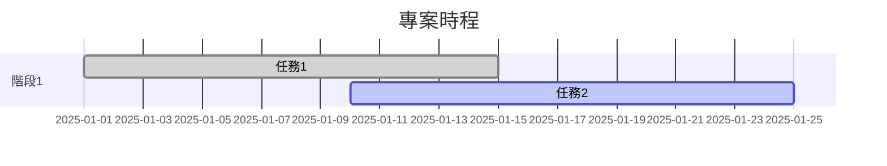

# RosAGV 文檔模板和格式規範

## 📋 概述

本文檔提供 RosAGV 專案規劃文檔的標準化模板和格式規範，確保所有文檔的一致性和 AI Agent 可讀性。

## 📝 標準文檔模板

### 1. 基礎模板結構

```markdown
# 文檔標題

## 📋 概述
簡要描述文檔的目的、範圍和目標讀者。

## 🎯 主要內容
### 1. 第一個主題
詳細描述第一個主題的內容。

### 2. 第二個主題
詳細描述第二個主題的內容。

## 📊 圖表和資料
使用 Mermaid 圖表、表格和其他視覺化元素。

## 🔧 實作細節
具體的技術實作說明和程式碼範例。

## 📝 相關文檔
- [相關文檔1](./related-doc1.md)
- [相關文檔2](./related-doc2.md)

---
**最後更新**: YYYY-MM-DD  
**維護責任**: 責任人角色  
**版本**: vX.Y.Z
```

### 2. 架構文檔模板

```markdown
# [系統/模組] 架構文檔

## 📋 概述
描述架構的目的、設計原則和關鍵決策。

## 🏗️ 架構圖


## 🔧 組件說明
### 組件A
- **職責**: 組件的主要職責
- **介面**: 對外提供的介面
- **依賴**: 依賴的其他組件

### 組件B
- **職責**: 組件的主要職責
- **介面**: 對外提供的介面
- **依賴**: 依賴的其他組件

## 🌐 通訊協定
描述組件間的通訊方式和協定。

## 📊 效能考量
描述效能需求和最佳化策略。

## 🛡️ 安全考量
描述安全需求和防護措施。

## 📝 相關文檔
- [系統總覽](./system-overview.md)
- [技術規格](../specifications/)

---
**最後更新**: YYYY-MM-DD  
**維護責任**: 系統架構師  
**版本**: vX.Y.Z
```

### 3. 需求文檔模板

```markdown
# [功能/系統] 需求規格

## 📋 概述
描述需求的背景、目標和範圍。

## 🎯 功能需求
### FR-001: 功能需求標題
- **描述**: 詳細描述功能需求
- **優先級**: 高/中/低
- **狀態**: ✅ 完成 / 🚧 進行中 / ⚠️ 待處理
- **驗收標準**: 明確的驗收標準

### FR-002: 功能需求標題
- **描述**: 詳細描述功能需求
- **優先級**: 高/中/低
- **狀態**: ✅ 完成 / 🚧 進行中 / ⚠️ 待處理
- **驗收標準**: 明確的驗收標準

## 📊 非功能需求
### NFR-001: 效能需求
- **描述**: 效能需求描述
- **指標**: 具體的效能指標
- **測試方法**: 效能測試方法

### NFR-002: 可靠性需求
- **描述**: 可靠性需求描述
- **指標**: 具體的可靠性指標
- **測試方法**: 可靠性測試方法

## 🔗 依賴關係
描述與其他需求或系統的依賴關係。

## 📝 相關文檔
- [業務流程](./business-processes.md)
- [技術規格](../specifications/)

---
**最後更新**: YYYY-MM-DD  
**維護責任**: 產品經理  
**版本**: vX.Y.Z
```

### 4. 技術規格模板

```markdown
# [技術/API] 規格文檔

## 📋 概述
描述技術規格的目的和適用範圍。

## 🔧 技術架構
描述技術實作的整體架構。

## 📡 API 規格
### API 端點 1
```yaml
端點: /api/v1/endpoint
方法: GET/POST/PUT/DELETE
參數:
  - name: 參數名稱
    type: 參數類型
    required: true/false
    description: 參數描述
回應:
  - status: 200
    description: 成功回應
    schema: 回應資料結構
```

### API 端點 2
類似格式...

## 📊 資料格式
### 資料結構 1
```json
{
  "field1": "string",
  "field2": "integer",
  "field3": {
    "nested_field": "value"
  }
}
```

## 🔍 錯誤處理
描述錯誤處理機制和錯誤碼定義。

## 📝 使用範例
提供具體的使用範例和程式碼片段。

## 📝 相關文檔
- [系統架構](../architecture/)
- [API 測試](../testing/)

---
**最後更新**: YYYY-MM-DD  
**維護責任**: 技術負責人  
**版本**: vX.Y.Z
```

### 5. 測試文檔模板

```markdown
# [功能/系統] 測試規格

## 📋 概述
描述測試的目的、範圍和策略。

## 🎯 測試目標
明確的測試目標和成功標準。

## 📊 測試案例
### TC-001: 測試案例標題
- **目的**: 測試案例的目的
- **前置條件**: 執行測試前的條件
- **測試步驟**: 
  1. 步驟1
  2. 步驟2
  3. 步驟3
- **預期結果**: 預期的測試結果
- **實際結果**: 實際的測試結果
- **狀態**: ✅ 通過 / ❌ 失敗 / ⚠️ 待執行

### TC-002: 測試案例標題
類似格式...

## 🔧 測試環境
描述測試環境的配置和需求。

## 📈 測試指標
| 指標 | 目標值 | 實際值 | 狀態 |
|------|--------|--------|------|
| 測試覆蓋率 | 80% | 75% | 🚧 進行中 |
| 通過率 | 95% | 90% | 🚧 進行中 |

## 📝 相關文檔
- [測試策略](./test-strategy.md)
- [功能需求](../requirements/)

---
**最後更新**: YYYY-MM-DD  
**維護責任**: 測試工程師  
**版本**: vX.Y.Z
```

## 🎨 格式規範

### 1. 標題層級
```markdown
# 一級標題 (文檔標題)
## 二級標題 (主要章節)
### 三級標題 (子章節)
#### 四級標題 (詳細項目)
```

### 2. 表情符號使用
| 符號 | 用途 | 範例 |
|------|------|------|
| 📋 | 概述、總覽 | ## 📋 概述 |
| 🎯 | 目標、重點 | ## 🎯 主要目標 |
| 🏗️ | 架構、結構 | ## 🏗️ 系統架構 |
| 🔧 | 技術、實作 | ## 🔧 技術實作 |
| 📊 | 資料、統計 | ## 📊 效能指標 |
| 🌐 | 網路、通訊 | ## 🌐 通訊協定 |
| 🔄 | 流程、循環 | ## 🔄 工作流程 |
| ⚠️ | 警告、注意 | ⚠️ 重要提醒 |
| ✅ | 完成、成功 | ✅ 已完成 |
| 🚧 | 進行中 | 🚧 開發中 |

### 3. 狀態標記
```markdown
- ✅ **完成**: 功能已實作並通過測試
- 🚧 **進行中**: 正在開發或測試階段
- ⚠️ **待處理**: 已規劃但尚未開始
- ❌ **已取消**: 不再需要或已廢棄
- 🔄 **重構中**: 需要重新設計或改善
```

### 4. 表格格式
```markdown
| 欄位1 | 欄位2 | 欄位3 | 狀態 |
|-------|-------|-------|------|
| 值1   | 值2   | 值3   | ✅ 完成 |
| 值4   | 值5   | 值6   | 🚧 進行中 |
```

### 5. 程式碼區塊
```markdown
# 單行程式碼
使用 `code` 標記單行程式碼

# 多行程式碼
```bash
# Bash 指令
docker compose up -d
```

```python
# Python 程式碼
def example_function():
    return "Hello, World!"
```

```yaml
# YAML 配置
key: value
nested:
  key: value
```
```

### 6. Mermaid 圖表
```markdown
# 流程圖


# 序列圖


# 甘特圖

```

## 📏 文檔品質標準

### 1. 內容品質
- **準確性**: 內容基於實際程式碼現況
- **完整性**: 涵蓋所有必要的資訊
- **一致性**: 術語和格式保持一致
- **可讀性**: 結構清晰，易於理解

### 2. 格式品質
- **標準化**: 遵循統一的模板格式
- **視覺化**: 適當使用圖表和表格
- **導航性**: 清楚的章節結構和交叉引用
- **可維護性**: 易於更新和修改

### 3. 技術品質
- **可執行性**: 程式碼範例可實際執行
- **可驗證性**: 提供驗證步驟和測試方法
- **可重現性**: 其他人可以重現描述的結果
- **可擴展性**: 支援未來的功能擴展

## 🔍 文檔審查檢查清單

### 內容審查
- [ ] 文檔目的和範圍明確
- [ ] 所有章節內容完整
- [ ] 技術資訊準確無誤
- [ ] 範例程式碼可執行
- [ ] 交叉引用連結有效

### 格式審查
- [ ] 遵循標準模板結構
- [ ] 標題層級正確
- [ ] 表情符號使用恰當
- [ ] 表格格式規範
- [ ] 程式碼區塊格式正確

### 品質審查
- [ ] 語言表達清晰
- [ ] 邏輯結構合理
- [ ] 視覺元素有效
- [ ] 版本資訊完整
- [ ] 維護責任明確

## 📝 文檔更新流程

### 1. 更新觸發條件
- 程式碼功能變更
- 系統架構調整
- 需求變更
- 錯誤修正
- 定期審查

### 2. 更新步驟
1. **識別變更**: 確定需要更新的文檔
2. **內容修改**: 根據變更更新文檔內容
3. **格式檢查**: 確保符合格式規範
4. **交叉引用**: 更新相關文檔的引用
5. **版本更新**: 更新版本號和修改日期
6. **審查確認**: 進行同儕審查
7. **提交變更**: 提交到版本控制系統

### 3. 版本控制
```
版本格式: vMajor.Minor.Patch
- Major: 重大結構變更
- Minor: 新增章節或重要內容
- Patch: 小幅修正和更新
```

---

**最後更新**: 2025-01-17  
**維護責任**: 文檔管理員  
**版本**: v1.0.0
