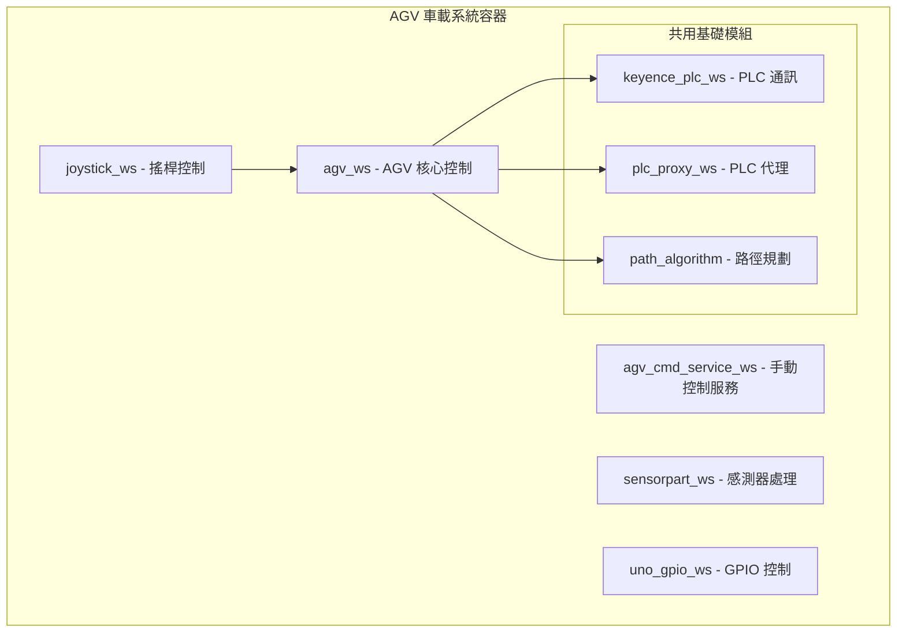
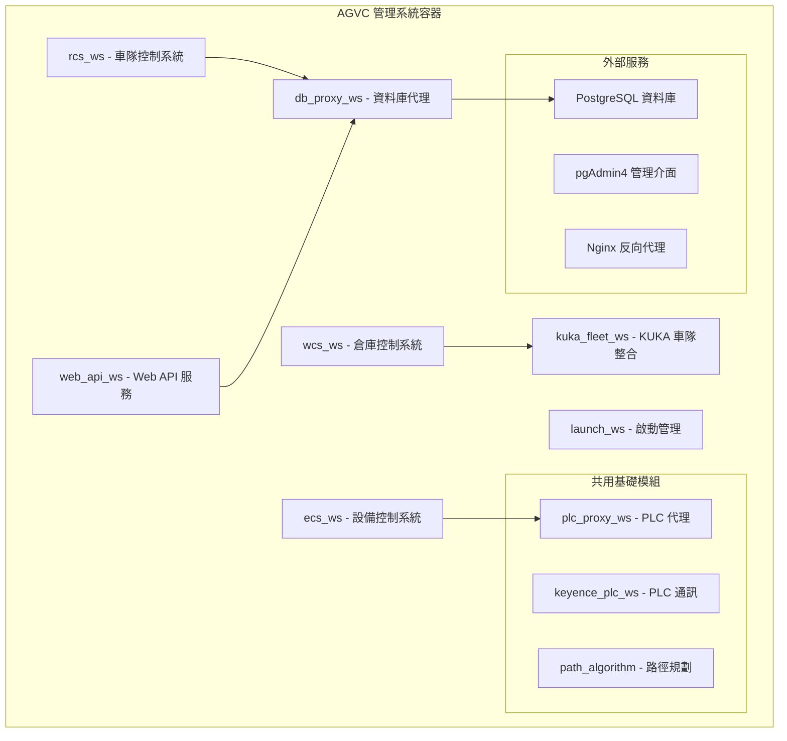
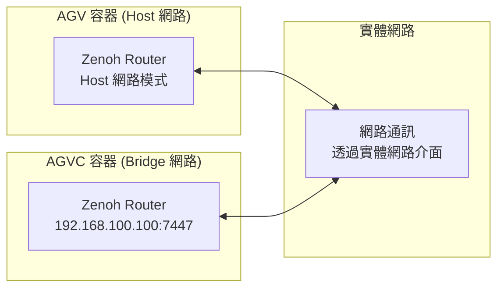

# RosAGV 雙環境容器架構

## 📋 架構概述

RosAGV 採用雙環境容器化架構，將系統分為 AGV 車載系統和 AGVC 管理系統兩個獨立的容器環境，實現職責分離和部署靈活性。

## 🚗 AGV 車載系統 (rosagv)

### 部署位置
- **目標環境**: AGV 車輛上的邊緣計算設備
- **容器名稱**: `rosagv`
- **Docker 映像**: `yazelin/agv:latest`
- **Docker Compose**: `docker-compose.yml`
- **啟動腳本**: `startup.agv.bash`

### 核心職責
- AGV 即時控制和狀態管理
- PLC 設備直接通訊
- 感測器資料處理
- 手動控制（搖桿）支援
- 路徑規劃和導航執行

### 包含的工作空間


### 啟動狀態
- ✅ **自動啟動**: `ros2 launch loader_agv launch.py`
  - agv_ws (Loader AGV 節點)
  - joystick_ws (joy_linux_node)
  - sensorpart_ws (感測器節點)
- ✅ **自動載入**: 所有工作空間環境
- ⚠️ **手動啟動**: agv_cmd_service_ws, uno_gpio_ws

### 網路配置
```yaml
# docker-compose.yml 網路設定
services:
  rosagv:
    image: yazelin/agv:latest
    container_name: rosagv
    network_mode: "host"     # 使用主機網路模式
    privileged: true         # 完整裝置存取權限
    devices:
      - "/dev/input:/dev/input"  # 掛載輸入裝置 (搖桿)
    restart: unless-stopped  # 自動重啟策略
```

## 🖥️ AGVC 管理系統 (agvc_server)

### 部署位置
- **目標環境**: AGVC 管理中心伺服器
- **容器名稱**: `agvc_server`
- **Docker 映像**: `yazelin/agvc:latest`
- **Docker Compose**: `docker-compose.agvc.yml`
- **啟動腳本**: `startup.agvc.bash`

### 核心職責
- 車隊管理和任務調度
- 資料庫管理和資料持久化
- Web 管理介面服務
- 外部系統整合（KUKA Fleet）
- 系統監控和日誌管理

### 包含的工作空間


### 啟動狀態
- ✅ **自動啟動**: PostgreSQL, pgAdmin4, Nginx
- ✅ **自動載入**: 所有工作空間環境
- ⚠️ **手動啟動**: 所有 ROS 2 節點（透過 launch_ws 管理）

### 網路配置
```yaml
# docker-compose.agvc.yml 網路設定
networks:
  bridge_network:
    driver: bridge
    ipam:
      config:
        - subnet: 192.168.100.0/24
          gateway: 192.168.100.1

services:
  agvc_server:
    networks:
      bridge_network:
        ipv4_address: 192.168.100.100  # 固定 IP
        mac_address: "02:42:00:00:00:01"  # 固定 MAC 地址
    ports:
      - "7447:7447"    # Zenoh Router
      - "2200:2200"    # SSH 服務
      - "8000:8000"    # FastAPI (web_api)
      - "8001:8001"    # FastAPI (agvc.ui)
      - "8002:8002"    # FastAPI (op.ui)
      - "5173:5173"    # Vue 開發伺服器

  postgres:
    networks:
      bridge_network:
        ipv4_address: 192.168.100.254  # 固定 IP
    ports:
      - "5432:5432"    # PostgreSQL

  pgadmin:
    networks:
      bridge_network:
        ipv4_address: 192.168.100.101  # 固定 IP
    ports:
      - "5050:80"      # pgAdmin4

  nginx:
    networks:
      bridge_network:
        ipv4_address: 192.168.100.252  # 固定 IP
    ports:
      - "80:80"        # Nginx (AGVCUI)
```

## 🌐 跨容器通訊

### Zenoh Router 跨容器通訊


### 通訊協定
- **ROS 2 通訊**: 透過 Zenoh RMW 跨容器通訊
- **AGV 網路模式**: Host 網路模式，直接使用主機網路介面
- **AGVC 網路模式**: Bridge 網路模式，使用固定 IP 192.168.100.0/24
- **資料庫存取**: AGVC 容器獨占 PostgreSQL (192.168.100.254:5432)
- **Web 服務**: AGVC 容器提供統一 Web 介面
- **PLC 通訊**: 兩個容器都可直接存取 PLC 設備

## 🔧 詳細容器配置

### AGV 車載系統環境變數
```yaml
environment:
  CONTAINER_TYPE: "agv"                              # 容器類型識別
  ZENOH_ROUTER_CONFIG_URI: "/app/routerconfig.json5" # Zenoh Router 配置檔案
  RMW_IMPLEMENTATION: "rmw_zenoh_cpp"                # ROS 2 RMW 實作
  SDL_AUDIODRIVER: dummy                             # 避免 pygame ALSA 錯誤
```

### AGV 車載系統資料卷掛載
```yaml
volumes:
  - ~/RosAGV/app:/app                               # 主要應用程式目錄
devices:
  - "/dev/input:/dev/input"                         # 輸入裝置 (搖桿)
```

### AGVC 管理系統環境變數
```yaml
# agvc_server 服務
environment:
  CONTAINER_TYPE: "agvc"                            # 容器類型識別
  DISPLAY: $DISPLAY                                 # X11 顯示支援
  ZENOH_ROUTER_CONFIG_URI: "/app/routerconfig.json5" # Zenoh Router 配置
  RMW_IMPLEMENTATION: "rmw_zenoh_cpp"               # ROS 2 RMW 實作

# postgres 服務
environment:
  POSTGRES_USER: postgres                           # 系統管理員帳號
  POSTGRES_PASSWORD: password                       # 系統管理員密碼
  POSTGRES_DB: postgres                             # 預設資料庫

# pgadmin 服務
environment:
  PGADMIN_DEFAULT_EMAIL: yazelin@ching-tech.com     # pgAdmin 登入帳號
  PGADMIN_DEFAULT_PASSWORD: password                # pgAdmin 登入密碼
```

### AGVC 管理系統資料卷掛載
```yaml
# agvc_server 服務
volumes:
  - ~/RosAGV/app:/app:rw                            # 主要應用程式目錄
  - ~/RosAGV/docker-compose.agvc.yml:/app/host/docker-compose.agvc.yml:ro
  - ~/RosAGV/docker-compose.yml:/app/host/docker-compose.yml:ro
  - ~/RosAGV/Dockerfile:/app/host/Dockerfile:ro
  - ~/RosAGV/Dockerfile.agvc:/app/host/Dockerfile.agvc:ro
  - ~/RosAGV/README.md:/app/host/README.md:rw
  - ~/RosAGV/.augment-guidelines:/app/host/.augment-guidelines:rw
  - /tmp/.X11-unix:/tmp/.X11-unix:rw                # X11 支援 (Ubuntu)

# nginx 服務
volumes:
  - ~/RosAGV/nginx:/etc/nginx/conf.d:ro             # Nginx 配置檔案

# postgres 服務
volumes:
  - postgres_data:/var/lib/postgresql/data          # PostgreSQL 資料存儲

# pgadmin 服務
volumes:
  - pgadmin_data:/var/lib/pgadmin                   # pgAdmin 配置存儲
```

## 🔧 容器管理

### 建置和啟動
```bash
# AGV 車載系統
docker compose -f docker-compose.yml up -d

# AGVC 管理系統
docker compose -f docker-compose.agvc.yml up -d

# 檢查狀態
docker compose -f docker-compose.yml ps
docker compose -f docker-compose.agvc.yml ps

# 重建映像 (如需要)
docker compose -f docker-compose.yml up -d --build --force-recreate
docker compose -f docker-compose.agvc.yml up -d --build --force-recreate
```

### 進入容器
```bash
# 進入 AGV 容器
docker compose -f docker-compose.yml exec rosagv bash

# 進入 AGVC 容器
docker compose -f docker-compose.agvc.yml exec agvc_server bash

# 進入其他 AGVC 服務
docker compose -f docker-compose.agvc.yml exec postgres bash
docker compose -f docker-compose.agvc.yml exec pgadmin bash
docker compose -f docker-compose.agvc.yml exec nginx bash
```

### 日誌管理
```bash
# 查看容器日誌
docker compose -f docker-compose.yml logs -f rosagv
docker compose -f docker-compose.agvc.yml logs -f agvc_server

# 查看特定服務日誌
docker compose -f docker-compose.agvc.yml logs -f postgres
docker compose -f docker-compose.agvc.yml logs -f pgadmin
docker compose -f docker-compose.agvc.yml logs -f nginx

# 查看所有 AGVC 服務日誌
docker compose -f docker-compose.agvc.yml logs -f

# 查看最近的日誌 (最後 100 行)
docker compose -f docker-compose.agvc.yml logs --tail=100 agvc_server
```

## 🐳 Docker 映像配置

### AGV 車載系統映像 (yazelin/agv:latest)
```dockerfile
# 基礎映像
FROM osrf/ros:jazzy-desktop-full

# 核心組件
- ROS 2 Jazzy Desktop Full
- rmw_zenoh_cpp (Zenoh RMW 實作)
- Python 虛擬環境 (/opt/pyvenv_env)
- SSH 服務 (port 2200)
- 研華 UNO-137 GPIO 支援

# 虛擬環境套件
- fastapi, uvicorn, pydantic
- pygame (搖桿支援)
- sqlalchemy, psycopg2, sqlmodel
- networkx (路徑規劃)
- python-socketio, requests

# 系統工具
- net-tools, iputils-ping, telnet
- gpiod, python3-libgpiod
- ros-jazzy-joy-linux
- 開發工具: git, cargo, clang, fzf, ripgrep

# 使用者配置
- root 使用者 (密碼: 36274806)
- ct 使用者 (密碼: 36274806, sudo 權限)
```

### AGVC 管理系統映像 (yazelin/agvc:latest)
```dockerfile
# 基礎映像
FROM osrf/ros:jazzy-desktop-full

# 核心組件
- ROS 2 Jazzy Desktop Full
- rmw_zenoh_cpp (Zenoh RMW 實作)
- Python 虛擬環境 (/opt/pyvenv_env)
- Node.js LTS (Web 開發支援)
- SSH 服務 (port 2200)

# 虛擬環境套件 (與 AGV 相同)
- fastapi, uvicorn, pydantic
- sqlalchemy, psycopg2, sqlmodel
- networkx, python-socketio
- python-multipart, jinja2

# 系統工具 (與 AGV 相同)
- 網路工具、開發工具、除錯工具

# 使用者配置 (與 AGV 相同)
- root 和 ct 使用者配置
```

### 第三方服務映像
```yaml
# PostgreSQL 資料庫
postgres:latest
- 預設使用者: postgres/password
- 預設資料庫: postgres
- 資料持久化: postgres_data 卷

# pgAdmin4 管理介面
dpage/pgadmin4:latest
- 預設帳號: yazelin@ching-tech.com/password
- 配置持久化: pgadmin_data 卷

# Nginx 反向代理
nginx:latest
- 配置檔案: ~/RosAGV/nginx
- 服務 AGVCUI 靜態檔案
```

## 📊 資源分配

### AGV 車載系統資源需求
```yaml
# 建議硬體規格
CPU: 4 cores (ARM64 或 x86_64)
RAM: 8GB
Storage: 64GB SSD
Network: Ethernet + WiFi (Host 網路模式)
GPIO: 研華 UNO-137 支援
USB: 搖桿裝置支援 (/dev/input)

# 容器配置
privileged: true                    # 完整裝置存取權限
network_mode: "host"               # 主機網路模式
restart: unless-stopped            # 自動重啟策略
```

### AGVC 管理系統資源需求
```yaml
# 建議硬體規格
CPU: 8 cores (x86_64)
RAM: 16GB
Storage: 256GB SSD
Network: Gigabit Ethernet
Database: PostgreSQL 專用儲存

# 容器配置
privileged: true                    # 完整系統權限
restart: always                     # 總是自動重啟
networks: bridge_network            # 自訂橋接網路
volumes: postgres_data, pgadmin_data # 持久化資料卷
```

## 🔄 部署策略

### 開發環境
- 單機部署：兩個容器在同一台機器上
- 共用網路：使用 Docker 橋接網路
- 開發工具：VS Code Remote Container

### 生產環境
- 分散部署：AGV 容器在車輛上，AGVC 容器在伺服器上
- 網路連線：透過 WiFi 或 4G/5G 連線
- 高可用性：AGVC 系統支援叢集部署

### 測試環境
- 模擬部署：使用 Docker Compose 模擬多車環境
- 整合測試：跨容器功能測試
- 效能測試：負載和壓力測試

## 🛡️ 安全考量

### 網路安全
- 容器間通訊加密
- 防火牆規則配置
- VPN 連線支援

### 資料安全
- 資料庫加密
- 備份和恢復機制
- 存取控制和認證

### 系統安全
- 容器映像安全掃描
- 定期安全更新
- 日誌監控和警報

## 📝 相關文檔

- [系統架構總覽](./system-overview.md)
- [技術棧選擇和整合](./technology-stack.md)
- [部署程序指南](../maintenance/deployment-procedures.md)
- [監控和警報機制](../maintenance/monitoring-alerting.md)

---

**最後更新**: 2025-01-17  
**維護責任**: DevOps 工程師  
**版本**: v1.0.0
