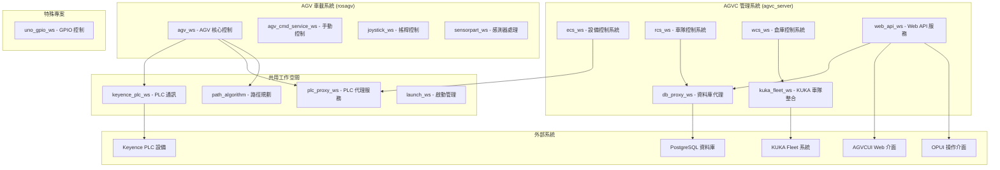

# RosAGV 系統架構總覽

## 📋 系統概述

RosAGV 是一個大型 ROS 2 專案，採用雙環境容器化架構，支援 AGV 車載系統和 AGVC 管理系統的統一管理。系統包含 15 個工作空間，實現完整的 AGV 車隊管理、倉庫控制和任務執行功能。

## 🏗️ 整體架構圖



## 🔧 核心模組關係

### 1. AGV 車載系統模組
- **agv_ws**: 核心控制邏輯，狀態機管理
- **agv_cmd_service_ws**: 手動控制命令服務
- **joystick_ws**: USB 搖桿控制介面
- **sensorpart_ws**: 感測器資料處理

### 2. AGVC 管理系統模組
- **ecs_ws**: 設備控制和監控
- **rcs_ws**: 車隊任務派發和管理
- **wcs_ws**: 倉庫控制和決策
- **web_api_ws**: RESTful API 服務
- **db_proxy_ws**: 資料庫連線和 ORM
- **kuka_fleet_ws**: KUKA 車隊系統整合

### 3. 共用基礎模組
- **keyence_plc_ws**: Keyence PLC 底層通訊
- **plc_proxy_ws**: PLC ROS 2 服務代理
- **path_algorithm**: A* 路徑規劃演算法
- **launch_ws**: 系統啟動和配置管理

### 4. 硬體整合模組
- **uno_gpio_ws**: 研華 UNO-137 GPIO 控制

## 🌐 通訊架構

### ROS 2 通訊層
- **RMW 實作**: Zenoh RMW (rmw_zenoh_cpp)
- **通訊協定**: DDS over Zenoh
- **AGV 網路**: Host 網路模式 (直接使用主機網路)
- **AGVC 網路**: Bridge 網路 192.168.100.0/24 (port 7447)
- **命名空間**: 統一使用 `/agvc` 命名空間

### 資料庫層
- **主資料庫**: PostgreSQL (192.168.100.254:5432)
- **ORM 框架**: SQLModel + SQLAlchemy
- **連線池**: 自訂 ConnectionPoolManager
- **管理介面**: pgAdmin4 (192.168.100.101:80 → localhost:5050)

### Web 服務層
- **核心 API 服務**: FastAPI (port 8000) - PLC/門控制/交通管制/KUKA Fleet API
- **AGVCUI 服務**: FastAPI (port 8001) - AGV 車隊管理介面 + Socket.IO
- **OPUI 服務**: FastAPI (port 8002) - 機台操作介面
- **Vue 開發服務**: Vite (port 5173) - 前端開發伺服器
- **反向代理**: Nginx (192.168.100.252:80) - 靜態檔案服務
- **認證機制**: JWT Token + 中介軟體認證

### 硬體通訊層
- **PLC 通訊**: Keyence PLC (TCP/IP port 8501)
- **KUKA 整合**: KUKA Fleet API (HTTP port 10870)
- **GPIO 控制**: libgpiod (研華 UNO-137)

## 📊 系統狀態總覽

### ✅ 完全實作的模組 (11個)
- keyence_plc_ws, plc_proxy_ws, path_algorithm, launch_ws
- agv_ws (Loader AGV), joystick_ws, sensorpart_ws
- db_proxy_ws, web_api_ws, kuka_fleet_ws, uno_gpio_ws

### 🚧 部分實作的模組 (2個)
- agv_ws (Cargo Mover AGV, Unloader AGV)
- agv_cmd_service_ws (基礎架構完成，功能待擴展)

### ⚠️ 手動啟動的模組 (7個)
- agv_cmd_service_ws, db_proxy_ws, ecs_ws, rcs_ws
- wcs_ws, web_api_ws, kuka_fleet_ws

### ✅ 自動啟動的模組 (3個)
- agv_ws (透過 loader_agv launch)
- joystick_ws (透過 loader_agv launch)
- sensorpart_ws (透過 loader_agv launch)

## 🔄 資料流向

### 1. AGV 控制流
```
搖桿輸入 → joystick_ws → agv_ws → plc_proxy_ws → keyence_plc_ws → PLC 設備
```

### 2. 任務管理流
```
Web UI → web_api_ws → db_proxy_ws → PostgreSQL
                  ↓
rcs_ws → wcs_ws → kuka_fleet_ws → KUKA Fleet
```

### 3. 狀態監控流
```
PLC 設備 → keyence_plc_ws → plc_proxy_ws → ecs_ws → db_proxy_ws → PostgreSQL
```

### 4. 路徑規劃流
```
任務請求 → agv_ws → path_algorithm → A* 演算法 → 路徑結果
```

## 🎯 設計原則

### 1. 模組化設計
- 每個工作空間職責單一且明確
- 鬆耦合、高內聚的模組關係
- 標準化的 ROS 2 介面

### 2. 容器化部署
- 雙環境隔離：AGV 車載 vs AGVC 管理
- Docker Compose 統一管理
- 環境特定的配置和啟動腳本

### 3. 可擴展性
- 支援多種 AGV 車型
- 可插拔的車隊系統整合
- 靈活的任務派發機制

### 4. 可靠性
- 完整的錯誤處理和恢復機制
- 連線池和自動重連
- 健康檢查和監控

## 📝 相關文檔

- [容器架構詳細說明](./container-architecture.md)
- [技術棧選擇和整合](./technology-stack.md)
- [工作空間依賴關係](./workspace-dependencies.md)
- [通訊協定規範](./communication-protocols.md)

---

**最後更新**: 2025-01-17  
**維護責任**: 系統架構師  
**版本**: v1.0.0
