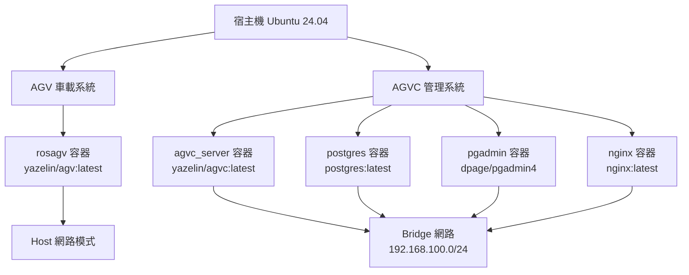

# RosAGV 部署程序指南

## 📋 概述

本文檔提供 RosAGV 系統的完整部署程序，包括環境準備、容器部署、配置驗證和故障排除。

## 🎯 部署架構總覽

### 雙環境部署模式


## 🔧 環境準備

### 1. 系統需求檢查
```bash
# 檢查作業系統版本
lsb_release -a
# 預期: Ubuntu 24.04 LTS

# 檢查 Docker 版本
docker --version
# 預期: Docker version 20.10+ 

# 檢查 Docker Compose 版本
docker compose version
# 預期: Docker Compose version v2.0+

# 檢查可用磁碟空間
df -h
# 建議: 至少 50GB 可用空間

# 檢查記憶體
free -h
# 建議: 至少 16GB RAM
```

### 2. 目錄結構準備
```bash
# 確認專案目錄結構
cd ~/RosAGV
ls -la

# 必要檔案檢查
required_files=(
    "docker-compose.yml"
    "docker-compose.agvc.yml"
    "Dockerfile"
    "Dockerfile.agvc"
    "app/startup.agv.bash"
    "app/startup.agvc.bash"
    "app/setup.bash"
)

for file in "${required_files[@]}"; do
    if [ -f "$file" ]; then
        echo "✅ $file 存在"
    else
        echo "❌ $file 缺失"
    fi
done
```

### 3. 網路配置準備
```bash
# 檢查端口可用性
ports_to_check=(80 2200 5432 5050 7447 8000 8001 8002 5173)

for port in "${ports_to_check[@]}"; do
    if netstat -tulpn | grep ":$port " > /dev/null; then
        echo "⚠️ 端口 $port 已被使用"
    else
        echo "✅ 端口 $port 可用"
    fi
done

# X11 支援設定 (Ubuntu 桌面環境)
xhost +local:
echo "✅ X11 本地存取已啟用"
```

## 🚀 部署步驟

### 第一階段：AGVC 管理系統部署

#### 1. 啟動 AGVC 管理系統
```bash
# 進入專案目錄
cd ~/RosAGV

# 啟動 AGVC 管理系統 (包含所有服務)
docker compose -f docker-compose.agvc.yml up -d

# 檢查服務狀態
docker compose -f docker-compose.agvc.yml ps
```

#### 2. 驗證 AGVC 服務
```bash
# 檢查容器狀態
docker compose -f docker-compose.agvc.yml ps
# 預期: 所有服務狀態為 "Up"

# 檢查網路配置
docker network inspect rosagv_bridge_network

# 檢查固定 IP 分配
docker compose -f docker-compose.agvc.yml exec agvc_server ip addr show
# 預期: 192.168.100.100

# 檢查 PostgreSQL 連線
docker compose -f docker-compose.agvc.yml exec postgres pg_isready
# 預期: accepting connections

# 檢查 pgAdmin 存取
curl -f http://localhost:5050 || echo "pgAdmin 未就緒"

# 檢查 Nginx 存取
curl -f http://localhost:80 || echo "Nginx 未就緒"
```

#### 3. 驗證 Zenoh Router
```bash
# 檢查 Zenoh Router 狀態
docker compose -f docker-compose.agvc.yml exec agvc_server bash -c "
ps aux | grep zenoh
netstat -tulpn | grep 7447
"
```

### 第二階段：AGV 車載系統部署

#### 1. 啟動 AGV 車載系統
```bash
# 啟動 AGV 車載系統
docker compose -f docker-compose.yml up -d

# 檢查服務狀態
docker compose -f docker-compose.yml ps
```

#### 2. 驗證 AGV 服務
```bash
# 檢查容器狀態
docker compose -f docker-compose.yml ps
# 預期: rosagv 狀態為 "Up"

# 檢查網路模式 (Host 模式)
docker compose -f docker-compose.yml exec rosagv ip addr show
# 預期: 顯示主機網路介面

# 檢查輸入裝置掛載
docker compose -f docker-compose.yml exec rosagv ls -la /dev/input/
# 預期: 顯示搖桿裝置

# 檢查 ROS 2 環境
docker compose -f docker-compose.yml exec rosagv bash -c "
source /app/setup.bash
ros2 node list
"
```

## 🔍 部署驗證

### 1. 服務健康檢查
```bash
# 建立健康檢查腳本
cat > ~/RosAGV/scripts/health-check.sh << 'EOF'
#!/bin/bash

echo "=== RosAGV 系統健康檢查 ==="

# 檢查 AGVC 服務
echo "檢查 AGVC 管理系統..."
docker compose -f docker-compose.agvc.yml ps --format "table {{.Name}}\t{{.Status}}\t{{.Ports}}"

# 檢查 AGV 服務
echo "檢查 AGV 車載系統..."
docker compose -f docker-compose.yml ps --format "table {{.Name}}\t{{.Status}}\t{{.Ports}}"

# 檢查關鍵端口
echo "檢查關鍵端口..."
for port in 80 2200 5432 5050 7447 8000; do
    if netstat -tulpn | grep ":$port " > /dev/null; then
        echo "✅ 端口 $port 正在監聽"
    else
        echo "❌ 端口 $port 未監聽"
    fi
done

# 檢查資料庫連線
echo "檢查資料庫連線..."
docker compose -f docker-compose.agvc.yml exec -T postgres pg_isready

# 檢查 Zenoh Router
echo "檢查 Zenoh Router..."
docker compose -f docker-compose.agvc.yml exec -T agvc_server bash -c "
if pgrep -f rmw_zenohd > /dev/null; then
    echo '✅ Zenoh Router 運行中'
else
    echo '❌ Zenoh Router 未運行'
fi
"

echo "=== 健康檢查完成 ==="
EOF

chmod +x ~/RosAGV/scripts/health-check.sh

# 執行健康檢查
~/RosAGV/scripts/health-check.sh
```

### 2. 功能驗證測試
```bash
# 測試 ROS 2 通訊
docker compose -f docker-compose.yml exec rosagv bash -c "
source /app/setup.bash
ros2 topic list | grep -E '(agv|plc|zenoh)'
"

# 測試 PLC 服務
docker compose -f docker-compose.yml exec rosagv bash -c "
source /app/setup.bash
ros2 service list | grep plc
"

# 測試 Web API
curl -f http://localhost:8000/health || echo "Web API 未就緒"

# 測試資料庫查詢
docker compose -f docker-compose.agvc.yml exec postgres bash -c "
psql -U postgres -c 'SELECT version();'
"
```

## 🔧 配置管理

### 1. 環境變數配置
```bash
# 檢查 AGV 容器環境變數
docker compose -f docker-compose.yml exec rosagv printenv | grep -E "(CONTAINER_TYPE|ZENOH|RMW)"

# 檢查 AGVC 容器環境變數
docker compose -f docker-compose.agvc.yml exec agvc_server printenv | grep -E "(CONTAINER_TYPE|ZENOH|RMW|DISPLAY)"
```

### 2. 資料卷驗證
```bash
# 檢查 AGV 資料卷掛載
docker compose -f docker-compose.yml exec rosagv bash -c "
ls -la /app/
ls -la /dev/input/
"

# 檢查 AGVC 資料卷掛載
docker compose -f docker-compose.agvc.yml exec agvc_server bash -c "
ls -la /app/
ls -la /app/host/
ls -la /tmp/.X11-unix/
"

# 檢查 PostgreSQL 資料卷
docker volume ls | grep postgres
docker compose -f docker-compose.agvc.yml exec postgres bash -c "
ls -la /var/lib/postgresql/data/
"
```

## 🚨 常見部署問題

### 1. 端口衝突
```bash
# 問題: 端口已被使用
# 解決方案: 檢查並停止衝突服務
sudo netstat -tulpn | grep :80
sudo systemctl stop apache2  # 如果 Apache 佔用 80 端口
```

### 2. 權限問題
```bash
# 問題: Docker 權限不足
# 解決方案: 將使用者加入 docker 群組
sudo usermod -aG docker $USER
newgrp docker
```

### 3. 映像拉取失敗
```bash
# 問題: 無法拉取 Docker 映像
# 解決方案: 檢查網路連線和 Docker Hub 存取
docker pull yazelin/agv:latest
docker pull yazelin/agvc:latest
```

### 4. X11 顯示問題
```bash
# 問題: GUI 應用程式無法顯示
# 解決方案: 重新設定 X11 權限
xhost +local:
export DISPLAY=:0
```

## 📝 部署檢查清單

### 部署前檢查
- [ ] 系統需求滿足 (Ubuntu 24.04, Docker, Docker Compose)
- [ ] 必要檔案存在 (docker-compose.yml, Dockerfile 等)
- [ ] 端口可用性確認
- [ ] 網路配置準備
- [ ] X11 權限設定

### 部署後驗證
- [ ] 所有容器正常啟動
- [ ] 網路配置正確
- [ ] 服務健康檢查通過
- [ ] ROS 2 通訊正常
- [ ] 資料庫連線成功
- [ ] Web 介面可存取

### 功能測試
- [ ] PLC 服務可用
- [ ] Zenoh Router 運行
- [ ] 搖桿裝置識別
- [ ] 路徑規劃服務
- [ ] Web API 回應

---

**最後更新**: 2025-01-17  
**維護責任**: DevOps 工程師  
**版本**: v1.0.0
