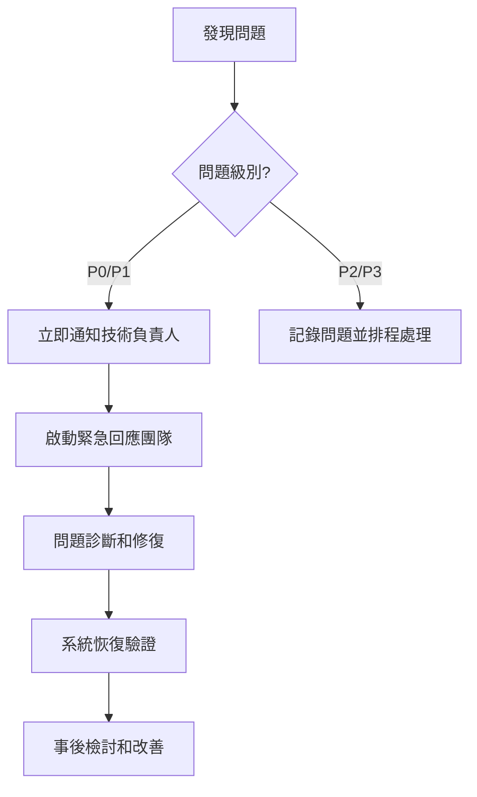

# RosAGV 故障排除指南

## 📋 概述

本文檔提供 RosAGV 系統的完整故障排除指南，涵蓋常見問題的診斷和解決方案。

## 🚨 緊急故障處理流程

### 緊急情況分級
| 級別 | 描述 | 回應時間 | 處理優先級 |
|------|------|----------|------------|
| P0 - 緊急 | 系統完全停機 | 15 分鐘 | 最高 |
| P1 - 高 | 核心功能異常 | 1 小時 | 高 |
| P2 - 中 | 部分功能異常 | 4 小時 | 中 |
| P3 - 低 | 輕微問題 | 24 小時 | 低 |

### 緊急聯絡流程


## 🔧 系統層級故障排除

### 1. 容器啟動問題

#### 問題症狀
- 容器無法啟動
- 容器啟動後立即退出
- 健康檢查失敗

#### 診斷步驟
```bash
# 檢查容器狀態
docker compose -f docker-compose.yml ps
docker compose -f docker-compose.agvc.yml ps

# 查看容器日誌
docker compose -f docker-compose.yml logs rosagv
docker compose -f docker-compose.agvc.yml logs agvc_server

# 檢查映像完整性
docker images | grep rosagv
docker inspect rosagv:latest

# 檢查資源使用
docker stats
df -h
free -h
```

#### 常見解決方案
```bash
# 重建映像
docker compose -f docker-compose.yml down
docker compose -f docker-compose.yml up -d --build --force-recreate

# 清理 Docker 資源
docker system prune -f
docker volume prune -f

# 檢查端口衝突
netstat -tulpn | grep -E "(2200|2201|5432|7447)"
```

### 2. Zenoh Router 連線問題

#### 問題症狀
- ROS 2 節點間無法通訊
- Zenoh Router 無法啟動
- 跨容器通訊失敗

#### 診斷步驟
```bash
# 檢查 Zenoh Router 狀態
docker compose -f docker-compose.yml exec rosagv bash -c "
ps aux | grep zenoh
cat /tmp/zenoh_router.pid
"

# 檢查 Zenoh 配置
docker compose -f docker-compose.yml exec rosagv bash -c "
cat /app/config/routerconfig.json5
"

# 檢查網路連線
docker compose -f docker-compose.yml exec rosagv bash -c "
netstat -tulpn | grep 7447
ping agvc_server
"
```

#### 解決方案
```bash
# 重啟 Zenoh Router
docker compose -f docker-compose.yml exec rosagv bash -c "
pkill -f rmw_zenohd
/opt/ros/jazzy/lib/rmw_zenoh_cpp/rmw_zenohd &
"

# 檢查防火牆設定
sudo ufw status
sudo iptables -L

# 重新配置網路
docker network ls
docker network inspect rosagv_rosagv_network
```

### 3. 資料庫連線問題

#### 問題症狀
- PostgreSQL 連線失敗
- 資料庫查詢超時
- 連線池耗盡

#### 診斷步驟
```bash
# 檢查 PostgreSQL 狀態
docker compose -f docker-compose.agvc.yml exec postgres bash -c "
pg_isready -h localhost -p 5432
"

# 檢查資料庫連線
docker compose -f docker-compose.agvc.yml exec agvc_server bash -c "
python3 -c 'import psycopg2; conn = psycopg2.connect(host=\"postgres\", port=5432, database=\"agvc_db\", user=\"agvc_user\", password=\"agvc_password\"); print(\"Connection OK\")'
"

# 檢查連線池狀態
docker compose -f docker-compose.agvc.yml logs agvc_server | grep -i "connection"
```

#### 解決方案
```bash
# 重啟 PostgreSQL
docker compose -f docker-compose.agvc.yml restart postgres

# 檢查資料庫配置
docker compose -f docker-compose.agvc.yml exec postgres bash -c "
cat /var/lib/postgresql/data/postgresql.conf | grep -E '(max_connections|shared_buffers)'
"

# 清理連線
docker compose -f docker-compose.agvc.yml exec postgres bash -c "
psql -U agvc_user -d agvc_db -c 'SELECT pg_terminate_backend(pid) FROM pg_stat_activity WHERE state = \"idle\";'
"
```

## 🔌 工作空間特定問題

### 1. PLC 通訊問題 (keyence_plc_ws)

#### 問題症狀
- PLC 連線超時
- 資料讀寫失敗
- 連線池耗盡

#### 診斷步驟
```bash
# 檢查 PLC 網路連線
ping 192.168.100.100  # PLC IP 位址
telnet 192.168.100.100 8501

# 檢查 PLC 服務狀態
docker compose -f docker-compose.yml exec rosagv bash -c "
python3 -c 'from keyence_plc.plc_client import PLCClient; client = PLCClient(); print(client.test_connection())'
"

# 檢查連線池狀態
docker compose -f docker-compose.yml logs rosagv | grep -i "plc"
```

#### 解決方案
```bash
# 重置 PLC 連線
docker compose -f docker-compose.yml restart rosagv

# 檢查 PLC 設定
# 確認 PLC IP 位址和端口設定
# 檢查網路設備狀態

# 調整連線池參數
# 編輯 /app/config/plc_config.yaml
# 增加 max_connections 或 timeout 值
```

### 2. AGV 控制問題 (agv_ws)

#### 問題症狀
- AGV 狀態異常
- 任務執行失敗
- 路徑規劃錯誤

#### 診斷步驟
```bash
# 檢查 AGV 節點狀態
docker compose -f docker-compose.yml exec rosagv bash -c "
ros2 node list | grep agv
ros2 topic list | grep agv
"

# 檢查 AGV 狀態發布
docker compose -f docker-compose.yml exec rosagv bash -c "
ros2 topic echo /agvc/agv_status --once
"

# 檢查路徑規劃服務
docker compose -f docker-compose.yml exec rosagv bash -c "
ros2 service list | grep path
"
```

#### 解決方案
```bash
# 重啟 AGV 節點
docker compose -f docker-compose.yml exec rosagv bash -c "
pkill -f loader_agv
ros2 launch loader_agv launch.py &
"

# 檢查配置檔案
docker compose -f docker-compose.yml exec rosagv bash -c "
cat /app/config/agv_config.yaml
"

# 重置 AGV 狀態
# 透過 PLC 重置 AGV 狀態機
```

### 3. Web API 問題 (web_api_ws)

#### 問題症狀
- API 回應超時
- 認證失敗
- 資料格式錯誤

#### 診斷步驟
```bash
# 檢查 FastAPI 服務狀態
docker compose -f docker-compose.agvc.yml exec agvc_server bash -c "
curl -f http://localhost:8000/health || echo 'API not responding'
"

# 檢查 API 日誌
docker compose -f docker-compose.agvc.yml logs agvc_server | grep -i "fastapi"

# 檢查認證服務
docker compose -f docker-compose.agvc.yml exec agvc_server bash -c "
curl -X POST http://localhost:8000/auth/login -H 'Content-Type: application/json' -d '{\"username\":\"test\",\"password\":\"test\"}'
"
```

#### 解決方案
```bash
# 重啟 Web API 服務
docker compose -f docker-compose.agvc.yml restart agvc_server

# 檢查環境變數
docker compose -f docker-compose.agvc.yml exec agvc_server bash -c "
printenv | grep -E '(JWT|API|DATABASE)'
"

# 清理 API 快取
# 重啟相關服務或清理快取資料
```

## 📊 效能問題診斷

### 1. 系統效能監控

#### 監控指令
```bash
# CPU 和記憶體使用率
docker stats --no-stream

# 磁碟使用率
df -h
docker system df

# 網路連線狀態
netstat -tulpn | grep -E "(2200|2201|5432|7447|8000)"

# 程序狀態
docker compose -f docker-compose.yml exec rosagv bash -c "
top -bn1 | head -20
"
```

#### 效能基準
| 指標 | 正常範圍 | 警告閾值 | 緊急閾值 |
|------|----------|----------|----------|
| CPU 使用率 | < 70% | 70-85% | > 85% |
| 記憶體使用率 | < 80% | 80-90% | > 90% |
| 磁碟使用率 | < 80% | 80-90% | > 90% |
| 網路延遲 | < 10ms | 10-50ms | > 50ms |

### 2. 資料庫效能問題

#### 診斷查詢
```sql
-- 檢查活躍連線
SELECT count(*) FROM pg_stat_activity;

-- 檢查慢查詢
SELECT query, mean_time, calls 
FROM pg_stat_statements 
ORDER BY mean_time DESC 
LIMIT 10;

-- 檢查鎖定狀態
SELECT * FROM pg_locks WHERE NOT granted;
```

#### 優化建議
```bash
# 調整 PostgreSQL 配置
# 增加 shared_buffers
# 調整 work_mem
# 優化 checkpoint 設定

# 資料庫維護
VACUUM ANALYZE;
REINDEX DATABASE agvc_db;
```

## 🔄 系統恢復程序

### 1. 緊急恢復步驟

#### 完整系統重啟
```bash
# 停止所有服務
docker compose -f docker-compose.yml down
docker compose -f docker-compose.agvc.yml down

# 清理資源
docker system prune -f

# 重新啟動
docker compose -f docker-compose.agvc.yml up -d
docker compose -f docker-compose.yml up -d

# 驗證系統狀態
./scripts/health-check.sh
```

#### 部分服務恢復
```bash
# 重啟特定服務
docker compose -f docker-compose.yml restart rosagv
docker compose -f docker-compose.agvc.yml restart postgres

# 重新載入配置
docker compose -f docker-compose.yml exec rosagv bash -c "
source /app/setup.bash
"
```

### 2. 資料恢復程序

#### 資料庫恢復
```bash
# 從備份恢復
docker compose -f docker-compose.agvc.yml exec postgres bash -c "
pg_restore -U agvc_user -d agvc_db /backup/agvc_db_backup.sql
"

# 檢查資料完整性
docker compose -f docker-compose.agvc.yml exec postgres bash -c "
psql -U agvc_user -d agvc_db -c 'SELECT count(*) FROM machines;'
"
```

#### 配置檔案恢復
```bash
# 從版本控制恢復
git checkout HEAD -- app/config/

# 重新載入配置
docker compose -f docker-compose.yml restart rosagv
docker compose -f docker-compose.agvc.yml restart agvc_server
```

## 📝 故障記錄和分析

### 故障報告模板
```yaml
故障報告:
  時間: YYYY-MM-DD HH:MM:SS
  級別: P0/P1/P2/P3
  影響範圍: 描述受影響的系統和使用者
  症狀描述: 詳細描述問題現象
  根本原因: 問題的根本原因分析
  解決方案: 採取的解決措施
  預防措施: 避免再次發生的措施
  經驗教訓: 從此次故障中學到的經驗
```

### 故障趨勢分析
- 定期分析故障模式
- 識別系統薄弱環節
- 制定預防性維護計劃
- 更新故障排除程序

## 📝 相關文檔

- [部署程序指南](./deployment-procedures.md)
- [監控和警報機制](./monitoring-alerting.md)
- [備份和恢復計劃](./backup-recovery.md)
- [系統架構總覽](../architecture/system-overview.md)

---

**最後更新**: 2025-01-17  
**維護責任**: 系統管理員  
**版本**: v1.0.0
