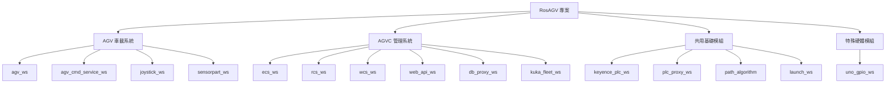

# RosAGV 工作分解結構 (WBS)

## 📋 概述

本文檔基於 RosAGV 專案的 15 個工作空間，提供詳細的工作分解結構，支援 AI Agent 進行增量開發和功能擴展。

## 🏗️ 專案層級結構



## 🎯 工作空間狀態矩陣

### ✅ 完全實作的工作空間 (11個)

#### 1. 共用基礎模組 (4個)
| 工作空間 | 狀態 | 完成度 | 關鍵功能 |
|---------|------|--------|----------|
| keyence_plc_ws | ✅ 完成 | 100% | PLC 通訊、記憶體管理、連線池 |
| plc_proxy_ws | ✅ 完成 | 100% | 8種 ROS 2 服務、自動讀取 |
| path_algorithm | ✅ 完成 | 100% | A* 演算法、NetworkX 整合 |
| launch_ws | ✅ 完成 | 100% | ECS/Web API Launch 檔案 |

#### 2. AGV 車載系統 (3個)
| 工作空間 | 狀態 | 完成度 | 關鍵功能 |
|---------|------|--------|----------|
| agv_ws | ✅ 部分完成 | 85% | Loader AGV 完整，其他車型部分 |
| joystick_ws | ✅ 完成 | 100% | USB 搖桿控制、joy_linux 整合 |
| sensorpart_ws | ✅ 完成 | 100% | 感測器資料處理 |

#### 3. AGVC 管理系統 (3個)
| 工作空間 | 狀態 | 完成度 | 關鍵功能 |
|---------|------|--------|----------|
| db_proxy_ws | ✅ 完成 | 100% | SQLModel ORM、連線池管理 |
| web_api_ws | ✅ 完成 | 100% | FastAPI、JWT 認證 |
| kuka_fleet_ws | ✅ 完成 | 100% | KUKA Fleet API 整合 |

#### 4. 特殊硬體模組 (1個)
| 工作空間 | 狀態 | 完成度 | 關鍵功能 |
|---------|------|--------|----------|
| uno_gpio_ws | ✅ 完成 | 100% | 研華 UNO-137 GPIO 控制 |

### 🚧 部分實作的工作空間 (2個)

| 工作空間 | 狀態 | 完成度 | 待完成項目 |
|---------|------|--------|------------|
| agv_cmd_service_ws | 🚧 部分完成 | 60% | 功能擴展、API 完善 |
| agv_ws | 🚧 部分完成 | 85% | Cargo Mover、Unloader AGV |

### ⚠️ 手動啟動的工作空間 (7個)

| 工作空間 | 啟動狀態 | 原因 | 建議動作 |
|---------|----------|------|----------|
| agv_cmd_service_ws | ⚠️ 手動啟動 | 功能待擴展 | 完善後加入自動啟動 |
| ecs_ws | ⚠️ 手動啟動 | 透過 launch_ws 管理 | 使用 ecs_launch 啟動 |
| rcs_ws | ⚠️ 手動啟動 | 透過 launch_ws 管理 | 整合到系統啟動流程 |
| wcs_ws | ⚠️ 手動啟動 | 透過 launch_ws 管理 | 整合到系統啟動流程 |
| web_api_ws | ⚠️ 手動啟動 | 透過 launch_ws 管理 | 使用 web_api_launch 啟動 |
| db_proxy_ws | ⚠️ 手動啟動 | 獨立服務 | 評估自動啟動需求 |
| kuka_fleet_ws | ⚠️ 手動啟動 | 外部依賴 | 條件式自動啟動 |

## 📋 詳細任務分解

### 1. AGV 車載系統任務

#### 1.1 agv_ws 擴展任務
```yaml
任務組: AGV 多車型支援
優先級: 高
預估工時: 40 小時

子任務:
  - 1.1.1 Cargo Mover AGV 實作 (16h)
    - 狀態機邏輯實作
    - 任務處理流程
    - PLC 整合測試
    
  - 1.1.2 Unloader AGV 實作 (16h)
    - 狀態機邏輯實作
    - 任務處理流程
    - PLC 整合測試
    
  - 1.1.3 多車型統一管理 (8h)
    - 車型配置管理
    - 動態車型切換
    - 測試和驗證
```

#### 1.2 agv_cmd_service_ws 功能擴展
```yaml
任務組: 手動控制服務擴展
優先級: 中
預估工時: 24 小時

子任務:
  - 1.2.1 API 功能完善 (12h)
    - 手動移動控制 API
    - 緊急停止功能
    - 狀態查詢服務
    
  - 1.2.2 安全機制實作 (8h)
    - 權限控制
    - 操作日誌
    - 異常處理
    
  - 1.2.3 整合測試 (4h)
    - 與 agv_ws 整合
    - 端到端測試
```

### 2. AGVC 管理系統任務

#### 2.1 自動啟動整合
```yaml
任務組: AGVC 系統自動啟動
優先級: 中
預估工時: 16 小時

子任務:
  - 2.1.1 啟動腳本整合 (8h)
    - 修改 startup.agvc.bash
    - 依賴順序管理
    - 健康檢查機制
    
  - 2.1.2 配置管理優化 (4h)
    - 環境變數統一
    - 配置檔案驗證
    - 錯誤處理改善
    
  - 2.1.3 監控和日誌 (4h)
    - 啟動狀態監控
    - 日誌聚合
    - 警報機制
```

#### 2.2 Web 介面整合
```yaml
任務組: Web 介面統一管理
優先級: 低
預估工時: 20 小時

子任務:
  - 2.2.1 AGVCUI 整合優化 (8h)
    - API 整合改善
    - 使用者體驗優化
    - 效能調整
    
  - 2.2.2 OPUI 功能擴展 (8h)
    - 操作介面改善
    - 即時狀態顯示
    - 任務管理功能
    
  - 2.2.3 統一認證系統 (4h)
    - 單一登入 (SSO)
    - 權限管理
    - 會話管理
```

### 3. 系統整合任務

#### 3.1 容器化改善
```yaml
任務組: 容器化架構優化
優先級: 低
預估工時: 32 小時

子任務:
  - 3.1.1 Docker 映像優化 (12h)
    - 映像大小減少
    - 建置時間優化
    - 安全性改善
    
  - 3.1.2 網路配置優化 (8h)
    - 跨容器通訊優化
    - 安全性配置
    - 效能調整
    
  - 3.1.3 資源管理 (8h)
    - 資源限制配置
    - 監控和警報
    - 自動擴展機制
    
  - 3.1.4 備份和恢復 (4h)
    - 資料備份策略
    - 災難恢復計劃
    - 測試和驗證
```

#### 3.2 測試自動化
```yaml
任務組: 自動化測試體系
優先級: 中
預估工時: 40 小時

子任務:
  - 3.2.1 單元測試擴展 (16h)
    - 測試覆蓋率提升
    - 測試案例補充
    - 測試工具整合
    
  - 3.2.2 整合測試建立 (16h)
    - 跨工作空間測試
    - 端到端測試
    - 效能測試
    
  - 3.2.3 CI/CD 流程 (8h)
    - 自動化建置
    - 自動化測試
    - 自動化部署
```

## 🎯 開發優先級矩陣

### 高優先級任務 (立即執行)
1. **agv_ws 多車型支援** - 核心功能完善
2. **自動啟動整合** - 系統可用性提升
3. **測試自動化基礎** - 品質保證

### 中優先級任務 (短期規劃)
1. **agv_cmd_service_ws 功能擴展** - 操作便利性
2. **Web 介面整合** - 使用者體驗
3. **監控和日誌系統** - 運維支援

### 低優先級任務 (長期規劃)
1. **容器化架構優化** - 效能和安全性
2. **進階功能開發** - 系統擴展
3. **文檔和培訓** - 知識管理

## 📊 資源分配建議

### 開發人力配置
- **ROS 2 開發工程師**: 2-3 人 (AGV 核心功能)
- **Web 開發工程師**: 1-2 人 (前端介面)
- **DevOps 工程師**: 1 人 (容器化和部署)
- **測試工程師**: 1 人 (測試自動化)

### 時程規劃
- **第一階段** (4 週): 高優先級任務完成
- **第二階段** (6 週): 中優先級任務完成
- **第三階段** (8 週): 低優先級任務和優化

## 📝 相關文檔

- [優先級矩陣](./priority-matrix.md)
- [里程碑規劃](./milestone-roadmap.md)
- [風險評估](./risk-assessment.md)
- [資源分配](./resource-allocation.md)

---

**最後更新**: 2025-01-17  
**維護責任**: 專案經理  
**版本**: v1.0.0
