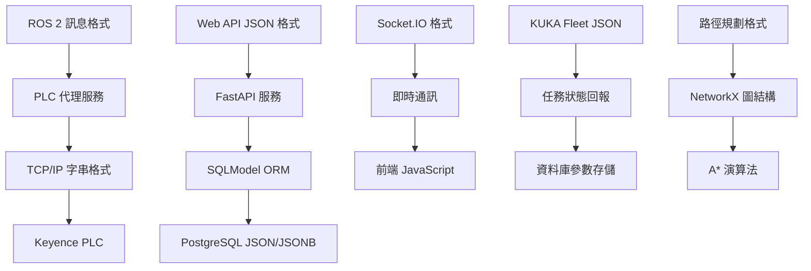

# RosAGV 跨系統資料交換格式規格

## 📋 概述

本文檔詳細描述 RosAGV 系統中各子系統間的資料交換格式規格，基於實際程式碼實作。系統採用多種資料格式標準，確保不同技術棧間的無縫整合。

## 🏗️ 資料交換架構

### 系統間資料流


### 資料格式分類
| 格式類型 | 使用場景 | 編碼方式 | 驗證機制 |
|----------|----------|----------|----------|
| ROS 2 訊息 | 節點間通訊 | IDL/CDR | ROS 2 型別系統 |
| JSON/JSONB | Web API、資料庫 | UTF-8 | Pydantic 驗證 |
| TCP/IP 字串 | PLC 通訊 | ASCII/UTF-8 | 指令格式驗證 |
| Socket.IO | 即時通訊 | JSON over WebSocket | 事件型別驗證 |
| NetworkX | 路徑規劃 | Python 物件 | 圖結構驗證 |

## 📡 ROS 2 訊息格式

### 1. PLC 服務介面格式

#### ReadData 服務格式
```yaml
# plc_interfaces/srv/ReadData.srv
# Request
string device_type    # "DM" 或 "MR"
string address        # PLC 位址字串

---
# Response  
bool success          # 操作成功標記
string value          # 讀取值 (字串格式)
string message        # 狀態或錯誤訊息
```

#### WriteContinuousData 服務格式
```yaml
# plc_interfaces/srv/WriteContinuousData.srv
# Request
string device_type    # 裝置類型
string start_address  # 起始位址
string[] values       # 值陣列

---
# Response
bool success          # 操作成功標記
string message        # 狀態或錯誤訊息
```

### 2. 標準 ROS 2 訊息格式

#### 搖桿控制格式
```yaml
# sensor_msgs/msg/Joy
Header header
float32[] axes        # 搖桿軸值 (-1.0 到 1.0)
int32[] buttons       # 按鈕狀態 (0 或 1)
```

#### 幾何訊息格式
```yaml
# geometry_msgs/msg/Pose
Point position        # 位置 (x, y, z)
Quaternion orientation # 方向 (x, y, z, w)

# nav_msgs/msg/Odometry
Header header
string child_frame_id
PoseWithCovariance pose
TwistWithCovariance twist
```

## 🌐 Web API JSON 格式

### 1. FastAPI Pydantic 模型

#### PLC 控制資料模型
```python
# PLC 強制控制輸入
class ForceInput(BaseModel):
    device_type: str    # "DM" 或 "MR"
    key: str           # PLC 位址

# PLC 單一資料輸入
class SingleDataInput(BaseModel):
    device_type: str    # 裝置類型
    key: str           # 位址
    value: str         # 值 (字串格式)

# PLC 連續資料輸入
class ContinuousDataInput(BaseModel):
    device_type: str    # 裝置類型
    start_key: str     # 起始位址
    values: List[str]  # 值陣列
```

#### 門控制資料模型
```python
# 門狀態查詢
class DoorStateData(BaseModel):
    doorId: str        # 門 ID

# 門控制指令
class DoorControlData(BaseModel):
    doorId: str        # 門 ID
    isOpen: bool       # 開啟狀態
```

#### 交通管制資料模型
```python
# 交管區控制
class TrafficControlData(BaseModel):
    trafficId: str     # 交管區 ID
    agvId: str         # AGV ID

# 按名稱控制
class TrafficControlByNameData(BaseModel):
    trafficName: str   # 交管區名稱
    agvId: str         # AGV ID
```

### 2. KUKA Fleet 資料格式

#### 任務提交格式 (submitMission)
```python
class KukaMissionData(BaseModel):
    orgId: str                              # 組織 ID (必填)
    requestId: str                          # 請求 ID (必填)
    missionCode: str                        # 任務代碼 (必填)
    missionType: str                        # 任務類型 (必填): MOVE, RACK_MOVE
    viewBoardType: Optional[str] = None     # 看板顯示類型
    robotModels: Optional[List[str]] = None # 機器人型號陣列
    robotIds: Optional[List[int]] = None    # 機器人 ID 陣列
    robotType: Optional[str] = None         # 機器人類型
    priority: Optional[int] = None          # 優先級 (1-99)
    containerModelCode: Optional[str] = None # 容器型號代碼
    containerCode: Optional[str] = None     # 容器代碼
    templateCode: Optional[str] = None      # 模板代碼
    lockRobotAfterFinish: Optional[bool] = None # 完成後鎖定機器人
    unlockRobotId: Optional[str] = None     # 解鎖機器人 ID
    unlockMissionCode: Optional[str] = None # 解鎖任務代碼
    idleNode: Optional[str] = None          # 閒置節點
    missionData: Optional[List[Dict[str, Any]]] = None # 任務資料

# 任務資料項目格式
class MissionDataItem(BaseModel):
    sequence: int                           # 序列號
    position: str                           # 位置 (節點名稱)
    type: str                              # 類型: NODE_POINT
    passStrategy: str                       # 放行策略: AUTO, MANUAL
```

#### 任務狀態回報格式 (missionStateCallback)
```python
class MissionStateCallbackData(BaseModel):
    missionCode: str                        # 任務代碼 (必填，最大32字元)
    viewBoardType: Optional[str] = None     # 任務類型
    containerCode: Optional[str] = None     # 容器代碼
    currentPosition: Optional[str] = None   # 當前位置
    slotCode: Optional[str] = None          # 槽位代碼
    robotId: Optional[str] = None           # 機器人 ID
    missionStatus: str                      # 任務狀態 (必填)
    message: Optional[str] = None           # 補充說明
    missionData: Optional[Dict[str, Any]] = None  # 自訂資料
```

#### 機器人狀態查詢格式 (robotQuery)
```python
class RobotQueryResponse(BaseModel):
    success: bool
    data: List[RobotStatus]
    message: str

class RobotStatus(BaseModel):
    robotId: str                            # 機器人 ID
    status: int                             # 狀態: 1-離場 2-離線 3-空閒 4-任務中 5-充電中 6-更新中 7-錯誤
    batteryLevel: int                       # 電池電量 (0-100)
    buildingCode: str                       # 建築代碼
    containerCode: str                      # 容器代碼
    errorMessage: str                       # 錯誤訊息
    floorNumber: str                        # 樓層號
    karOsVersion: str                       # KAR OS 版本
    liftStatus: int                         # 升降狀態
    liftTimes: int                          # 升降次數
    mapCode: str                            # 地圖代碼
    mileage: str                            # 里程
    missionCode: str                        # 當前任務代碼
    nodeCode: str                           # 節點代碼
    nodeForeignCode: str                    # 節點外部代碼
    nodeLabel: str                          # 節點標籤
    nodeNumber: int                         # 節點號碼
    occupyStatus: int                       # 佔用狀態
    reliability: int                        # 可靠性
    robotOrientation: str                   # 機器人方向
    robotType: str                          # 機器人類型
    runTime: str                            # 運行時間
    x: str                                  # X 座標
    y: str                                  # Y 座標
```

#### 容器管理格式
```python
# 容器入場
class ContainerInData(BaseModel):
    requestId: str                          # 請求 ID
    containerCode: str                      # 容器代碼
    position: str                           # 位置
    isNew: bool                            # 是否為新容器

# 容器出場
class ContainerOutData(BaseModel):
    requestId: str                          # 請求 ID
    containerCode: str                      # 容器代碼
    position: str                           # 位置

# 容器狀態
class ContainerStatus(BaseModel):
    containerCode: str                      # 容器代碼
    position: str                           # 當前位置
    status: str                            # 狀態
    robotId: str                           # 關聯機器人 ID
```

#### KUKA 任務狀態常數
```python
# KUKA AGV 狀態定義 (KukaFleetAdapter)
AGV_STATUS = {
    1: "REMOVED",      # 離場
    2: "OFFLINE",      # 離線
    3: "IDLE",         # 空閒
    4: "RUNNING",      # 任務中
    5: "CHARGING",     # 充電中
    6: "UPDATING",     # 更新中
    7: "ERROR"         # 錯誤
}

# KUKA 任務類型定義
MISSION_TYPES = {
    "MOVE": "移動任務",
    "RACK_MOVE": "搬運任務"
}

# KUKA 任務狀態定義 (回報狀態)
KUKA_MISSION_STATUS = {
    "MOVE_BEGIN": "開始移動",
    "ARRIVED": "到達任務節點",
    "UP_CONTAINER": "升箱完成",
    "DOWN_CONTAINER": "放下完成",
    "ROLLER_RECEIVE": "滾筒上料完成",
    "ROLLER_SEND": "滾筒下料完成",
    "PICKER_RECEIVE": "料箱取料完成",
    "PICKER_SEND": "料箱下料完成",
    "FORK_UP": "叉車叉取完成",
    "FORK_DOWN": "叉車放下完成",
    "COMPLETED": "任務完成",
    "CANCELED": "任務取消完成"
}

# KUKA Fleet Adapter 配置常數
KUKA_CONFIG = {
    "MAP_LAYOUT_DISTRICT": "test-test1",
    "ROBOT_MODEL": "KMP 400i diffDrive",
    "ROBOT_TYPE": "LIFT",
    "ORG_ID": "Ching-Tech",
    "BASE_URL": "http://192.168.11.206:10870",
    "DEFAULT_USERNAME": "admin",
    "DEFAULT_PASSWORD": "Admin"
}
```

### 3. AGV 管理資料格式

#### AGV 資料模型
```python
class AGVRequest(BaseModel):
    name: str                    # AGV 名稱
    description: str = None      # 描述
    model: str                   # 車型 (K400, Cargo, Loader, Unloader)
    x: float                     # X 座標
    y: float                     # Y 座標
    heading: float               # 方向角
    last_node: int = None        # 最後節點
    enable: int = 1              # 啟用狀態

class TaskStatusResponse(BaseModel):
    success: bool                # 操作成功標記
    message: str                 # 回應訊息
    task_id: Optional[int] = None      # 任務 ID
    status: Optional[int] = None       # 狀態碼
    status_name: Optional[str] = None  # 狀態名稱
```

#### 產品管理資料格式
```python
class ProductRequest(BaseModel):
    name: str                    # 產品名稱
    size: str                    # 產品尺寸
    process_settings_id: int     # 製程設定 ID
```

## 🗄️ 資料庫 JSON/JSONB 格式

### 1. SQLModel 中的 JSON 欄位

#### Task 參數格式
```python
# Task.parameters (JSON 欄位)
{
    "priority": 1,
    "max_retry": 3,
    "timeout": 300,
    "custom_data": {...},
    
    # KUKA 狀態資訊 (由 KUKA Fleet 回報更新)
    "kuka_mission_status": "COMPLETED",
    "kuka_robot_id": "AGV_01", 
    "kuka_container_code": "CONT_001",
    "kuka_current_position": "STATION_A",
    "kuka_slot_code": "SLOT_01",
    "kuka_view_board_type": "MOVE",
    "kuka_message": "任務完成",
    "kuka_mission_data": {...},
    "kuka_last_update": "2025-01-17T10:30:00Z"
}
```

#### Work 參數格式
```python
# Work.parameters (JSON 欄位)
{
    "workflow_type": "transport",
    "source_location": "A1",
    "target_location": "B2", 
    "load_type": "container",
    "priority_level": "high",
    "estimated_duration": 600
}
```

#### Client 操作資料格式
```python
# Client.op (JSON 欄位) - OPUI 扁平化格式
{
    "left": {
        "productSelected": 0,
        "products": ["PRODUCT_A", "PRODUCT_B"]
    },
    "right": {
        "productSelected": 1, 
        "products": ["PRODUCT_C", "PRODUCT_D"]
    }
}
```

### 2. 資料庫時間格式
```python
# 時區感知時間戳格式
created_at: datetime = Field(
    sa_column=Column(DateTime(timezone=True), nullable=False),
    default_factory=lambda: datetime.now(timezone.utc)
)

# ISO 8601 格式範例
"2025-01-17T10:30:00.123456+00:00"
```

## � PLC 通訊資料格式

### 1. TCP/IP 字串格式

#### 指令格式規範
```
格式: [指令] [參數] \r\n
編碼: UTF-8
結束符: \r\n (CRLF)
最大長度: 1024 bytes
```

#### 實際指令範例
```bash
# 讀取指令
發送: "RD DM7600\r\n"
回應: "1234\r\n"

# 寫入指令
發送: "WR DM1000 123\r\n"
回應: "OK\r\n"

# 連續讀取
發送: "RDS DM7600 10\r\n"
回應: "1234 5678 9012 3456 7890 1234 5678 9012 3456 7890\r\n"

# 錯誤回應
發送: "RD DM99999\r\n"
回應: "E0\r\n"  # E0:元件編號異常
```

### 2. PLC 記憶體資料格式

#### 位元組序和資料型別
```python
# 16-bit 小端序 (Little Endian)
word_value = 0x1234  # 16-bit word
bytes_data = struct.pack("<H", word_value)  # [0x34, 0x12]

# 資料型別轉換
PlcBytes.from_int(1234, length=2)      # 2 bytes: [0xD2, 0x04]
PlcBytes.from_float(3.14)              # 4 bytes: IEEE 754
PlcBytes.from_string("AGV001", 20)     # 20 bytes: ASCII + padding
```

#### 記憶體映射格式
```python
# DM 區域資料格式
DM_AREAS = {
    "AGV_ID": {
        "start": 7600,
        "length": 20,
        "type": "string",
        "encoding": "ascii"
    },
    "AGV_STATUS": {
        "start": 7620,
        "length": 20,
        "type": "int16",
        "format": "array"
    },
    "CONTROL_CMD": {
        "start": 1000,
        "length": 100,
        "type": "int16",
        "format": "array"
    }
}
```

## 🔄 Socket.IO 即時通訊格式 (OPUI)

### 1. 連線管理事件

#### 客戶端連線事件 (connect)
```javascript
// 自動觸發，無需額外資料
socket.on('connect', () => {
    console.log("✅ Socket.IO 連線成功");
    // 連線成功後會自動觸發登入流程
});
```

#### 客戶端登入事件 (login)
```javascript
// 前端發送登入請求
socket.emit('login', {
    deviceId: "device_001",           // 設備 ID (必填)
    machineId: 1,                     // 機台 ID (必填)
    userAgent: navigator.userAgent    // 瀏覽器資訊 (自動填入)
});

// 後端回應
{
    success: true,
    message: "登入成功，clientId: device_001",
    client: {
        clientId: "device_001",
        machineId: 1,
        userAgent: "Mozilla/5.0...",
        op: {
            left: { productSelected: 0, products: [] },
            right: { productSelected: 0, products: [] }
        }
    },
    clientId: "device_001"
}
```

#### 客戶端資料恢復事件 (restore_client_by_id)
```javascript
// 前端發送恢復請求
socket.emit('restore_client_by_id', {
    clientId: "device_001"
});

// 後端回應
{
    success: true,
    message: "恢復成功",
    client: { /* 完整客戶端資料 */ }
}
```

### 2. 資料同步事件

#### 客戶端狀態更新 (client_update)
```javascript
// 前端發送狀態更新
socket.emit('client_update', {
    clientId: "device_001",           // 客戶端 ID (必填)
    machineId: 1,                     // 機台 ID (必填)
    userAgent: navigator.userAgent,   // 瀏覽器資訊
    op: {                            // 操作資料 (扁平化結構)
        left: {
            productSelected: 0,       // 選中的產品索引
            products: ["PRODUCT_A", "PRODUCT_B"]  // 產品陣列
        },
        right: {
            productSelected: 1,
            products: ["PRODUCT_C", "PRODUCT_D"]
        }
    }
});

// 後端回應
{
    success: true,
    message: "設定已儲存",
    client: { /* 更新後的客戶端資料 */ },
    clientId: "device_001"
}
```

#### 伺服器資料廣播事件
```javascript
// 產品列表廣播 (product_list)
socket.on('product_list', (data) => {
    products: [
        { id: 1, name: "PRODUCT_A", size: "S" },
        { id: 2, name: "PRODUCT_B", size: "L" }
    ]
});

// 機台列表廣播 (machine_list)
socket.on('machine_list', (data) => {
    machines: [
        {
            id: 1,
            name: "機台_001",
            parking_space_1: 101,
            parking_space_2: 102,
            parking_space_1_status: 0,  // 0-未佔用 1-佔用中 2-已送達
            parking_space_2_status: 0
        }
    ]
});

// 房間列表廣播 (room_list)
socket.on('room_list', (data) => {
    rooms: [
        { id: 1, name: "生產區域_A" },
        { id: 2, name: "生產區域_B" }
    ]
});

// 停車格列表廣播 (parking_list)
socket.on('parking_list', (data) => {
    left: [
        { id: 1, name: "RACK_001" },
        { id: 2, name: "RACK_002" }
    ],
    right: [
        { id: 3, name: "RACK_003" }
    ]
});
```

### 3. AGV 操作事件

#### 叫空車事件 (call_empty)
```javascript
// 前端發送叫車請求
socket.emit('call_empty', {
    side: "left"                      // 停車格側邊: "left" 或 "right"
});

// 後端回應
{
    success: true,
    message: "叫車成功，任務 ID: 123"
}
```

#### 派車事件 (dispatch_full)
```javascript
// 前端發送派車請求
socket.emit('dispatch_full', {
    side: "left",                     // 停車格側邊
    rack: "RACK_001"                  // 料架名稱
});

// 後端回應
{
    success: true,
    message: "派車成功，任務 ID: 124"
}
```

#### 取消任務事件 (cancel_task)
```javascript
// 前端發送取消請求
socket.emit('cancel_task', {
    side: "left"                      // 停車格側邊
});

// 後端回應
{
    success: true,
    message: "已取消停車位 [101] 的任務"
}
```

#### 確認送達事件 (confirm_delivery)
```javascript
// 前端發送確認送達
socket.emit('confirm_delivery', {
    side: "left"                      // 停車格側邊
});

// 後端回應
{
    success: true,
    message: "已確認停車位 [101] 的rack架已搬移至作業區"
}
```

### 4. 料架管理事件

#### 新增料架事件 (add_rack)
```javascript
// 前端發送新增料架請求
socket.emit('add_rack', {
    rack: "RACK_001",                 // 料架名稱 (支援 rack 或 rackName)
    side: "left"                      // 停車格側邊
});

// 後端回應
{
    success: true,
    message: "料架 RACK_001 已分配到左側停車格"
}
```

#### 刪除料架事件 (del_rack)
```javascript
// 前端發送刪除料架請求
socket.emit('del_rack', {
    rackId: 1                         // 料架 ID
});

// 後端回應
{
    success: true,
    message: "料架已刪除"
}
```

### 5. 任務狀態事件

#### 活躍任務狀態同步 (active_tasks)
```javascript
// 後端主動推送活躍任務狀態
socket.on('active_tasks', (data) => {
    left: {
        task_id: 123,
        task_type: "call_empty",
        node_id: 101,
        status: "pending",            // pending, delivered, confirmed
        createdAt: 1642406400000
    },
    right: {
        task_id: 124,
        task_type: "dispatch_full",
        node_id: 102,
        status: "pending",
        createdAt: 1642406500000
    }
});
```

#### 任務狀態變更通知 (task_status_update)
```javascript
// 後端主動推送任務狀態變更
socket.on('task_status_update', (data) => {
    task_id: 123,
    side: "left",                     // 停車格側邊
    type: "call_empty",               // 任務類型
    status: "delivered",              // 新狀態: pending, delivered, confirmed, completed
    status_name: "已送達",            // 狀態中文名稱
    status_description: "任務已完成，等待確認",
    machine_id: 1,
    node_id: 101,
    updatedAt: "2025-01-17T10:30:00Z"
});
```

#### 任務狀態查詢事件
```javascript
// 查詢任務狀態 (get_task_status)
socket.emit('get_task_status', {
    taskId: 123
});

// 查詢活躍任務 (get_active_tasks)
socket.emit('get_active_tasks', {});

// 測試完成任務 (test_complete_task)
socket.emit('test_complete_task', {
    taskId: 123
});
```

### 6. 通知事件

#### 通知訊息 (notify_message)
```javascript
// 後端發送通知訊息
socket.on('notify_message', (data) => {
    message: "AGV已將rack架送達停車位[101]"
});
```

#### 錯誤訊息 (error_message)
```javascript
// 後端發送錯誤訊息
socket.on('error_message', (data) => {
    message: "找不到客戶端資訊"
});
```

### 7. OPUI 扁平化資料結構

#### op 欄位格式 (客戶端操作資料)
```javascript
// OPUI 使用的扁平化 op 資料結構
op: {
    left: {
        productSelected: 0,           // 選中的產品索引 (0-based)
        products: [                   // 產品陣列
            "PRODUCT_A",
            "PRODUCT_B",
            "PRODUCT_C"
        ]
    },
    right: {
        productSelected: 1,
        products: [
            "PRODUCT_D",
            "PRODUCT_E"
        ]
    }
}

// 向後相容性：自動遷移舊的 product 欄位
// 舊格式 (已棄用)
op: {
    left: {
        productSelected: 0,
        product: ["PRODUCT_A"]        // 舊欄位名稱
    }
}

// 自動遷移為新格式
op: {
    left: {
        productSelected: 0,
        products: ["PRODUCT_A"]       // 新欄位名稱
    }
}
```

### 8. Socket.IO 配置和中介軟體

#### 伺服器配置
```python
# OPUI Socket.IO 伺服器配置
sio = socketio.AsyncServer(
    async_mode="asgi",
    cors_allowed_origins="*",
    engineio_logger=True,
    logger=True
)

# CORS 中介軟體
app.add_middleware(
    CORSMiddleware,
    allow_origins=["*"],
    allow_credentials=True,
    allow_methods=["*"],
    allow_headers=["*"]
)
```

#### 客戶端連線管理
```python
class OpUiSocket:
    def __init__(self, sio):
        self.sio = sio
        self.user_sid_map = {}        # clientId -> sid 映射
        self.task_monitor = TaskMonitor()
        self.task_service = TaskService()
```

### 9. AGVCUI Socket.IO 格式 (車隊管理系統)

#### 連線管理事件

##### 客戶端連線事件 (connect)
```javascript
// 自動觸發，無需額外資料
socket.on('connect', () => {
    console.log("✅ Socket.IO 連線成功");
    // 連線成功後會自動接收所有系統資料
});
```

##### 使用者登入事件 (user_login)
```javascript
// 前端發送登入請求
socket.emit('user_login', {
    username: "admin",               // 使用者名稱 (必填)
    password: "password"             // 密碼 (必填)
});

// 後端回應
{
    success: true,
    message: "登入成功，歡迎 管理員",
    user: {
        id: 1,
        username: "admin",
        role: "admin",
        full_name: "管理員",
        is_active: true,
        isLoggedIn: true,
        isConnected: true
    },
    access_token: "eyJ0eXAiOiJKV1QiLCJhbGciOiJIUzI1NiJ9..."
}
```

##### 使用者登出事件 (user_logout)
```javascript
// 前端發送登出請求
socket.emit('user_logout', {});

// 後端回應
{
    success: true,
    message: "登出成功"
}
```

#### 系統資料廣播事件

##### 地圖資訊廣播 (map_info)
```javascript
// 後端主動推送地圖資訊
socket.on('map_info', (data) => {
    nodes: [                         // CT 節點
        { id: 1, x: 10.5, y: 20.3 },
        { id: 2, x: 15.7, y: 25.1 }
    ],
    edges: [                         // CT 邊
        { id: 1, from_id: 1, to_id: 2, weight: 1.0, name: "PATH_1_2" }
    ],
    kukaNodes: [                     // KUKA 節點
        { id: 1, uuid: "550e8400-e29b-41d4-a716-446655440000", x: 12.0, y: 22.0 }
    ],
    kukaEdges: [                     // KUKA 邊
        { id: 1, from_id: 1, to_id: 2, weight: 1.5, name: "KUKA_PATH_1_2" }
    ],
    agvs: [                          // AGV 資料 (包含在地圖中)
        {
            id: 1,
            name: "AGV_001",
            model: "K400",
            x: 10.5,
            y: 20.3,
            heading: 90.0,
            last_node: 1,
            enable: 1
        }
    ]
});
```

##### AGV 列表廣播 (agv_list)
```javascript
// 後端主動推送 AGV 列表
socket.on('agv_list', (data) => {
    agvs: [
        {
            id: 1,
            name: "AGV_001",
            model: "K400",                   // 車型: K400, Cargo, Loader, Unloader
            x: 10.5,                         // X 座標
            y: 20.3,                         // Y 座標
            heading: 90.0,                   // 方向角
            last_node: 1,                    // 最後節點
            enable: 1,                       // 啟用狀態
            description: "主要運輸車輛",
            status_id: 3,                    // 狀態 ID
            battery_level: 85.5,             // 電池電量
            current_position: "NODE_123"     // 當前位置
        }
    ]
});
```

##### 任務列表廣播 (task_list)
```javascript
// 後端主動推送任務列表
socket.on('task_list', (data) => {
    tasks: [
        {
            id: 123,
            parent_task_id: null,           // 父任務 ID
            work_id: 1,                     // 工作 ID
            status_id: 3,                   // 狀態 ID (0-6, 51-54)
            room_id: 1,                     // 房間 ID
            node_id: 101,                   // 節點 ID
            agv_id: 1,                      // AGV ID
            name: "運輸任務_001",
            description: "從 A 點運輸到 B 點",
            mission_code: "MISSION_001",    // KUKA 任務代碼
            priority: 1,                    // 優先級
            parameters: {                   // JSON 參數
                "source_location": "A1",
                "target_location": "B2",
                "kuka_mission_status": "COMPLETED"
            },
            created_at: "2025-01-17T10:30:00Z",
            updated_at: "2025-01-17T11:00:00Z"
        }
    ]
});
```

##### 料架列表廣播 (rack_list)
```javascript
// 後端主動推送料架列表
socket.on('rack_list', (data) => {
    racks: [
        {
            id: 1,
            name: "RACK_001",
            agv_id: 1,                      // 關聯 AGV ID
            location_id: 101,               // 位置 ID
            product_id: 1,                  // 產品 ID
            is_carry: 0,                    // 是否被搬運
            is_in_map: 1,                   // 是否在地圖中
            is_docked: 0,                   // 是否停靠
            status_id: 1,                   // 狀態 ID
            direction: 0,                   // 方向
            size: "S",                      // 產品尺寸 (S/L)
            product_name: "PRODUCT_A",      // 產品名稱
            total: 32,                      // 總容量 (S=32, L=16)
            count: 15                       // 當前數量
        }
    ]
});
```

##### 載具列表廣播 (carrier_list)
```javascript
// 後端主動推送載具列表
socket.on('carrier_list', (data) => {
    carriers: [
        {
            id: 1,
            name: "CARRIER_001",
            rack_id: 1,                     // 關聯料架 ID
            status_id: 1,                   // 狀態 ID
            enable: 1                       // 啟用狀態
        }
    ]
});
```

##### 機台列表廣播 (machine_list)
```javascript
// 後端主動推送機台列表
socket.on('machine_list', (data) => {
    machines: [
        {
            id: 1,
            name: "機台_001",
            description: "生產機台",
            parking_space_1: 101,           // 停車格 1
            parking_space_2: 102,           // 停車格 2
            enable: 1                       // 啟用狀態
        }
    ]
});
```

##### 房間列表廣播 (room_list)
```javascript
// 後端主動推送房間列表
socket.on('room_list', (data) => {
    rooms: [
        {
            id: 1,
            name: "生產區域_A",
            description: "主要生產區域",
            process_settings_id: 1,         // 製程設定 ID
            enable: 1                       // 啟用狀態
        }
    ]
});
```

##### 信號列表廣播 (signal_list)
```javascript
// 後端主動推送信號列表
socket.on('signal_list', (data) => {
    signals: [
        {
            id: 1,
            eqp_id: 1,                      // 設備 ID
            eqp_port_id: 1,                 // 設備端口 ID
            name: "SIGNAL_001",
            description: "設備狀態信號",
            value: "1",                     // 信號值
            type_of_value: "BOOL",          // 值類型
            dm_address: "DM1000"            // PLC 位址
        }
    ]
});
```

##### 位置列表廣播 (location_list)
```javascript
// 後端主動推送位置列表
socket.on('location_list', (data) => {
    locations: [
        {
            id: 1,
            name: "STATION_A",
            description: "工作站 A"
        }
    ]
});
```

#### 通知事件

##### 通知訊息 (notify_message)
```javascript
// 後端發送通知訊息
socket.on('notify_message', (data) => {
    message: "AGV 任務已完成"
});
```

##### 錯誤訊息 (error_message)
```javascript
// 後端發送錯誤訊息
socket.on('error_message', (data) => {
    message: "AGV 連線中斷"
});
```

#### AGVCUI 變更追蹤機制

##### 修改日誌追蹤 (modify_log_all_objects)
```python
# 變更追蹤機制
class ModifyLog:
    id: int
    table_name: str                  # 資料表名稱
    record_id: str                   # 記錄 ID
    operation: str                   # 操作類型: INSERT, UPDATE, DELETE
    modified_at: datetime            # 修改時間

# 追蹤的資料表
TRACKED_TABLES = {
    "agv": notify_agvs,             # AGV 資料變更
    "rack": notify_racks,           # 料架資料變更
    "carrier": notify_carriers,     # 載具資料變更
    "signal": notify_signals,       # 信號資料變更
    "task": notify_tasks,           # 任務資料變更
}

# 變更檢查邏輯
check_since = now - timedelta(seconds=0.2)  # 0.2 秒內的變更
recent_updates = [log for log in logs if log.modified_at > check_since]
```

##### 週期性資料同步
```python
# AGVCUI 週期性任務配置
PERIODIC_TASKS = [
    {
        "func": notify_by_modifylog,    # 變更追蹤通知
        "interval": 0.1,                # 100ms 間隔
        "last_time": 0
    }
]

# 自動同步機制
# - 每 100ms 檢查資料變更
# - 根據 modify_log 表追蹤變更
# - 自動推送變更的資料到所有連線的客戶端
# - AGV 變更時同時更新地圖資料
```

#### AGVCUI vs OPUI 差異對比

##### 功能定位差異
```yaml
AGVCUI (車隊管理系統):
  - 目標用戶: 系統管理員、調度員
  - 主要功能: AGV 車隊監控、任務管理、系統配置
  - 資料範圍: 全系統資料 (所有 AGV、任務、料架)
  - 更新機制: 變更追蹤 + 週期性同步
  - 認證方式: 使用者登入 (username/password)

OPUI (操作介面):
  - 目標用戶: 現場操作員
  - 主要功能: 機台操作、叫車派車、料架管理
  - 資料範圍: 機台相關資料 (特定機台的停車格)
  - 更新機制: 事件驅動 + 即時回應
  - 認證方式: 設備登入 (deviceId/machineId)
```

##### Socket.IO 事件差異
```yaml
AGVCUI 事件:
  - user_login/user_logout        # 使用者認證
  - map_info                      # 完整地圖資訊
  - agv_list                      # 所有 AGV 狀態
  - task_list                     # 所有任務狀態
  - rack_list                     # 所有料架狀態
  - 自動資料同步                   # 變更追蹤機制

OPUI 事件:
  - login/client_update           # 客戶端認證
  - call_empty/dispatch_full      # AGV 操作指令
  - add_rack/del_rack            # 料架操作指令
  - active_tasks                  # 活躍任務狀態
  - 手動操作回應                   # 事件驅動機制
```

##### 資料結構差異
```yaml
AGVCUI 資料結構:
  - 完整的資料庫模型映射
  - 包含所有關聯資料 (AGV, Task, Rack, Carrier)
  - 支援複雜查詢和統計
  - 資料包含完整的元資料

OPUI 資料結構:
  - 扁平化的操作資料 (op 欄位)
  - 專注於操作相關資料
  - 簡化的狀態管理
  - 向後相容性處理
```

## 🗺️ 地圖和路徑資料格式

### 1. NetworkX 圖結構格式

#### 節點資料格式
```python
# CT 節點格式
node_data = {
    "id": 123,
    "x": 10.5,
    "y": 20.3,
    "type": "station",
    "properties": {
        "name": "STATION_A",
        "capacity": 2,
        "equipment": ["conveyor", "sensor"]
    }
}

# KUKA 節點格式
kuka_node_data = {
    "id": 456,
    "uuid": "550e8400-e29b-41d4-a716-446655440000",
    "node_type_id": "STATION",
    "x": 15.7,
    "y": 25.1,
    "properties": {
        "floor": 1,
        "zone": "PRODUCTION"
    }
}
```

#### 邊資料格式
```python
# CT 邊格式
edge_data = {
    "from_id": 123,
    "to_id": 456,
    "weight": 1.0,
    "name": "PATH_A_TO_B",
    "properties": {
        "direction": "bidirectional",
        "max_speed": 1.5,
        "restrictions": []
    }
}
```

### 2. 地圖匯入格式

#### KUKA 地圖 JSON 格式
```json
{
    "floors": [
        {
            "floor_id": 1,
            "nodes": [
                {
                    "id": 1,
                    "uuid": "550e8400-e29b-41d4-a716-446655440000",
                    "node_type_id": "STATION",
                    "x": 10.5,
                    "y": 20.3
                }
            ],
            "edges": [
                {
                    "from_id": 1,
                    "to_id": 2,
                    "weight": 1.0,
                    "name": "EDGE_1_2"
                }
            ]
        }
    ]
}
```

#### CT 地圖 JSON 格式
```json
{
    "nodes": [
        {
            "id": 123,
            "x": 10.5,
            "y": 20.3
        }
    ],
    "edges": [
        {
            "from_id": 123,
            "to_id": 456,
            "weight": 1.0,
            "name": "PATH_123_456"
        }
    ]
}
```

## 🔢 資料驗證和轉換

### 1. Pydantic 驗證規則

#### 欄位驗證範例
```python
from pydantic import BaseModel, validator, Field
from typing import List, Optional

class AGVDataModel(BaseModel):
    name: str = Field(..., min_length=1, max_length=50)
    x: float = Field(..., ge=-1000.0, le=1000.0)  # 座標範圍限制
    y: float = Field(..., ge=-1000.0, le=1000.0)
    battery_level: float = Field(..., ge=0.0, le=100.0)  # 電池百分比

    @validator('name')
    def name_must_be_alphanumeric(cls, v):
        if not v.replace('_', '').isalnum():
            raise ValueError('名稱只能包含字母、數字和底線')
        return v
```

### 2. 資料型別轉換

#### JSON 序列化處理
```python
import json
from datetime import datetime, timezone
from decimal import Decimal

class CustomJSONEncoder(json.JSONEncoder):
    def default(self, obj):
        if isinstance(obj, datetime):
            return obj.isoformat()
        elif isinstance(obj, Decimal):
            return float(obj)
        elif hasattr(obj, '__dict__'):
            return obj.__dict__
        return super().default(obj)
```

#### SQLModel 資料轉換
```python
# 資料庫模型轉 API 回應
def model_to_dict(model_instance):
    result = {}
    for column in model_instance.__table__.columns:
        value = getattr(model_instance, column.name)
        if isinstance(value, datetime):
            result[column.name] = value.isoformat()
        else:
            result[column.name] = value
    return result
```

## 📊 資料格式效能考量

### 1. 序列化效能
| 格式 | 序列化速度 | 大小 | 可讀性 | 使用場景 |
|------|------------|------|--------|----------|
| JSON | 中等 | 中等 | 高 | Web API, 配置 |
| MessagePack | 快 | 小 | 低 | ROS 2 內部 |
| Protocol Buffers | 快 | 小 | 低 | 高效能通訊 |
| 純文字 | 慢 | 大 | 高 | PLC 通訊 |

### 2. 資料壓縮
```python
# JSON 資料壓縮
import gzip
import json

def compress_json_data(data):
    json_str = json.dumps(data, separators=(',', ':'))
    return gzip.compress(json_str.encode('utf-8'))

def decompress_json_data(compressed_data):
    json_str = gzip.decompress(compressed_data).decode('utf-8')
    return json.loads(json_str)
```

## 🔒 資料安全和驗證

### 1. 輸入驗證
```python
# SQL 注入防護
from sqlalchemy import text

# ❌ 危險：直接字串拼接
query = f"SELECT * FROM tasks WHERE id = {user_input}"

# ✅ 安全：參數化查詢
query = text("SELECT * FROM tasks WHERE id = :task_id")
result = session.execute(query, {"task_id": user_input})
```

### 2. 資料清理
```python
import re
from html import escape

def sanitize_string_input(input_str: str) -> str:
    """清理字串輸入，防止 XSS 和注入攻擊"""
    # 移除危險字元
    cleaned = re.sub(r'[<>"\']', '', input_str)
    # HTML 轉義
    cleaned = escape(cleaned)
    # 限制長度
    return cleaned[:255]
```

## �📝 相關文檔

- [Web API 規格](./web-api-specification.md)
- [資料庫結構設計](./database-schema.md)
- [ROS 2 介面規格](./ros2-interfaces.md)
- [PLC 通訊協定](./plc-communication.md)

---

**最後更新**: 2025-01-17
**維護責任**: 系統整合工程師
**版本**: v1.0.0
