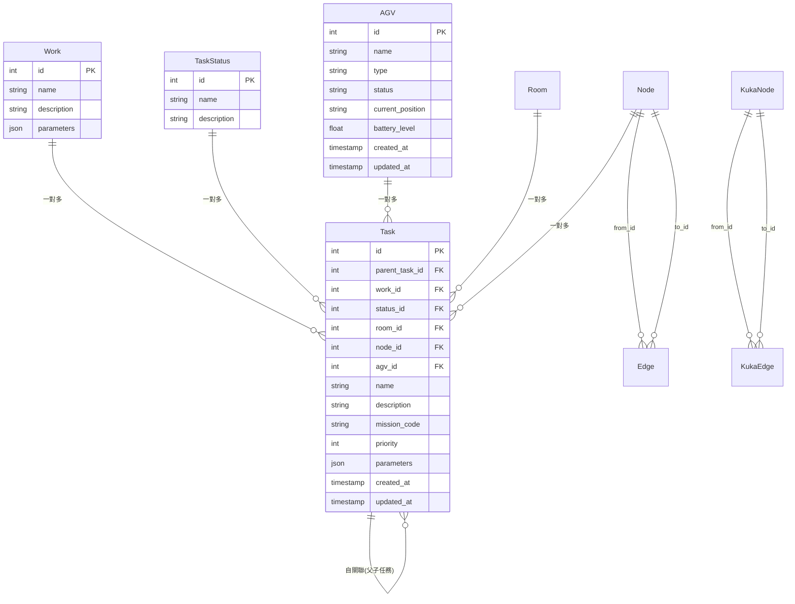
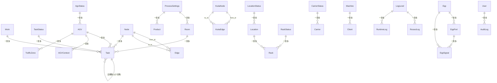

# RosAGV 資料庫結構規格

## 📋 概述

本文檔詳細描述 RosAGV 系統的 PostgreSQL 資料庫結構，基於 `app/db_proxy_ws/` 工作空間的實際 SQLModel ORM 定義。資料庫採用 PostgreSQL 14+，使用 SQLModel + SQLAlchemy 進行 ORM 管理。

## 🏗️ 資料庫架構

### 連線配置
```yaml
資料庫類型: PostgreSQL
主機位址: 192.168.100.254
端口: 5432
資料庫名稱: agvc
使用者: agvc
密碼: password
連線池: 自訂 ConnectionPoolManager
ORM 框架: SQLModel + SQLAlchemy
```

### 資料庫連線池管理
```python
# ConnectionPoolManager 配置
class ConnectionPoolManager:
    def __init__(self, database_url: str):
        self.engine = create_engine(
            database_url,
            pool_size=10,
            max_overflow=20,
            pool_pre_ping=True,
            pool_recycle=3600
        )
```

## 📊 核心資料表結構

### 1. 任務管理相關表

#### 1.1 Work 表 (工作定義)
```sql
CREATE TABLE work (
    id SERIAL PRIMARY KEY,
    name VARCHAR NOT NULL,
    description VARCHAR,
    parameters JSON
);
```

**SQLModel 定義**:
```python
class Work(SQLModel, table=True):
    __tablename__ = "work"
    id: Optional[int] = Field(default=None, primary_key=True)
    name: str
    description: Optional[str] = None
    parameters: Optional[Dict[str, Any]] = Field(sa_column=Column(JSON))
    
    # 關聯關係
    tasks: List["Task"] = Relationship(back_populates="work")
```

#### 1.2 TaskStatus 表 (任務狀態)
```sql
CREATE TABLE task_status (
    id SERIAL PRIMARY KEY,
    name VARCHAR NOT NULL,
    description VARCHAR
);
```

**狀態碼定義**:
| 狀態碼 | 英文名稱 | 中文描述 | 說明 |
|--------|----------|----------|------|
| 0 | REQUESTING | 請求中 | UI-請求執行任務 |
| 1 | PENDING | 待處理 | WCS-任務已接受，待處理 |
| 2 | READY_TO_EXECUTE | 待執行 | RCS-任務已派發，待執行 |
| 3 | EXECUTING | 執行中 | AGV-任務正在執行 |
| 4 | COMPLETED | 已完成 | AGV-任務已完成 |
| 5 | CANCELLING | 取消中 | 任務取消 |
| 6 | ERROR | 錯誤 | 錯誤 |
| 51 | WCS_CANCELLING | WCS-取消中 | WCS-任務取消中，待處理 |
| 52 | RCS_CANCELLING | RCS-取消中 | RCS-任務取消中，取消中 |
| 53 | AGV_CANCELLING | AGV-取消中 | AGV-取消完成 |
| 54 | CANCELLED | 已取消 | 任務已取消 |

#### 1.3 Task 表 (任務)
```sql
CREATE TABLE task (
    id SERIAL PRIMARY KEY,
    parent_task_id INTEGER REFERENCES task(id),
    work_id INTEGER REFERENCES work(id),
    status_id INTEGER REFERENCES task_status(id),
    room_id INTEGER REFERENCES room(id),
    node_id INTEGER REFERENCES node(id),
    agv_id INTEGER REFERENCES agv(id),
    name VARCHAR NOT NULL,
    description VARCHAR,
    mission_code VARCHAR,
    priority INTEGER DEFAULT 0,
    parameters JSON,
    created_at TIMESTAMP WITH TIME ZONE NOT NULL,
    updated_at TIMESTAMP WITH TIME ZONE
);
```

**SQLModel 定義**:
```python
class Task(SQLModel, table=True):
    __tablename__ = "task"
    id: Optional[int] = Field(default=None, primary_key=True)
    parent_task_id: Optional[int] = Field(default=None, foreign_key="task.id")
    work_id: Optional[int] = Field(default=None, foreign_key="work.id")
    status_id: Optional[int] = Field(default=None, foreign_key="task_status.id")
    room_id: Optional[int] = Field(default=None, foreign_key="room.id")
    node_id: Optional[int] = Field(default=None, foreign_key="node.id")
    agv_id: Optional[int] = Field(default=None, foreign_key="agv.id")
    name: str
    description: Optional[str] = None
    mission_code: Optional[str] = None  # KUKA 系統任務代碼
    priority: int = Field(default=0)
    parameters: Optional[Dict[str, Any]] = Field(sa_column=Column(JSON))
    created_at: datetime = Field(
        sa_column=Column(DateTime(timezone=True), nullable=False),
        default_factory=lambda: datetime.now(timezone.utc)
    )
    updated_at: Optional[datetime] = Field(
        default=None,
        sa_column=Column(DateTime(timezone=True), nullable=True)
    )
    
    # 關聯關係
    work: Optional["Work"] = Relationship(back_populates="tasks")
    agv: Optional["AGV"] = Relationship()
```

### 2. 地圖和導航相關表

#### 2.1 Node 表 (CT 節點)
```sql
CREATE TABLE node (
    id INTEGER PRIMARY KEY,
    x FLOAT,
    y FLOAT,
    created_at TIMESTAMP WITH TIME ZONE,
    updated_at TIMESTAMP WITH TIME ZONE
);
```

#### 2.2 Edge 表 (CT 邊)
```sql
CREATE TABLE edge (
    id SERIAL PRIMARY KEY,
    from_id INTEGER REFERENCES node(id),
    to_id INTEGER REFERENCES node(id),
    name VARCHAR,
    weight FLOAT DEFAULT 1.0,
    created_at TIMESTAMP WITH TIME ZONE,
    updated_at TIMESTAMP WITH TIME ZONE
);
```

#### 2.3 KukaNode 表 (KUKA 節點)
```sql
CREATE TABLE kuka_node (
    id INTEGER PRIMARY KEY,
    uuid VARCHAR,
    node_type_id VARCHAR,
    x FLOAT,
    y FLOAT,
    updated_at TIMESTAMP WITH TIME ZONE
);
```

#### 2.4 KukaEdge 表 (KUKA 邊)
```sql
CREATE TABLE kuka_edge (
    id SERIAL PRIMARY KEY,
    from_id INTEGER REFERENCES kuka_node(id),
    to_id INTEGER REFERENCES kuka_node(id),
    weight FLOAT,
    name VARCHAR,
    updated_at TIMESTAMP WITH TIME ZONE
);
```

### 3. 設備管理相關表

#### 3.1 AGV 表 (AGV 車輛)
```sql
CREATE TABLE agv (
    id SERIAL PRIMARY KEY,
    name VARCHAR NOT NULL,
    type VARCHAR,
    status VARCHAR,
    current_position VARCHAR,
    battery_level FLOAT,
    created_at TIMESTAMP WITH TIME ZONE,
    updated_at TIMESTAMP WITH TIME ZONE
);
```

#### 3.2 Room 表 (房間/區域)
```sql
CREATE TABLE room (
    id SERIAL PRIMARY KEY,
    name VARCHAR NOT NULL,
    description VARCHAR,
    floor_level INTEGER,
    created_at TIMESTAMP WITH TIME ZONE,
    updated_at TIMESTAMP WITH TIME ZONE
);
```

## 🔗 關聯關係圖



### 4. 設備和信號管理相關表

#### 4.1 Eqp 表 (設備)
```sql
CREATE TABLE eqp (
    id SERIAL PRIMARY KEY,
    location_id INTEGER,
    name VARCHAR NOT NULL,
    description VARCHAR
);
```

**SQLModel 定義**:
```python
class Eqp(SQLModel, table=True):
    __tablename__ = "eqp"
    id: Optional[int] = Field(default=None, primary_key=True)
    location_id: Optional[int] = None  # 設備所在地，可以是 None
    name: str
    description: Optional[str] = None

    # 關聯關係
    signals: List["EqpSignal"] = Relationship(back_populates="eqp")
    ports: List["EqpPort"] = Relationship(back_populates="eqp")
```

#### 4.2 EqpPort 表 (設備端口)
```sql
CREATE TABLE eqp_port (
    id SERIAL PRIMARY KEY,
    eqp_id INTEGER REFERENCES eqp(id) NOT NULL,
    name VARCHAR NOT NULL,
    description VARCHAR
);
```

#### 4.3 EqpSignal 表 (設備信號)
```sql
CREATE TABLE eqp_signal (
    id SERIAL PRIMARY KEY,
    eqp_id INTEGER REFERENCES eqp(id) NOT NULL,
    eqp_port_id INTEGER REFERENCES eqp_port(id),
    name VARCHAR NOT NULL,
    description VARCHAR,
    value VARCHAR NOT NULL,
    type_of_value VARCHAR NOT NULL,
    dm_address VARCHAR
);
```

### 5. 產品和製程管理相關表

#### 5.1 ProcessSettings 表 (製程設定)
```sql
CREATE TABLE process_settings (
    id SERIAL PRIMARY KEY,
    name VARCHAR NOT NULL,
    description VARCHAR,
    parameters JSON
);
```

#### 5.2 Product 表 (產品)
```sql
CREATE TABLE product (
    id SERIAL PRIMARY KEY,
    process_settings_id INTEGER REFERENCES process_settings(id),
    name VARCHAR NOT NULL,
    description VARCHAR,
    parameters JSON
);
```

### 6. 位置和料架管理相關表

#### 6.1 LocationStatus 表 (位置狀態)
```sql
CREATE TABLE location_status (
    id SERIAL PRIMARY KEY,
    name VARCHAR NOT NULL,
    description VARCHAR
);
```

#### 6.2 Location 表 (位置)
```sql
CREATE TABLE location (
    id SERIAL PRIMARY KEY,
    status_id INTEGER REFERENCES location_status(id),
    name VARCHAR NOT NULL,
    description VARCHAR,
    x FLOAT,
    y FLOAT,
    enable INTEGER DEFAULT 1
);
```

#### 6.3 RackStatus 表 (料架狀態)
```sql
CREATE TABLE rack_status (
    id SERIAL PRIMARY KEY,
    name VARCHAR NOT NULL,
    description VARCHAR
);
```

#### 6.4 Rack 表 (料架)
```sql
CREATE TABLE rack (
    id SERIAL PRIMARY KEY,
    status_id INTEGER REFERENCES rack_status(id),
    location_id INTEGER REFERENCES location(id),
    name VARCHAR NOT NULL,
    description VARCHAR,
    enable INTEGER DEFAULT 1
);
```

### 7. 載具管理相關表

#### 7.1 CarrierStatus 表 (載具狀態)
```sql
CREATE TABLE carrier_status (
    id SERIAL PRIMARY KEY,
    name VARCHAR NOT NULL,
    description VARCHAR
);
```

#### 7.2 Carrier 表 (載具)
```sql
CREATE TABLE carrier (
    id SERIAL PRIMARY KEY,
    status_id INTEGER REFERENCES carrier_status(id),
    name VARCHAR NOT NULL,
    description VARCHAR,
    enable INTEGER DEFAULT 1
);
```

### 8. 客戶端和機台管理相關表

#### 8.1 Machine 表 (機台)
```sql
CREATE TABLE machine (
    id SERIAL PRIMARY KEY,
    name VARCHAR NOT NULL,
    description VARCHAR,
    parking_space_1 INTEGER,
    parking_space_2 INTEGER,
    enable INTEGER DEFAULT 1
);
```

#### 8.2 Client 表 (客戶端)
```sql
CREATE TABLE client (
    id VARCHAR PRIMARY KEY,
    machine_id INTEGER REFERENCES machine(id),
    op JSON,
    user_agent VARCHAR NOT NULL,
    created_at TIMESTAMP WITH TIME ZONE NOT NULL,
    updated_at TIMESTAMP WITH TIME ZONE
);
```

#### 8.3 User 表 (使用者)
```sql
CREATE TABLE user (
    id SERIAL PRIMARY KEY,
    username VARCHAR(50) UNIQUE NOT NULL,
    email VARCHAR(100) UNIQUE,
    password_hash VARCHAR(255) NOT NULL,
    full_name VARCHAR(100),
    role VARCHAR(20) NOT NULL DEFAULT 'user',
    is_active BOOLEAN DEFAULT TRUE,
    created_at TIMESTAMP WITH TIME ZONE NOT NULL,
    updated_at TIMESTAMP WITH TIME ZONE
);
```

### 9. AGV 狀態管理相關表

#### 9.1 AgvStatus 表 (AGV 狀態)
```sql
CREATE TABLE agv_status (
    id SERIAL PRIMARY KEY,
    name VARCHAR NOT NULL,
    description VARCHAR
);
```

#### 9.2 AGVContext 表 (AGV 上下文)
```sql
CREATE TABLE agv_context (
    id SERIAL PRIMARY KEY,
    agv_id INTEGER REFERENCES agv(id) NOT NULL,
    context VARCHAR NOT NULL,
    current_state VARCHAR NOT NULL,
    last_state VARCHAR NOT NULL,
    updated_at TIMESTAMP WITH TIME ZONE NOT NULL
);
```

#### 9.3 TrafficZone 表 (交通管制區)
```sql
CREATE TABLE traffic_zone (
    id SERIAL PRIMARY KEY,
    owner_agv_id INTEGER REFERENCES agv(id),
    name VARCHAR NOT NULL,
    description VARCHAR,
    points VARCHAR NOT NULL,
    status VARCHAR DEFAULT 'free',
    enable BOOLEAN DEFAULT FALSE
);
```

### 10. 日誌管理相關表

#### 10.1 LogLevel 表 (日誌等級)
```sql
CREATE TABLE log_level (
    id SERIAL PRIMARY KEY,
    name VARCHAR NOT NULL,
    description VARCHAR
);
```

#### 10.2 RosoutLog 表 (ROS 輸出日誌)
```sql
CREATE TABLE rosout_log (
    id SERIAL PRIMARY KEY,
    level_id INTEGER REFERENCES log_level(id),
    name VARCHAR NOT NULL,
    msg VARCHAR NOT NULL,
    file VARCHAR,
    function VARCHAR,
    line INTEGER,
    stamp TIMESTAMP WITH TIME ZONE NOT NULL
);
```

#### 10.3 RuntimeLog 表 (運行時日誌)
```sql
CREATE TABLE runtime_log (
    id SERIAL PRIMARY KEY,
    level_id INTEGER REFERENCES log_level(id),
    name VARCHAR NOT NULL,
    msg VARCHAR NOT NULL,
    stamp TIMESTAMP WITH TIME ZONE NOT NULL
);
```

#### 10.4 AuditLog 表 (審計日誌)
```sql
CREATE TABLE audit_log (
    id SERIAL PRIMARY KEY,
    user_id INTEGER REFERENCES user(id),
    action VARCHAR NOT NULL,
    table_name VARCHAR NOT NULL,
    record_id VARCHAR,
    old_values JSON,
    new_values JSON,
    timestamp TIMESTAMP WITH TIME ZONE NOT NULL
);
```

### 11. 授權管理相關表

#### 11.1 License 表 (授權)
```sql
CREATE TABLE license (
    id SERIAL PRIMARY KEY,
    license_key VARCHAR NOT NULL,
    product_name VARCHAR NOT NULL,
    max_users INTEGER,
    expiry_date DATE,
    is_active BOOLEAN DEFAULT TRUE,
    created_at TIMESTAMP WITH TIME ZONE NOT NULL
);
```

## 🔗 完整關聯關係圖



## 📊 資料庫統計資訊

### 資料表總覽
| 分類 | 資料表數量 | 主要功能 |
|------|------------|----------|
| 任務管理 | 3 | Work, Task, TaskStatus |
| AGV 管理 | 4 | AGV, AGVContext, TrafficZone, AgvStatus |
| 地圖導航 | 6 | Node, Edge, KukaNode, KukaEdge, NodeType |
| 設備管理 | 3 | Eqp, EqpPort, EqpSignal |
| 位置管理 | 6 | Location, LocationStatus, Rack, RackStatus, Room |
| 載具管理 | 2 | Carrier, CarrierStatus |
| 產品管理 | 2 | Product, ProcessSettings |
| 客戶端管理 | 3 | Client, Machine, User |
| 日誌管理 | 4 | RosoutLog, RuntimeLog, AuditLog, LogLevel |
| 授權管理 | 1 | License |
| **總計** | **34** | **完整的 AGVC 系統資料模型** |

### 特殊資料類型使用
| 資料類型 | 使用表 | 用途 |
|----------|--------|------|
| JSON | Work, Task, Product, ProcessSettings, Client | 彈性參數存儲 |
| JSONB | AGV, AuditLog | 高效能 JSON 查詢 |
| TIMESTAMP WITH TIME ZONE | 多數表 | 時區感知的時間戳 |
| VARCHAR(限制長度) | User, License | 特定長度限制 |

## 📝 相關文檔

- [Web API 規格](./web-api-specification.md)
- [ROS 2 介面規格](./ros2-interfaces.md)
- [功能需求規格](../requirements/functional-requirements.md)
- [容器架構說明](../architecture/container-architecture.md)

---

**最後更新**: 2025-01-17
**維護責任**: 資料庫架構師
**版本**: v1.0.0
