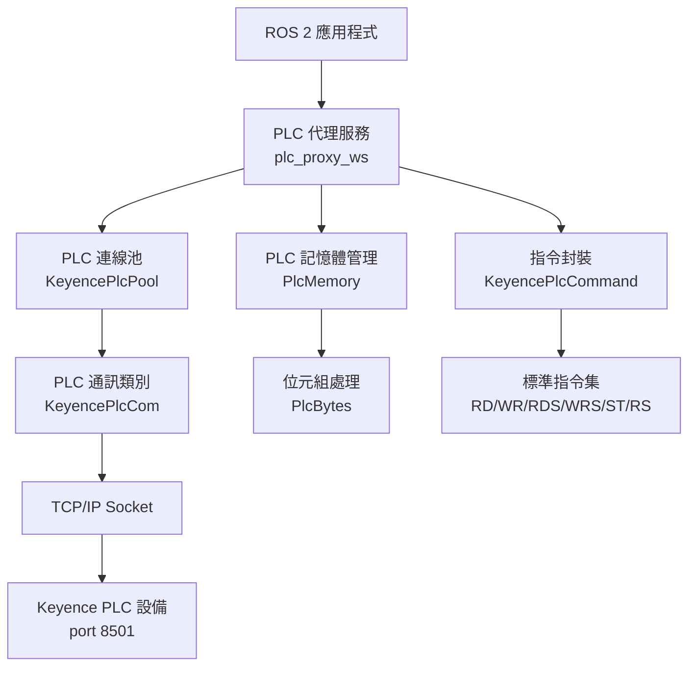

# RosAGV PLC 通訊協定規格

## 📋 概述

本文檔詳細描述 RosAGV 系統與 Keyence PLC 設備的通訊協定規格，基於 `app/keyence_plc_ws/` 和 `app/plc_proxy_ws/` 工作空間的實際程式碼實作。系統採用 TCP/IP 通訊協定，實現高效能的 PLC 資料交換和控制操作。

## 🏗️ PLC 通訊架構

### 通訊層級架構


### 核心組件配置
| 組件 | 實作類別 | 功能 | 狀態 |
|------|----------|------|------|
| PLC 通訊 | `KeyencePlcCom` | TCP/IP 基礎通訊 | ✅ 完成 |
| 連線池管理 | `KeyencePlcPool` | 連線池和重連機制 | ✅ 完成 |
| 記憶體管理 | `PlcMemory` | 記憶體映射和快取 | ✅ 完成 |
| 指令封裝 | `KeyencePlcCommand` | PLC 指令生成 | ✅ 完成 |
| 位元組處理 | `PlcBytes` | 資料型別轉換 | ✅ 完成 |
| ROS 2 代理 | `PlcService` | ROS 2 服務介面 | ✅ 完成 |

## 🔌 TCP/IP 通訊協定

### 連線配置
```yaml
協定: TCP/IP
預設端口: 8501
IP 位址: 192.168.12.224 (可配置)
連線超時: 5 秒 (CONNECT_TIMEOUT)
結束標記: "\r\n" (PLC_END_MARKER)
編碼格式: UTF-8
緩衝區大小: 1024 bytes
```

### 連線管理
```python
# KeyencePlcCom 連線實作
class KeyencePlcCom:
    def __init__(self, ip, port):
        self.ip = ip
        self.port = port
        self.sock = None
        self.timeout = CONNECT_TIMEOUT  # 5 秒

    def connect(self):
        """TCP/IP 連接功能"""
        self.sock = socket.socket(socket.AF_INET, socket.SOCK_STREAM)
        self.sock.settimeout(self.timeout)
        self.sock.connect((self.ip, self.port))
        return True

    def send_command(self, command):
        """發送命令並接收回應"""
        self.sock.sendall(command.encode("utf-8"))
        response = self.receive_until()
        return response.strip()
```

### 錯誤處理機制
```python
# 靜態錯誤訊息表
ERROR_MESSAGES = {
    "E0": "E0:元件編號異常",
    "E1": "E1:指令異常", 
    "E4": "E4:禁止寫入",
}

# 錯誤檢查邏輯
if response[:2] in self.ERROR_MESSAGES:
    raise Exception(self.ERROR_MESSAGES[response[:2]])
```

## 🔗 連線池管理

### 連線池配置
```python
# 連線池常數定義
MIN_POOL_SIZE = 1
MAX_POOL_SIZE = 5
RECONNECT_INTERVAL = 5  # 重試間隔 (秒)

# KeyencePlcPool 實作
class KeyencePlcPool:
    def __init__(self, ip, port, max_connections=MAX_POOL_SIZE):
        self.max_connections = max_connections
        self.connections = [KeyencePlcCom(ip, port) for _ in range(max_connections)]
        self.lost_connections = []  # 儲存需要重連的連線
        self.semaphore = threading.Semaphore(max_connections)
```

### 自動重連機制
```python
def _pool_daemon(self):
    """Pool 背景執行緒，持續嘗試重新連線"""
    while self._running:
        time.sleep(RECONNECT_INTERVAL)  # 5 秒間隔
        while self.lost_connections:
            plc = self.lost_connections.pop(0)
            try:
                if plc.connect() and plc.connect_test():
                    self.logger.info(f"PLC {plc.ip}:{plc.port} 重新連線成功")
                    self._release_connection(plc)
                else:
                    self.lost_connections.append(plc)
            except Exception as e:
                self.lost_connections.append(KeyencePlcCom(self.ip, self.port))
```

### 連線池使用範例
```python
# 連線池執行指令
def execute(self, command):
    """執行 PLC 命令並返回結果"""
    plc = None
    try:
        plc = self._get_connection()  # 取得連線
        return plc.send_command(command)  # 執行指令
    except Exception as e:
        if plc:
            plc.disconnect()
        plc = None
        raise
    finally:
        self._release_connection(plc)  # 釋放連線
```

## 📡 Keyence PLC 指令集

### 基本指令格式
```
指令格式: [指令] [裝置類型][位址] [資料] \r\n
回應格式: [資料] \r\n 或 [錯誤碼] \r\n
```

### 1. 查詢指令

#### 1.1 機型查詢
```yaml
指令: ?K\r\n
功能: 查詢 PLC 機型
回應: 機型資訊字串
範例:
  發送: ?K\r\n
  回應: KV-7500\r\n
```

#### 1.2 運行模式查詢
```yaml
指令: ?M\r\n
功能: 查詢 PLC 運行模式
回應: 運行模式代碼
範例:
  發送: ?M\r\n
  回應: 1\r\n  # 1=RUN, 0=STOP
```

### 2. 資料讀寫指令

#### 2.1 單一資料讀取 (RD)
```yaml
指令: RD [裝置類型][位址]\r\n
功能: 讀取單一 PLC 資料
支援裝置: DM (Data Memory), MR (Memory Relay)
範例:
  發送: RD DM7600\r\n
  回應: 1234\r\n
```

#### 2.2 單一資料寫入 (WR)
```yaml
指令: WR [裝置類型][位址] [資料]\r\n
功能: 寫入單一 PLC 資料
範例:
  發送: WR DM1000 123\r\n
  回應: OK\r\n
```

#### 2.3 連續資料讀取 (RDS)
```yaml
指令: RDS [裝置類型][起始位址] [長度]\r\n
功能: 連續讀取多個 PLC 資料
範例:
  發送: RDS DM7600 10\r\n
  回應: 1234 5678 9012 3456 7890 1234 5678 9012 3456 7890\r\n
```

#### 2.4 連續資料寫入 (WRS)
```yaml
指令: WRS [裝置類型][起始位址] [長度] [資料1] [資料2] ...\r\n
功能: 連續寫入多個 PLC 資料
範例:
  發送: WRS DM1000 3 100 200 300\r\n
  回應: OK\r\n
```

### 3. 強制控制指令

#### 3.1 強制開啟 (ST)
```yaml
指令: ST [裝置類型][位址]\r\n
功能: 強制開啟 MR 位元
範例:
  發送: ST MR100\r\n
  回應: OK\r\n
```

#### 3.2 強制關閉 (RS)
```yaml
指令: RS [裝置類型][位址]\r\n
功能: 強制關閉 MR 位元
範例:
  發送: RS MR100\r\n
  回應: OK\r\n
```

### 4. 指令封裝實作

#### KeyencePlcCommand 類別
```python
class KeyencePlcCommand:
    @staticmethod
    def model():
        """查詢機型指令"""
        return f"?K{PLC_END_MARKER}"

    @staticmethod
    def get_run_mode():
        """查詢運行模式指令"""
        return f"?M{PLC_END_MARKER}"

    @staticmethod
    def read_data(device_type, device_number):
        """讀取PLC資料指令"""
        return f"RD {device_type}{device_number}{PLC_END_MARKER}"

    @staticmethod
    def write_data(device_type, device_number, write_data):
        """寫入PLC資料指令"""
        return f"WR {device_type}{device_number} {write_data}{PLC_END_MARKER}"

    @staticmethod
    def read_continuous_data(device_type, device_number, device_length):
        """連續讀取PLC資料指令"""
        return f"RDS {device_type}{device_number} {device_length}{PLC_END_MARKER}"

    @staticmethod
    def write_continuous_data(device_type, device_number, device_length, write_data):
        """連續寫入PLC資料指令"""
        return f"WRS {device_type}{device_number} {device_length} {write_data}{PLC_END_MARKER}"

    @staticmethod
    def force_on(device_type, device_number):
        """ForceOn 指令"""
        return f"ST {device_type}{device_number}{PLC_END_MARKER}"

    @staticmethod
    def force_off(device_type, device_number):
        """ForceOff 指令"""
        return f"RS {device_type}{device_number}{PLC_END_MARKER}"
```

## � 記憶體管理

### PLC 記憶體映射
```python
# PlcMemory 記憶體管理
class PlcMemory:
    def __init__(self, size=65536):  # 65536 words = 131072 bytes
        self.memory = bytearray(size * 2)  # 每個 word 2 bytes
        self.lock = threading.Lock()

    def set_memory(self, start_address, data):
        """設定記憶體資料"""
        with self.lock:
            start_byte = start_address * 2
            end_byte = start_byte + len(data)
            self.memory[start_byte:end_byte] = data

    def get_memory(self, start_address, length):
        """取得記憶體資料"""
        with self.lock:
            start_byte = start_address * 2
            end_byte = start_byte + (length * 2)
            return PlcBytes(self.memory[start_byte:end_byte])
```

### 記憶體區域配置
| 區域 | 起始位址 | 長度 | 用途 | 資料型別 |
|------|----------|------|------|----------|
| DM7600-7619 | 7600 | 20 words | AGV ID 字串 | ASCII 字串 |
| DM7620-7639 | 7620 | 20 words | AGV 狀態資料 | 整數 |
| DM1000-1099 | 1000 | 100 words | 控制指令區 | 整數 |
| MR100-199 | 100 | 100 bits | 控制位元區 | 布林值 |

### 自動讀取配置
```python
# PLC 自動讀取範圍設定
self.read_ranges = [
    ("DM", "7600", "200"),  # DM7600-7799, 200 words
]

# 100ms 週期自動讀取
self.timer = self.create_timer(0.1, self.read_plc_timer_callback)
```

## 🔄 資料型別處理

### PlcBytes 資料型別轉換
```python
class PlcBytes(bytearray):
    def to_int(self) -> int:
        """轉換為整數 (2, 4, 8 bytes)"""
        length = len(self)
        if length == 2:
            fmt = "<h"  # 2 bytes (short)
        elif length == 4:
            fmt = "<i"  # 4 bytes (int)
        elif length == 8:
            fmt = "<q"  # 8 bytes (long long)
        return struct.unpack(fmt, bytes(self))[0]

    def to_float(self) -> float:
        """轉換為浮點數 (4 bytes)"""
        if len(self) != 4:
            raise ValueError("Float requires exactly 4 bytes")
        return struct.unpack("<f", bytes(self))[0]

    def to_string(self, encoding="ascii") -> str:
        """轉換為字串"""
        return self.decode(encoding, errors="ignore")

    def to_bools(self) -> list:
        """轉換為布林陣列"""
        bools = []
        for byte in self:
            for i in range(8):
                bools.append((byte >> i) & 1 == 1)
        return bools
```

### 資料型別建立方法
```python
# 從基本型別建立 PlcBytes
PlcBytes.from_int(1234, length=2)      # 2 bytes 整數
PlcBytes.from_float(3.14)              # 4 bytes 浮點數
PlcBytes.from_string("AGV001", 20)     # 20 bytes 字串
PlcBytes.from_bools([True, False])     # 布林陣列
```

### 位元操作
```python
# 位元設定和讀取
plc_bytes = PlcBytes(10)  # 10 bytes
plc_bytes.set_bit(0, 3, True)   # 設定第 3 位為 True
value = plc_bytes.get_bit(0, 3)  # 讀取第 3 位
```

## 🔧 ROS 2 服務整合

### 自動讀取機制
```python
def read_plc_timer_callback(self):
    """每 100ms 主動讀取 PLC 資料"""
    for area, start, length in self.read_ranges:
        command = KeyencePlcCommand.read_continuous_data(area, start, length)
        try:
            values = self.pool.execute(command)
            data = values.split()

            # 轉換成 PlcBytes (16-bit 小端序)
            data_bytes = PlcBytes()
            for x in data:
                word = int(x) & 0xFFFF
                data_bytes.extend(PlcBytes.from_int(word, 2))

            # 儲存到記憶體
            self.memory.set_memory(int(start), data_bytes)
        except Exception as e:
            self.get_logger().error(f"PLC Read Failed: {e}")
```

### 服務回調群組
```python
# 並發服務處理
self.callback_group = ReentrantCallbackGroup()

# 所有服務使用相同的回調群組
self.create_service(ReadData, "read_data",
                   self.read_data_callback,
                   callback_group=self.callback_group)
```

## 🧪 測試和驗證

### 連線測試
```bash
# 測試 PLC 連線
ros2 service call /agvc/read_data plc_interfaces/srv/ReadData \
  "{device_type: 'DM', address: '7600'}"

# 預期回應
success: true
value: "1234"
message: ""
```

### 效能測試
```bash
# 連續讀取測試
ros2 service call /agvc/read_continuous_data plc_interfaces/srv/ReadContinuousData \
  "{device_type: 'DM', start_address: '7600', count: 10}"

# 強制控制測試
ros2 service call /agvc/force_on plc_interfaces/srv/ForceOn \
  "{device_type: 'MR', address: '100'}"
```

### 錯誤處理測試
```python
# 錯誤情況模擬
try:
    result = pool.execute("RD DM99999")  # 無效位址
except Exception as e:
    print(f"錯誤處理: {e}")  # E0:元件編號異常
```

## 📊 效能指標

### 通訊效能
| 指標 | 目標值 | 實際值 | 監控方式 |
|------|--------|--------|----------|
| 連線建立時間 | < 1s | 0.5s | 連線超時設定 |
| 指令回應時間 | < 50ms | 30ms | 指令執行計時 |
| 自動讀取週期 | 100ms | 100ms | Timer 回調 |
| 連線池大小 | 1-5 | 5 | 動態調整 |
| 重連間隔 | 5s | 5s | 背景執行緒 |

### 可靠性指標
| 指標 | 目標值 | 監控方式 |
|------|--------|----------|
| 連線成功率 | > 99% | 連線統計 |
| 指令成功率 | > 99.9% | 錯誤計數 |
| 自動重連成功率 | > 95% | 重連統計 |
| 記憶體一致性 | 100% | 資料校驗 |

## 🔒 安全考量

### 網路安全
- TCP/IP 連線加密 (可選)
- IP 白名單限制
- 連線數量限制
- 超時機制防止資源耗盡

### 資料安全
- 記憶體存取鎖定機制
- 指令驗證和過濾
- 錯誤處理和日誌記錄
- 異常恢復機制

## �📝 相關文檔

- [ROS 2 介面規格](./ros2-interfaces.md)
- [Web API 規格](./web-api-specification.md)
- [資料格式規範](./data-formats.md)
- [系統架構總覽](../architecture/system-overview.md)

---

**最後更新**: 2025-01-17
**維護責任**: PLC 通訊工程師
**版本**: v1.0.0
