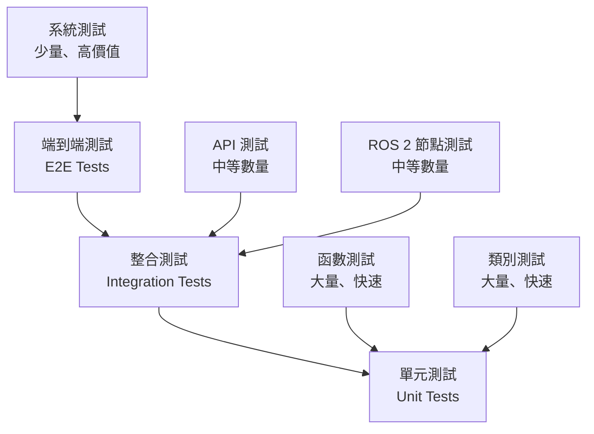

# RosAGV 測試策略

## 📋 概述

本文檔定義 RosAGV 專案的整體測試策略和測試金字塔，確保系統品質和可靠性。

## 🏗️ 測試金字塔架構



### 測試層級分配
- **單元測試**: 70% (快速、大量、低成本)
- **整合測試**: 20% (中等速度、中等成本)
- **端到端測試**: 10% (慢速、少量、高價值)

## 🎯 測試目標和指標

### 覆蓋率目標
| 測試類型 | 目標覆蓋率 | 當前覆蓋率 | 狀態 |
|---------|------------|------------|------|
| 程式碼覆蓋率 | 80% | 65% | 🚧 進行中 |
| 分支覆蓋率 | 75% | 60% | 🚧 進行中 |
| 功能覆蓋率 | 90% | 75% | 🚧 進行中 |
| API 覆蓋率 | 95% | 80% | 🚧 進行中 |

### 品質指標
| 指標 | 目標值 | 當前值 | 狀態 |
|------|--------|--------|------|
| 測試通過率 | 95% | 90% | 🚧 接近目標 |
| 測試執行時間 | < 10 分鐘 | 12 分鐘 | ⚠️ 需優化 |
| 缺陷逃逸率 | < 5% | 8% | ⚠️ 需改善 |
| 自動化率 | 85% | 70% | 🚧 進行中 |

## 🔧 按工作空間的測試策略

### 1. 共用基礎模組測試

#### keyence_plc_ws 測試策略
```yaml
測試重點: PLC 通訊可靠性和效能
測試類型:
  - 單元測試: 連線池管理、記憶體操作
  - 整合測試: PLC 設備通訊
  - 效能測試: 高併發連線
  - 可靠性測試: 網路中斷恢復

測試工具:
  - pytest: Python 單元測試
  - mock: PLC 設備模擬
  - stress testing: 負載測試
```

#### plc_proxy_ws 測試策略
```yaml
測試重點: ROS 2 服務正確性和穩定性
測試類型:
  - 單元測試: 服務回調函數
  - 整合測試: ROS 2 服務調用
  - 並發測試: 多客戶端同時調用
  - 錯誤處理測試: 異常情況處理

測試工具:
  - pytest: Python 單元測試
  - ros2 test: ROS 2 測試框架
  - launch_testing: Launch 檔案測試
```

#### path_algorithm 測試策略
```yaml
測試重點: 路徑規劃演算法正確性
測試類型:
  - 單元測試: A* 演算法邏輯
  - 整合測試: NetworkX 整合
  - 效能測試: 大型地圖路徑規劃
  - 邊界測試: 極端情況處理

測試工具:
  - pytest: Python 單元測試
  - networkx.testing: 圖論測試
  - benchmark: 效能基準測試
```

### 2. AGV 車載系統測試

#### agv_ws 測試策略
```yaml
測試重點: 狀態機邏輯和任務執行
測試類型:
  - 單元測試: 狀態轉換邏輯
  - 整合測試: PLC 整合、路徑規劃整合
  - 系統測試: 完整任務執行流程
  - 安全測試: 緊急停止、異常處理

測試工具:
  - gtest: C++ 單元測試
  - ros2 test: ROS 2 測試框架
  - simulation: 模擬環境測試
```

#### joystick_ws 測試策略
```yaml
測試重點: 搖桿輸入處理和回應時間
測試類型:
  - 單元測試: 輸入處理邏輯
  - 整合測試: joy_linux 整合
  - 即時性測試: 回應時間測試
  - 硬體測試: 多種搖桿型號

測試工具:
  - ros2 test: ROS 2 測試框架
  - hardware simulation: 硬體模擬
```

### 3. AGVC 管理系統測試

#### web_api_ws 測試策略
```yaml
測試重點: API 正確性和效能
測試類型:
  - 單元測試: API 端點邏輯
  - 整合測試: 資料庫整合
  - API 測試: RESTful API 規範
  - 負載測試: 高併發請求

測試工具:
  - pytest: Python 單元測試
  - fastapi.testclient: FastAPI 測試
  - locust: 負載測試
  - postman: API 測試
```

#### db_proxy_ws 測試策略
```yaml
測試重點: 資料庫操作正確性和效能
測試類型:
  - 單元測試: ORM 模型和查詢
  - 整合測試: PostgreSQL 整合
  - 事務測試: ACID 特性驗證
  - 效能測試: 查詢效能優化

測試工具:
  - pytest: Python 單元測試
  - sqlalchemy.testing: ORM 測試
  - pgbench: PostgreSQL 效能測試
```

## 🚀 自動化測試流程

### CI/CD 測試管道


### 測試環境配置
```yaml
開發環境:
  - 本地單元測試
  - 快速回饋循環
  - 開發者自主測試

測試環境:
  - 自動化整合測試
  - Docker 容器測試
  - 模擬生產環境

預生產環境:
  - 端到端測試
  - 效能測試
  - 使用者驗收測試

生產環境:
  - 監控和警報
  - 健康檢查
  - 回滾機制
```

## 🔍 測試工具和框架

### Python 測試工具
```bash
# 單元測試框架
pytest                    # 主要測試框架
pytest-cov               # 覆蓋率報告
pytest-mock              # Mock 支援
pytest-asyncio           # 異步測試

# 效能測試
locust                    # 負載測試
memory-profiler          # 記憶體分析
py-spy                   # 效能分析

# 資料庫測試
pytest-postgresql        # PostgreSQL 測試
factory-boy              # 測試資料生成
```

### C++ 測試工具
```bash
# ROS 2 測試框架
ros2 test                # ROS 2 測試命令
launch_testing           # Launch 檔案測試
gtest                    # Google Test 框架
gmock                    # Google Mock 框架

# 效能測試
google-benchmark         # 效能基準測試
valgrind                 # 記憶體檢查
```

### 整合測試工具
```bash
# API 測試
postman                  # API 測試工具
newman                   # Postman CLI
httpie                   # HTTP 客戶端

# 容器測試
docker-compose           # 多容器測試
testcontainers          # 容器化測試
```

## 📊 測試報告和監控

### 測試報告格式
```yaml
測試執行報告:
  - 測試總數和通過率
  - 覆蓋率報告
  - 效能指標
  - 失敗案例分析

品質趨勢報告:
  - 週度品質趨勢
  - 缺陷密度分析
  - 測試效率指標
  - 改善建議
```

### 監控指標
```yaml
即時監控:
  - 測試通過率
  - 建置成功率
  - 部署頻率
  - 平均修復時間

長期趨勢:
  - 程式碼品質趨勢
  - 測試覆蓋率變化
  - 缺陷發現率
  - 客戶滿意度
```

## 🎯 測試最佳實踐

### 測試設計原則
1. **FIRST 原則**: Fast, Independent, Repeatable, Self-validating, Timely
2. **AAA 模式**: Arrange, Act, Assert
3. **單一職責**: 每個測試只驗證一個功能點
4. **可讀性**: 測試名稱清楚描述測試目的

### 測試資料管理
1. **測試資料隔離**: 每個測試使用獨立資料
2. **資料清理**: 測試後自動清理資料
3. **資料工廠**: 使用工廠模式生成測試資料
4. **資料版本控制**: 測試資料版本化管理

### 測試維護策略
1. **定期重構**: 清理過時的測試案例
2. **測試文檔**: 維護測試案例文檔
3. **測試審查**: 程式碼審查包含測試審查
4. **測試培訓**: 團隊測試技能培訓

## 📝 相關文檔

- [單元測試規格](./unit-test-specifications.md)
- [整合測試計劃](./integration-test-plans.md)
- [驗收標準](./acceptance-criteria.md)
- [效能基準測試](./performance-benchmarks.md)
- [自動化測試](./automated-testing.md)

---

**最後更新**: 2025-01-17  
**維護責任**: 測試工程師  
**版本**: v1.0.0
