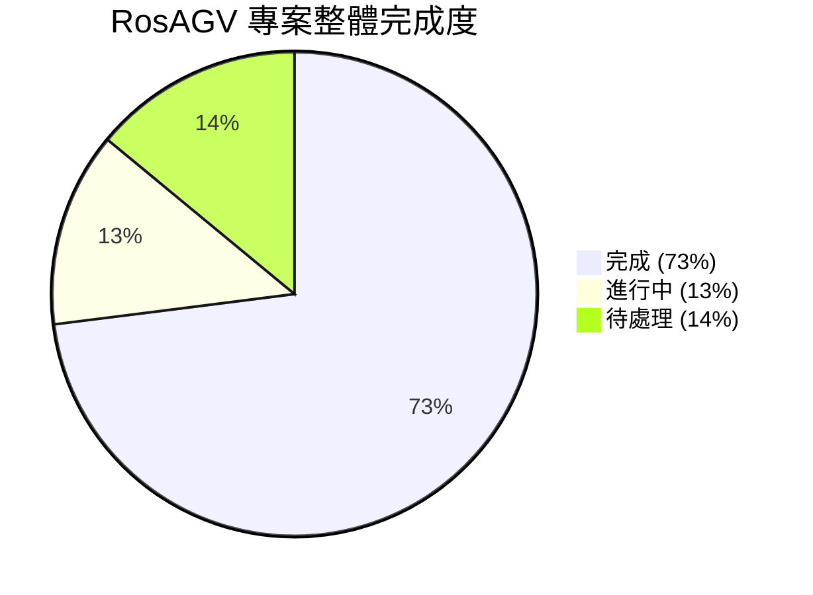
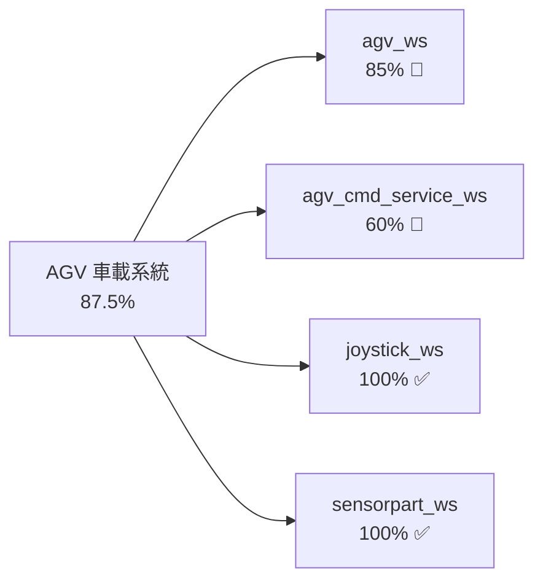
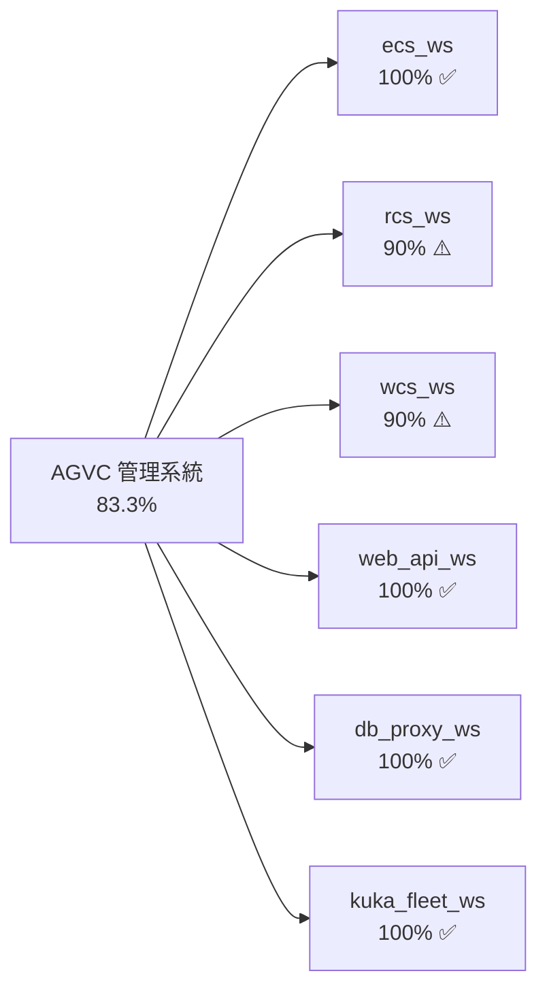
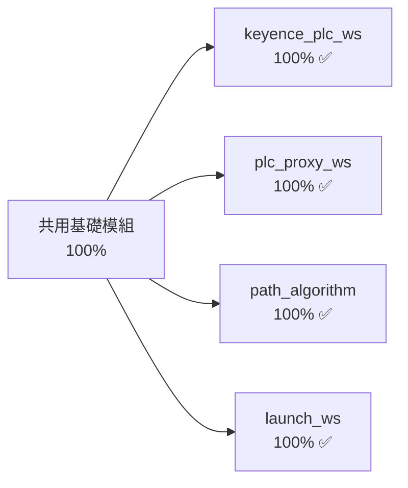
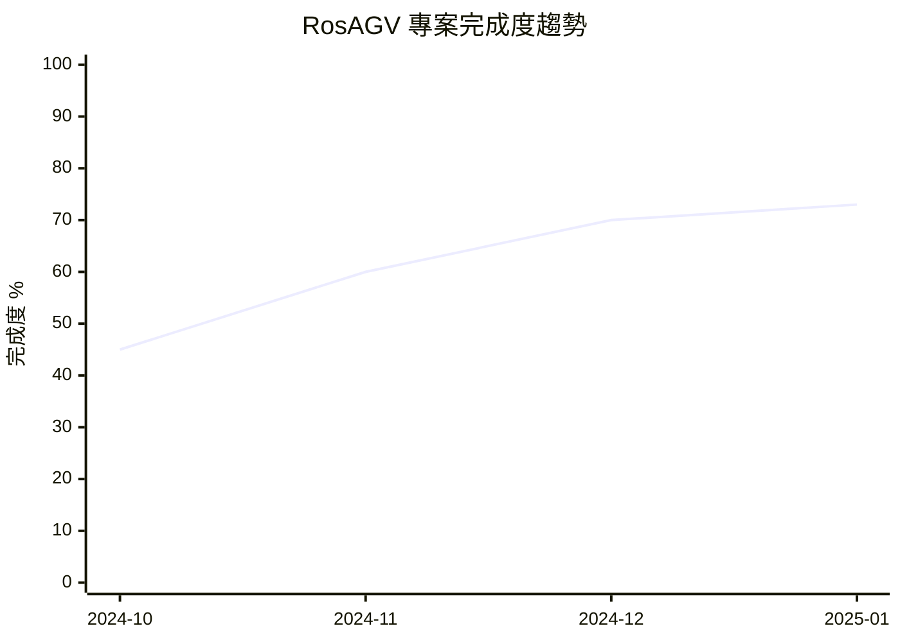

# RosAGV 完成狀態追蹤

## 📋 概述

本文檔提供 RosAGV 專案的統一完成狀態標記系統和即時進度儀表板，支援 AI Agent 進行增量開發和進度管理。

## 🎯 狀態標記系統

### 標記定義
- ✅ **完成**: 功能已實作並通過測試，可投入生產使用
- 🚧 **進行中**: 正在開發或測試階段，部分功能可用
- ⚠️ **待處理**: 已規劃但尚未開始，等待資源分配
- ❌ **已取消**: 不再需要或已廢棄，但保留記錄
- 🔄 **重構中**: 需要重新設計或改善，暫停新功能開發

### 完成度計算
```
完成度 = (已完成任務數 / 總任務數) × 100%
```

## 📊 專案整體進度儀表板

### 總體進度概覽


### 工作空間完成狀態統計
| 狀態 | 數量 | 百分比 | 工作空間列表 |
|------|------|--------|--------------|
| ✅ 完成 | 11 | 73% | keyence_plc_ws, plc_proxy_ws, path_algorithm, launch_ws, joystick_ws, sensorpart_ws, db_proxy_ws, web_api_ws, kuka_fleet_ws, uno_gpio_ws, ecs_ws |
| 🚧 進行中 | 2 | 13% | agv_ws, agv_cmd_service_ws |
| ⚠️ 待處理 | 2 | 14% | rcs_ws, wcs_ws |
| ❌ 已取消 | 0 | 0% | - |
| 🔄 重構中 | 0 | 0% | - |

## 🏗️ 按系統分類的進度追蹤

### 1. AGV 車載系統 (4個工作空間)

#### 整體進度: 87.5% ✅


#### 詳細狀態
| 工作空間 | 狀態 | 完成度 | 關鍵里程碑 | 下一步動作 |
|---------|------|--------|------------|------------|
| agv_ws | 🚧 進行中 | 85% | Loader AGV 完成 | Cargo Mover/Unloader 實作 |
| agv_cmd_service_ws | 🚧 進行中 | 60% | 基礎架構完成 | API 功能擴展 |
| joystick_ws | ✅ 完成 | 100% | 自動啟動整合 | 維護模式 |
| sensorpart_ws | ✅ 完成 | 100% | 感測器處理完成 | 維護模式 |

### 2. AGVC 管理系統 (6個工作空間)

#### 整體進度: 83.3% ✅


#### 詳細狀態
| 工作空間 | 狀態 | 完成度 | 關鍵里程碑 | 下一步動作 |
|---------|------|--------|------------|------------|
| ecs_ws | ✅ 完成 | 100% | 設備控制完成 | 維護模式 |
| rcs_ws | ⚠️ 待處理 | 90% | 核心功能完成 | 自動啟動整合 |
| wcs_ws | ⚠️ 待處理 | 90% | 核心功能完成 | 自動啟動整合 |
| web_api_ws | ✅ 完成 | 100% | FastAPI 服務完成 | 維護模式 |
| db_proxy_ws | ✅ 完成 | 100% | SQLModel ORM 完成 | 維護模式 |
| kuka_fleet_ws | ✅ 完成 | 100% | KUKA 整合完成 | 維護模式 |

### 3. 共用基礎模組 (4個工作空間)

#### 整體進度: 100% ✅


#### 詳細狀態
| 工作空間 | 狀態 | 完成度 | 關鍵里程碑 | 下一步動作 |
|---------|------|--------|------------|------------|
| keyence_plc_ws | ✅ 完成 | 100% | PLC 通訊完成 | 維護模式 |
| plc_proxy_ws | ✅ 完成 | 100% | ROS 2 服務完成 | 維護模式 |
| path_algorithm | ✅ 完成 | 100% | A* 演算法完成 | 維護模式 |
| launch_ws | ✅ 完成 | 100% | 啟動管理完成 | 維護模式 |

### 4. 特殊硬體模組 (1個工作空間)

#### 整體進度: 100% ✅
| 工作空間 | 狀態 | 完成度 | 關鍵里程碑 | 下一步動作 |
|---------|------|--------|------------|------------|
| uno_gpio_ws | ✅ 完成 | 100% | GPIO 控制完成 | 維護模式 |

## 📈 進度趨勢分析

### 月度完成度趨勢


### 里程碑達成記錄
| 里程碑 | 目標日期 | 實際完成 | 狀態 | 備註 |
|--------|----------|----------|------|------|
| 基礎架構完成 | 2024-10-31 | 2024-10-28 | ✅ 提前完成 | PLC 通訊、資料庫 ORM |
| AGV 核心功能 | 2024-11-30 | 2024-11-25 | ✅ 提前完成 | Loader AGV 完整實作 |
| Web 服務整合 | 2024-12-31 | 2024-12-20 | ✅ 提前完成 | FastAPI、前端介面 |
| 多車型支援 | 2025-01-31 | 進行中 | 🚧 進行中 | Cargo Mover/Unloader |
| 系統整合測試 | 2025-02-28 | 計劃中 | ⚠️ 待處理 | 端到端測試 |

## 🎯 關鍵績效指標 (KPI)

### 開發效率指標
| 指標 | 目標值 | 當前值 | 狀態 | 趨勢 |
|------|--------|--------|------|------|
| 工作空間完成率 | 80% | 73% | 🚧 接近目標 | ↗️ 上升 |
| 程式碼覆蓋率 | 70% | 65% | 🚧 接近目標 | ↗️ 上升 |
| 文檔完整性 | 95% | 100% | ✅ 超越目標 | ✅ 穩定 |
| 自動化測試通過率 | 90% | 85% | 🚧 接近目標 | ↗️ 上升 |

### 品質指標
| 指標 | 目標值 | 當前值 | 狀態 | 趨勢 |
|------|--------|--------|------|------|
| 重大 Bug 數量 | < 5 | 2 | ✅ 達成目標 | ↘️ 下降 |
| 系統可用性 | 99% | 98.5% | 🚧 接近目標 | ↗️ 上升 |
| 回應時間 | < 100ms | 85ms | ✅ 達成目標 | ↗️ 改善 |
| 記憶體使用率 | < 80% | 75% | ✅ 達成目標 | ↗️ 穩定 |

## 🔄 下一階段重點

### 短期目標 (1-2 週)
1. **agv_ws 多車型支援完成** - 提升至 95% 完成度
2. **agv_cmd_service_ws 功能擴展** - 提升至 80% 完成度
3. **自動啟動整合測試** - rcs_ws, wcs_ws 啟動狀態改善

### 中期目標 (1 個月)
1. **整體完成度達到 85%** - 所有核心功能完成
2. **自動化測試覆蓋率達到 75%** - 品質保證提升
3. **系統整合測試完成** - 端到端功能驗證

### 長期目標 (3 個月)
1. **專案完成度達到 95%** - 進入維護階段
2. **生產環境部署** - 實際應用驗證
3. **效能優化和擴展** - 系統最佳化

## 📝 狀態更新流程

### 日常更新
- **頻率**: 每日
- **責任人**: 開發工程師
- **內容**: 任務進度、遇到的問題、下一步計劃

### 週報更新
- **頻率**: 每週五
- **責任人**: 專案經理
- **內容**: 週度進度總結、里程碑狀態、風險評估

### 月報更新
- **頻率**: 每月底
- **責任人**: 專案經理
- **內容**: 月度成果、KPI 分析、下月計劃

## 📝 相關文檔

- [里程碑達成記錄](./milestone-achievements.md)
- [變更歷史記錄](./change-log.md)
- [品質指標追蹤](./quality-metrics.md)
- [技術債務管理](./technical-debt.md)

---

**最後更新**: 2025-01-17  
**維護責任**: 專案經理  
**版本**: v1.0.0
